# CosMx Whole Transcriptome: Human Colon Mini Dataset

## 1 The dataset

NanoString **CosMx Whole Transcriptome (WTx)**, human colon, slide S0.
This is a **single field of view** (FOV 71) cut out of the ~400-FOV
export the companion GiottoDisk tutorial works through. The donor is a
56-year-old woman with a G1, stage **IVA T3N0M1a** primary sigmoid
adenocarcinoma, and the field was chosen where tumor, desmoplastic
stroma and residual mucosa meet.

The panel is carried over whole; only the cells are subset:

|                      | full slide S0 | this subset |
|----------------------|--------------:|------------:|
| fields of view       |          ~400 |  1 (FOV 71) |
| cells                |       493,834 |       1,752 |
| panel features       |        20,378 |      20,378 |
| RNA targets          |        18,935 |      18,935 |
| negative probes      |            50 |          50 |
| SystemControl probes |         1,393 |       1,393 |

The parent export is Bruker Spatial Biology’s [CosMx Human Whole
Transcriptome colon
dataset](https://brukerspatialbiology.com/products/cosmx-spatial-molecular-imager/ffpe-dataset/cosmx-human-whole-transcriptome-colon-dataset/).

The subset is registered with `GiottoData` as
**`cosmx_mini_colon_wtx`**, so
[`getSpatialDataset()`](https://giotto-suite.github.io/GiottoData/reference/getSpatialDataset.html)
fetches and unpacks it in one call.

## 2 Packages

``` r

remotes::install_github("giotto-suite/GiottoUtils", ref = "dev")
GiottoUtils::suite_install(c("Giotto", "GiottoData"), ref = "disk")
BiocManager::install("scran")
```

## 3 Setup

``` r

suppressMessages({
  library(Giotto); library(GiottoClass); library(GiottoVisuals)
  library(GiottoData)
  library(data.table); library(ggplot2); library(cowplot)
})

plot_theme <- theme_classic(base_size = 9)

results_folder <- "results"   # where every Giotto figure is saved as a PNG

instructions <- createGiottoInstructions(save_dir    = results_folder,
                                         save_plot   = TRUE,
                                         show_plot   = TRUE,
                                         return_plot = FALSE,
                                         python_path = NULL) # NULL uses the Python in the installed Giotto environment
```

[`getSpatialDataset()`](https://giotto-suite.github.io/GiottoData/reference/getSpatialDataset.html)
downloads the bundle, checks it against the checksum in `GiottoData`’s
manifest and unpacks it, then returns the directory it used. Either way
the download is skipped on a re-run.

``` r

# where the dataset is downloaded and unpacked; left unset,
# getSpatialDataset() defaults to tools::R_user_dir("GiottoData", "cache")
data_path <- "data/"

mini_dir <- getSpatialDataset("cosmx_mini_colon_wtx", directory = data_path)
mini_dir
```

    ## [1] "data//cosmx_mini_colon_wtx"

## 4 Create the giotto object

``` r

mini_cosmx <- createGiottoCosMxObject(
  cosmx_dir        = mini_dir,
  slide            = 1,
  feat_type        = c("rna", "negprobes", "falsecode"),
  split_keyword    = list("^Negative", "^SystemControl"),
  poly_pref        = "csv",
  load_expression  = TRUE,
  load_cellmeta    = TRUE,
  load_transcripts = TRUE,
  load_images      = NULL,
  instructions     = instructions,
  verbose          = FALSE)
mini_cosmx
```

``` r

showGiottoCellMetadata(mini_cosmx, nrows = 1)
showGiottoFeatMetadata(mini_cosmx, nrows = 2)
```

## 5 Quality control and filtering

``` r

mini_cosmx <- addStatistics(mini_cosmx, stats = "cell",
                            expression_values = "raw")

# the same statistics for the negative-control probes
mini_cosmx <- addStatistics(mini_cosmx, feat_type = "negprobes",
                            stats = "cell", expression_values = "raw")

prefilter_qc <- pDataDT(mini_cosmx)
prefilter_qc[, depth := as.numeric(nCount_RNA)]
```

[`addStatistics()`](https://giottosuite.com/dev/reference/addStatistics.md)
writes per-cell counts, genes detected and total expression into the
cell metadata, which is what the thresholds below act on. Running it on
`negprobes` too gives the background against which the RNA counts should
be read: the 50 negative probes carry no target, so their per-cell
totals are the noise floor for this panel.

``` r

head(pDataDT(mini_cosmx, feat_type = "negprobes")[
  , .(cell_ID, nr_feats, total_expr)], 3)
```

| cell_ID  | nr_feats | total_expr |
|:---------|---------:|-----------:|
| c_1_71_1 |        1 |          1 |
| c_1_71_2 |        1 |          1 |
| c_1_71_3 |        1 |          1 |

**Pre-filter distributions and an overlap cross-check**

Transcripts carry the vendor’s own cell assignment, so re-deriving the
counts by overlapping them with the segmentation is an independent check
on both that assignment and the polygon repair.

``` r

mini_cosmx  <- calculateOverlap(mini_cosmx, spat_info = "cell",
                                feat_info = "rna", verbose = FALSE)
overlap_obj <- overlapToMatrix(mini_cosmx, spat_info = "cell",
                               feat_info = "rna", name = "overlap")

vendor_matrix  <- getExpression(overlap_obj, values = "raw", output = "matrix")
derived_matrix <- getExpression(overlap_obj, values = "overlap",
                                output = "matrix")[rownames(vendor_matrix),
                                                   colnames(vendor_matrix)]
vendor_totals  <- Matrix::colSums(vendor_matrix)
derived_totals <- Matrix::colSums(derived_matrix)
data.table(vendor_counts  = sum(vendor_matrix),
           derived_counts = sum(derived_matrix),
           correlation    = round(cor(vendor_totals, derived_totals), 3),
           median_ratio   = round(median(derived_totals /
                                          pmax(vendor_totals, 1)), 3))
```

``` r

ggplot(data.table(vendor = vendor_totals, derived = derived_totals),
       aes(vendor, derived)) +
  geom_point(size = 0.5, alpha = 0.35, stroke = 0) +
  geom_abline(slope = 1, intercept = 0, linetype = "dashed",
              color = "#C44E52") +
  scale_x_log10() + scale_y_log10() +
  labs(x = "vendor counts per cell", y = "overlap-derived counts per cell") +
  plot_theme
```

| vendor_counts | derived_counts | correlation | median_ratio |
|--------------:|---------------:|------------:|-------------:|
|       3010885 |        3106445 |       0.915 |        0.989 |

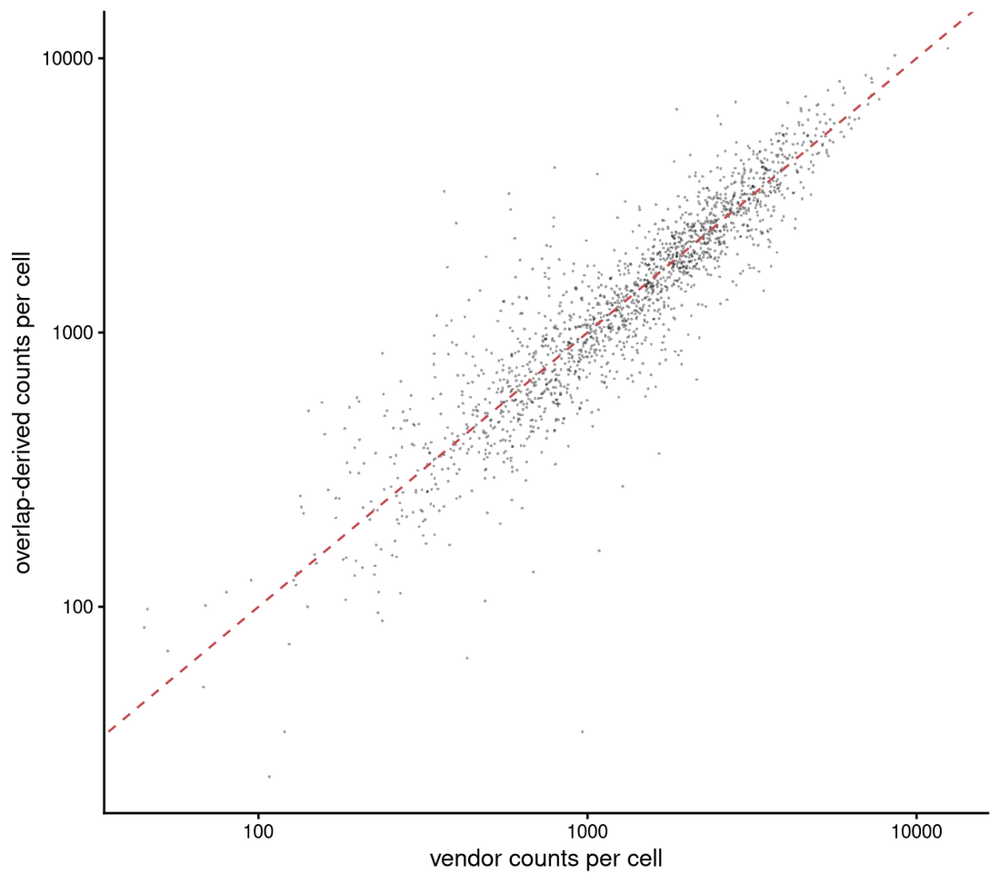

Derived totals run slightly high because ~7% of detections are
unassigned by the vendor yet still fall inside a polygon. Scatter off
the diagonal reflects the polygon repair, since a few microns of
residual placement error moves boundary transcripts into a neighboring
cell. A much lower correlation would point at the repair rather than the
assignment.

[`filterDistributions()`](https://giottosuite.com/dev/reference/filterDistributions.md)
reads the per-cell statistics straight off the object, so the two panels
below are the distributions before any filtering.

``` r

p_counts <- filterDistributions(mini_cosmx, detection = "cells",
                                method = "sum", nr_bins = 60,
                                show_plot = FALSE, return_plot = TRUE,
                                save_plot = FALSE) +
  scale_x_log10() +
  labs(title = NULL, x = "counts per cell", y = "cells") + plot_theme

p_genes <- filterDistributions(mini_cosmx, detection = "cells",
                               method = "threshold", nr_bins = 60,
                               show_plot = FALSE, return_plot = TRUE,
                               save_plot = FALSE) +
  geom_vline(xintercept = 100, color = "#C44E52", linetype = "dashed") +
  labs(title = NULL, x = "genes per cell", y = "cells") + plot_theme

p_qc <- plot_grid(p_counts, p_genes, nrow = 1)
GiottoVisuals::all_plots_save_function(mini_cosmx, p_qc,
                                       default_save_name = "filterDistributions",
                                       base_width = 9, base_height = 3.2)
print(p_qc)
```

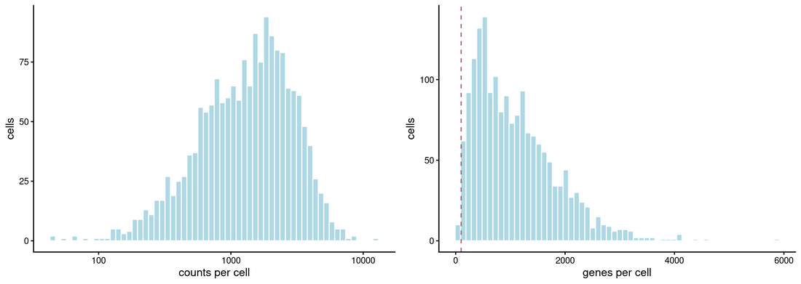

``` r

qc_probs <- c(0, 0.5, 0.9, 0.99, 1)
qc_table <- data.table(
  metric = c("counts per cell", "genes per cell"),
  rbind(round(as.numeric(quantile(prefilter_qc$depth, qc_probs,
                                  na.rm = TRUE)), 1),
        round(as.numeric(quantile(prefilter_qc$nr_feats, qc_probs,
                                  na.rm = TRUE)), 1)))
setnames(qc_table, 2:6, c("min", "median", "q90", "q99", "max"))
qc_table
```

| metric          | min | median |    q90 |    q99 |   max |
|:----------------|----:|-------:|-------:|-------:|------:|
| counts per cell |  45 | 1422.5 | 3426.4 | 5863.4 | 12449 |
| genes per cell  |  39 |  935.5 | 2108.0 | 3258.0 |  5865 |

``` r

mini_cosmx <- filterGiotto(mini_cosmx,
                           expression_threshold   = 1,
                           feat_det_in_min_cells  = 25,
                           min_det_feats_per_cell = 100)
mini_cosmx
```

## 6 Normalization and dimension reduction

``` r

SEED <- 1234

mini_cosmx <- normalizeGiotto(mini_cosmx, scale_feats = FALSE,
                              scale_cells = FALSE, scalefactor = 6000)

mini_cosmx <- normalizeGiotto(mini_cosmx, norm_methods = "pearson_resid",
                              name = "pearson_resid", verbose = FALSE)

mini_cosmx <- addStatistics(mini_cosmx, stats = c("cell", "feature"))

mini_cosmx <- calculateHVF(mini_cosmx, method = "cov_groups",
                           nr_expression_groups = 20,
                           zscore_threshold = 1.1,
                           show_plot = FALSE, save_plot = FALSE,
                           return_plot = FALSE, verbose = FALSE)

mini_cosmx <- runPCA(mini_cosmx, feats_to_use = "hvf", scale_unit = TRUE,
                     center = TRUE, ncp = 20, method = "auto",
                     set_seed = TRUE, seed_number = SEED, verbose = FALSE)
```

``` r

gene_metadata <- fDataDT(mini_cosmx)
head(gene_metadata[hvf == "yes", feat_ID])
```

    ## [1] "KRT7"  "C1QC"  "ITGB2" "RENBP" "HPSE2" "OR4C3"

``` r

screePlot(mini_cosmx, ncp = 20, verbose = FALSE)
```

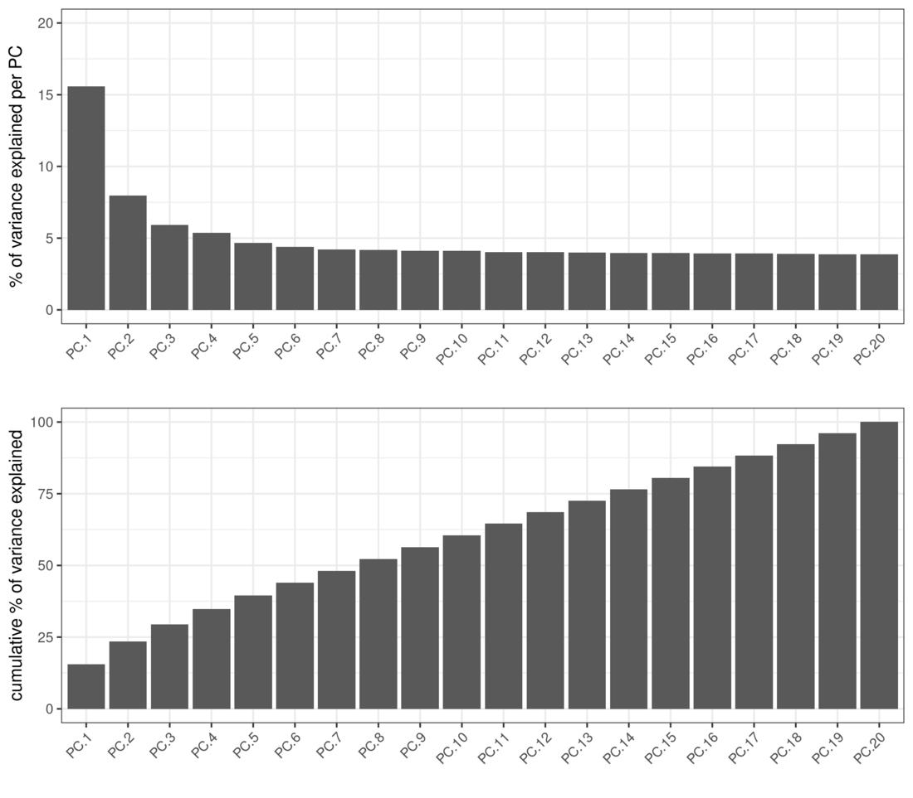

## 7 Neighbors, UMAP, clustering

``` r

# PC1 is dropped: on the full slide it correlates with sequencing depth rather
# than biology, and one field is too small to re-derive that cut
mini_cosmx <- createNearestNetwork(mini_cosmx, type = "sNN", k = 20,
                                   dimensions_to_use = 2:20,
                                   verbose = FALSE)

mini_cosmx <- doLeidenCluster(mini_cosmx, name = "leiden_clus",
                              nn_network_to_use = "sNN",
                              objective_function = "modularity",
                              resolution = 1,
                              n_iterations = 100, set_seed = TRUE,
                              seed_number = SEED)

mini_cosmx <- runUMAP(mini_cosmx, dimensions_to_use = 2:20,
                      n_neighbors = 20, min_dist = 0.3,
                      spread = 1, n_sgd_threads = 0,
                      set_seed = TRUE, seed_number = SEED, verbose = FALSE)
```

``` r

showGiottoDimRed(mini_cosmx, nrows = 3)
```

``` r

cell_metadata <- pDataDT(mini_cosmx)
cell_metadata[, clus := factor(leiden_clus,
                               levels = sort(unique(as.integer(leiden_clus))))]
CLUS_LEVELS <- levels(cell_metadata$clus)
LEIDEN_PAL  <- setNames(getDistinctColors(length(CLUS_LEVELS)), CLUS_LEVELS)

data.table(clusters = uniqueN(cell_metadata$clus),
           cells    = nrow(cell_metadata),
           smallest = min(cell_metadata[, .N, by = clus]$N),
           largest  = max(cell_metadata[, .N, by = clus]$N))
```

| clusters | cells | smallest | largest |
|---------:|------:|---------:|--------:|
|       10 |  1738 |       21 |     349 |

``` r

p_umap_clusters <- plotUMAP(mini_cosmx, cell_color = "leiden_clus",
                            cell_color_code = LEIDEN_PAL,
                            point_size = 0.9, point_alpha = 0.7,
                            point_shape = "border", point_border_stroke = 0,
                            show_center_label = TRUE, label_size = 3.2,
                            show_plot = FALSE, return_plot = TRUE,
                            save_plot = FALSE)
p_umap_genes <- plotUMAP(mini_cosmx, cell_color = "nr_feats",
                         color_as_factor = FALSE,
                         cell_color_gradient = "viridis",
                         gradient_style = "sequential",
                         point_size = 0.9, point_alpha = 0.7,
                         point_shape = "border", point_border_stroke = 0,
                         show_plot = FALSE, return_plot = TRUE,
                         save_plot = FALSE)
p_umap_genes <- p_umap_genes +
  scale_fill_viridis_c(transform = "log10", name = "genes\nper cell")
p_umaps <- plot_grid(p_umap_clusters, p_umap_genes, nrow = 1,
                     rel_widths = c(1, 0.95))
GiottoVisuals::all_plots_save_function(mini_cosmx, p_umaps,
                                       default_save_name = "UMAP",
                                       base_width = 11, base_height = 4.6)
print(p_umaps)
```

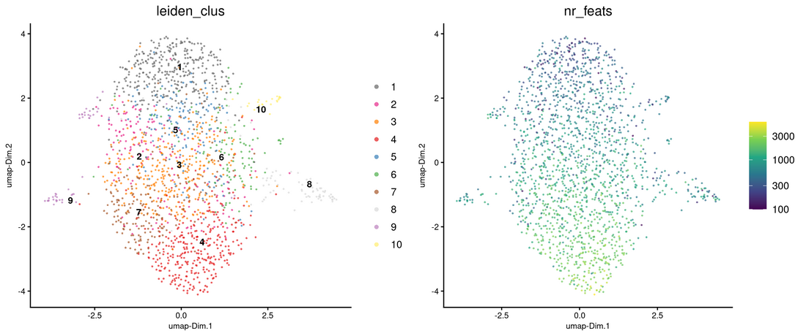

## 8 Markers

[`findScranMarkers_one_vs_all()`](https://giottosuite.com/dev/reference/findScranMarkers_one_vs_all.md)
compares each cluster against the pooled remainder with a Welch test and
returns a `ranking` column, which orders the genes within each cluster.

> **Disclaimer: this is a 1,752-cell fixture, not a study.** One field
> of view cannot support biological conclusions: clusters are small,
> rare populations are absent or represented by a handful of cells, and
> the marker statistics are correspondingly unstable. Treat everything
> downstream as a demonstration of the pipeline, and do not read the
> cell-type calls as findings.

``` r

expr_norm <- GiottoClass::getExpression(mini_cosmx, values = "normalized",
                                        output = "matrix")

scran_markers <- findScranMarkers_one_vs_all(mini_cosmx,
                                             cluster_column = "leiden_clus",
                                             expression_values = "normalized",
                                             verbose = FALSE)
```

``` r

markers_de <- scran_markers[
  , .(feats, cluster = as.character(cluster), logFC, p_value = p.value, FDR,
      ranking)]
markers_de <- markers_de[logFC >= 0.25 & FDR <= 0.05][order(cluster, ranking)]
head(markers_de, 5)
```

| feats  | cluster |     logFC |   p_value |       FDR | ranking |
|:-------|--------:|----------:|----------:|----------:|--------:|
| RPS18  |       1 | 0.6442366 | 0.0000098 | 0.0000872 |       1 |
| RPS4X  |       1 | 0.4593824 | 0.0008676 | 0.0036157 |       2 |
| TMSB10 |       1 | 0.4477043 | 0.0007153 | 0.0030872 |       3 |
| PIGR   |       1 | 0.4150404 | 0.0053978 | 0.0158247 |       4 |
| RPS19  |       1 | 0.3930049 | 0.0068114 | 0.0192436 |       5 |

``` r

top_markers <- markers_de[order(cluster, ranking)][
  , head(.SD, 8), by = cluster]
cluster_table <- merge(
  cell_metadata[, .(cells = .N), by = .(cluster = as.character(clus))],
  top_markers[, .(top_genes = paste(feats, collapse = ", ")), by = cluster],
  by = "cluster", all.x = TRUE)
cluster_table[is.na(top_genes), top_genes := "(no markers passed the filter)"]
cluster_table[, cluster := factor(cluster, levels = CLUS_LEVELS)]
setorder(cluster_table, cluster)
cluster_table[]
```

| cluster | cells | top_genes |
|---:|---:|:---|
| 1 | 349 | RPS18, RPS4X, TMSB10, PIGR, RPS19, RPLP2 |
| 2 | 159 | MPV17L, AEBP1, THBS1 |
| 3 | 312 | RIMBP3B, OR10H5, NPIPB3, MPV17L, ZNF91, GID4, RPS3, MEX3C |
| 4 | 329 | OR10H5, RIMBP3B, MPV17L, NPIPB3, ZNF91, EPCAM, MEX3C, NPIPB11 |
| 5 | 144 | RPS27A |
| 6 | 112 | COL1A1 |
| 7 | 189 | RIMBP3B, OR10H5, MEX3C, RPS3, NPIPB11, ATP10B, MPV17L |
| 8 | 77 | CD74, CTSB, CTSD, RNASE1, HLA-DRB1, SPP1, C1QC, APOE |
| 9 | 46 | COL4A1, SPARC, COL4A2, COL18A1, PLVAP, IGFBP7, SPARCL1, HSPG2 |
| 10 | 21 | IGKC, IGHA1, IGHG1, JCHAIN, PRMT8, COL1A1, DENND6B, SMCO3 |

## 9 Naming the clusters

### 9.1 Curated marker panels

One curated gene set per broad cell type, used to read the clusters
below and to pick the genes drawn in the dot plot.

``` r

colon_markers_l1 <- list(
  endothelial          = c("PECAM1", "CDH5", "CLDN5", "VWF", "EGFL7", "PLVAP"),
  epithelial_secretory = c("MUC2", "CLCA1", "FCGBP", "ZG16", "SPINK4", "REG1A"),
  fibroblast_CAF       = c("COL1A1", "COL1A2", "COL3A1", "DCN", "LUM", "POSTN"),
  immune_mast          = c("TPSB2", "CPA3", "MS4A2", "HDC"),
  immune_myeloid       = c("CD68", "CD14", "CSF1R", "AIF1", "C1QC", "APOE"),
  immune_nk_t          = c("CD3D", "CD3E", "TRAC", "PTPRC", "TRBC1", "GNLY"),
  immune_plasma        = c("IGHA1", "IGKC", "JCHAIN", "MZB1", "DERL3"),
  myofibroblast_SMC    = c("MYH11", "ACTG2", "DES", "LMOD1", "CNN1"),
  state_derepressed    = c("ZNF91", "MPV17L", "GID4", "SHB", "OR10H5"),
  tumor                = c("CEACAM5", "CEACAM6", "S100P", "TESC", "ETV4",
                           "AXIN2"))
```

### 9.2 Attaching labels

One entry per Leiden cluster. If this is re-run the cell typing may
change, because Leiden numbers carry no meaning across runs.

``` r

broad_palette <- c(
  epithelial_colonocyte = "#238B45",
  tumor                 = "#B2182B",
  fibroblast_CAF        = "#8C510A",
  endothelial           = "#00BFC4",
  immune_myeloid        = "#E08214",
  immune_plasma         = "#67A9CF",
  QC_unassigned         = "gray70")

BROAD <- c(
  "1"  = "epithelial_colonocyte", "2"  = "fibroblast_CAF",
  "3"  = "tumor",                 "4"  = "tumor",
  "5"  = "QC_unassigned",         "6"  = "fibroblast_CAF",
  "7"  = "tumor",                 "8"  = "immune_myeloid",
  "9"  = "endothelial",           "10" = "immune_plasma")
```

``` r

stopifnot("BROAD must name every cluster" =
            length(setdiff(CLUS_LEVELS, names(BROAD))) == 0)

mini_cosmx <- annotateGiotto(mini_cosmx, annotation_vector = BROAD,
                             cluster_column = "leiden_clus",
                             name = "cell_type_broad")

cell_metadata <- merge(cell_metadata,
                       pDataDT(mini_cosmx)[, .(cell_ID, cell_type_broad)],
                       by = "cell_ID")

CELL_TYPES       <- sort(unique(cell_metadata$cell_type_broad))
CELL_TYPE_COLORS <- broad_palette[CELL_TYPES]
cell_metadata[, cell_type := factor(cell_type_broad, levels = CELL_TYPES)]
```

``` r

dot_genes <- intersect(unique(unlist(colon_markers_l1, use.names = FALSE)),
                       rownames(expr_norm))

dot_means <- sapply(split(cell_metadata$cell_ID, cell_metadata$cell_type),
                    function(ids) Matrix::rowMeans(expr_norm[dot_genes, ids,
                                                             drop = FALSE]))
dot_midpoint <- round(median(dot_means), 2)
dot_limits   <- unname(round(quantile(dot_means, c(0.02, 0.98),
                                      na.rm = TRUE), 2))

dotPlot(mini_cosmx, feats = dot_genes,
        cluster_column       = "cell_type_broad",
        cluster_custom_order = CELL_TYPES,
        expression_values    = "normalized",
        dot_color_gradient   = c("#3B4CC0", "#F7F7F7", "#B40426"),
        gradient_style       = "divergent",
        gradient_midpoint    = dot_midpoint,
        gradient_limits      = dot_limits,
        dot_scale            = 2.6,
        axis_text            = 5.5,
        theme_param = list(axis.text.x = element_text(angle = 45, hjust = 1)))
```

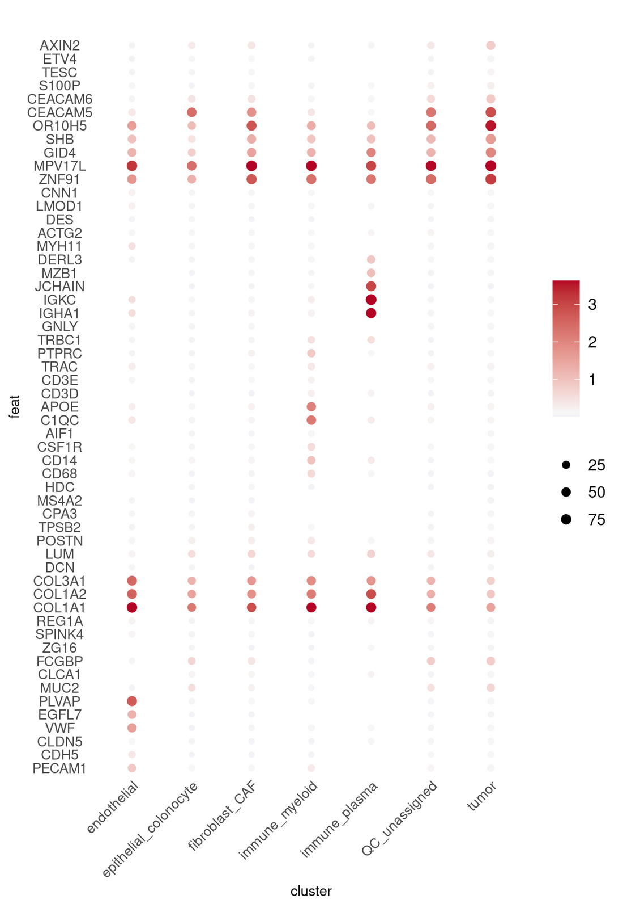

``` r

top2_markers <- unique(markers_de[order(cluster, -logFC)][
  , head(.SD, 2), by = cluster]$feats)

MARKERS <- c("IGKC",    # plasma cell
             "COL1A1",  # fibroblast / CAF
             "PLVAP",   # blood endothelium
             "APOE")    # macrophage
stopifnot(all(MARKERS %in% rownames(expr_norm)))

plotMetaDataHeatmap(mini_cosmx, metadata_cols = "cell_type_broad",
                    selected_feats = top2_markers,
                    expression_values = "normalized",
                    show_values = "zscores_rescaled", x_text_angle = 45)
```

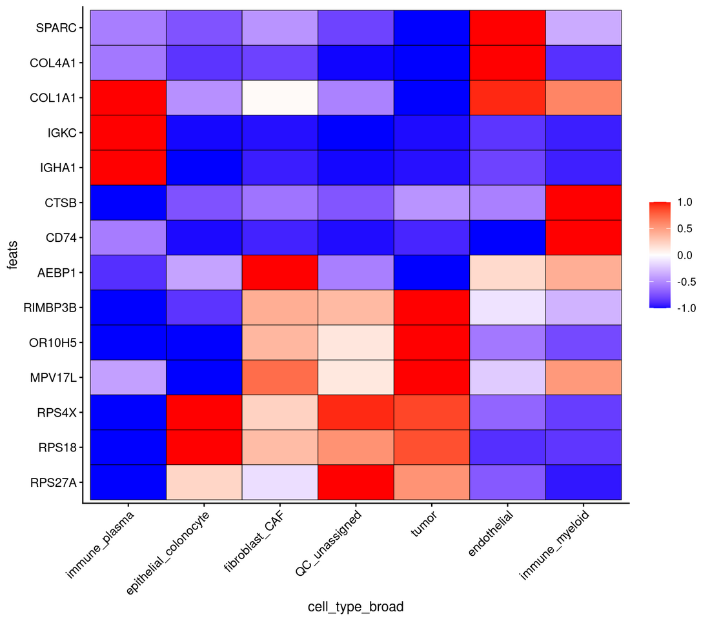

``` r

violinPlot(mini_cosmx, feats = MARKERS, cluster_column = "cell_type_broad",
           expression_values = "normalized", strip_text = 7,
           axis_text_x_size = 7)
```

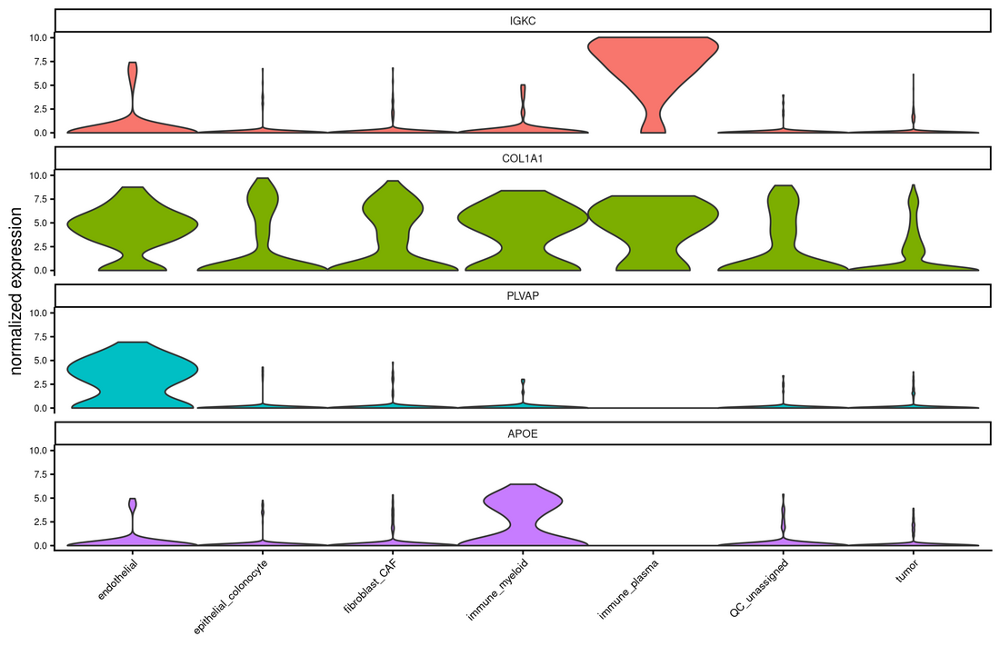

``` r

dimFeatPlot2D(mini_cosmx, expression_values = "normalized",
              feats = MARKERS, dim_reduction_to_use = "umap",
              point_size = 1, cow_n_col = 2)
```

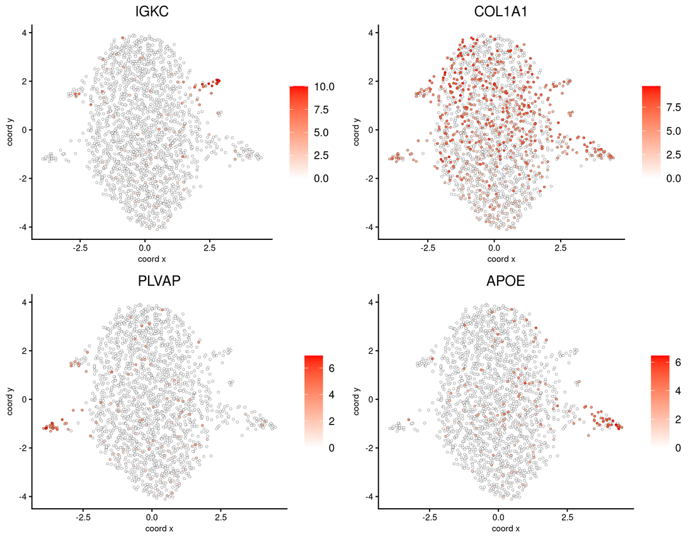

## 10 Spatial visualization

``` r

plotUMAP(mini_cosmx, cell_color = "cell_type_broad",
         cell_color_code = CELL_TYPE_COLORS,
         point_size = 0.9, point_alpha = 0.7,
         point_shape = "border", point_border_stroke = 0,
         show_center_label = TRUE, label_size = 3.1)
```

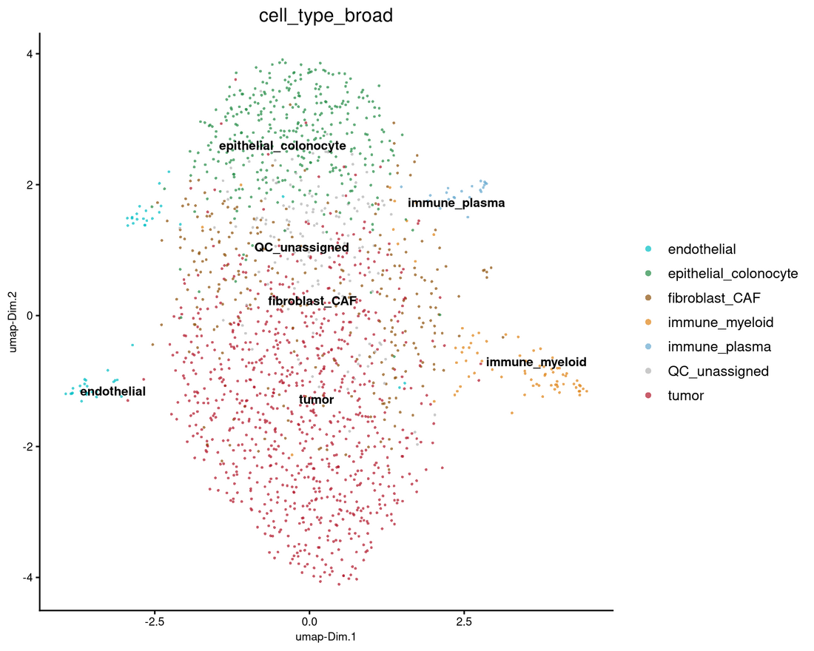

``` r

spatInSituPlotPoints(mini_cosmx,
                     polygon_feat_type = "cell",
                     show_polygon = TRUE, polygon_fill = "cell_type_broad",
                     polygon_fill_as_factor = TRUE,
                     polygon_fill_code = CELL_TYPE_COLORS,
                     polygon_color = "gray25", polygon_line_size = 0.05,
                     background_color = "white")
```

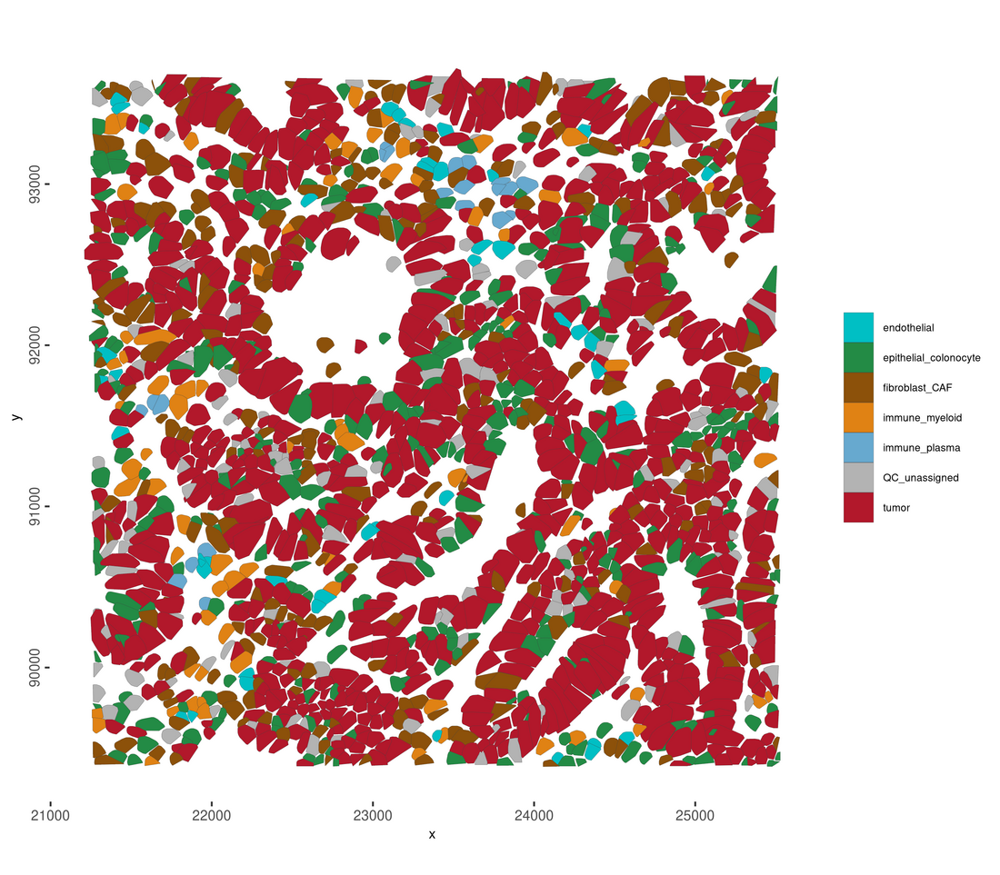

The clustering never saw spatial information, so the tissue architecture
in this panel is an independent check on it.

``` r

cell_type_plots <- lapply(CELL_TYPES, function(cell_type)
  spatPlot2D(mini_cosmx, cell_color = "cell_type_broad",
             cell_color_code = CELL_TYPE_COLORS,
             select_cell_groups = cell_type, show_other_cells = TRUE,
             other_cell_color = "lightgrey", other_point_size = 0.6,
             point_size = 0.6, point_shape = "no_border",
             coord_fix_ratio = 1, show_legend = FALSE, title = cell_type,
             background_color = "white",
             show_plot = FALSE, return_plot = TRUE, save_plot = FALSE))
p_facets <- plot_grid(plotlist = cell_type_plots, ncol = 5)
GiottoVisuals::all_plots_save_function(mini_cosmx, p_facets,
                                       default_save_name = "spatPlot2D",
                                       base_width = 11, base_height = 7)
print(p_facets)
```

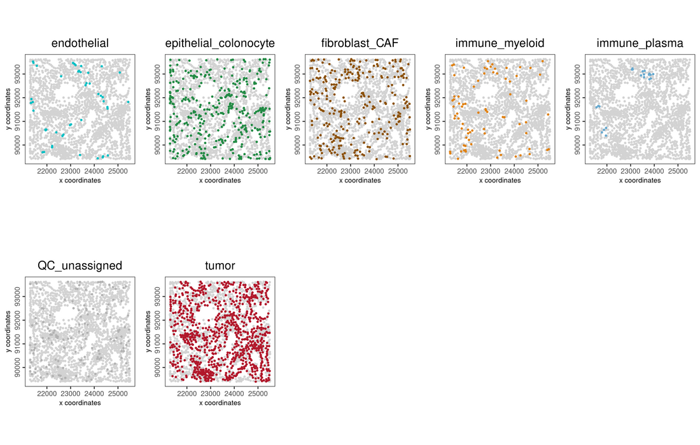

``` r

marker_plots <- lapply(head(MARKERS, 2), function(gene)
  spatInSituPlotPoints(mini_cosmx, polygon_feat_type = "cell",
                       show_polygon = TRUE, polygon_fill = gene,
                       polygon_fill_as_factor = FALSE,
                       polygon_fill_gradient_style = "sequential",
                       polygon_color = "gray45", polygon_line_size = 0.05,
                       background_color = "white",
                       show_plot = FALSE, return_plot = TRUE,
                       save_plot = FALSE))
p_spat_feats <- plot_grid(plotlist = marker_plots, nrow = 1)
GiottoVisuals::all_plots_save_function(mini_cosmx, p_spat_feats,
                                       default_save_name = "spatInSituPlotPoints",
                                       base_width = 11, base_height = 5)
print(p_spat_feats)
```

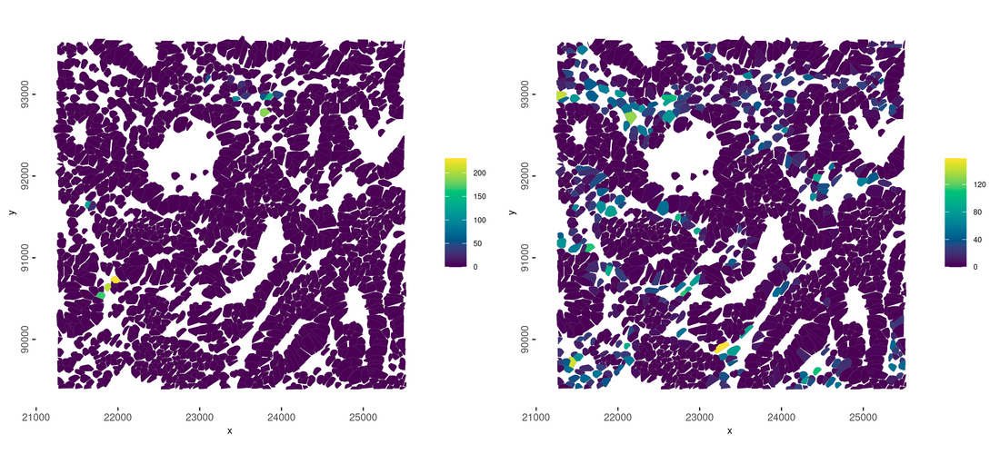

## 11 Transcripts in place

``` r

spatInSituPlotPoints(mini_cosmx,
                     feats = list(rna = c("EPCAM", "PLVAP", "IGKC")),
                     feat_type = "rna",
                     feats_color_code = c(EPCAM = "#FF77E9",
                                          PLVAP = "#A64DFF",
                                          IGKC  = "#00E64D"),
                     plot_last = "points",
                     polygon_feat_type = "cell", show_polygon = TRUE,
                     polygon_fill = "cell_type_broad",
                     polygon_fill_as_factor = TRUE,
                     polygon_fill_code = CELL_TYPE_COLORS, polygon_alpha = 1,
                     polygon_color = "gray35", polygon_line_size = 0.05,
                     point_size = 0.55, background_color = "white")
```

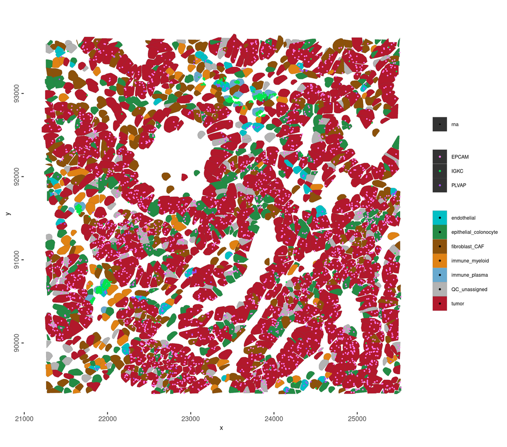

## 12 Spatial expression patterns

A Delaunay network over the cell centroids, then
[`binSpect()`](https://giottosuite.com/dev/reference/binSpect.md): each
gene’s expression is binarized and tested for whether the high cells are
neighbors more often than chance.

``` r

mini_cosmx <- createSpatialNetwork(mini_cosmx, name = "Delaunay_network",
                                   method = "Delaunay", minimum_k = 2,
                                   maximum_distance_delaunay = 50,
                                   verbose = FALSE)

# restricted to the highly variable features; the full panel is 18,505 genes
hvf_genes    <- fDataDT(mini_cosmx)[hvf == "yes", feat_ID]
binspect_res <- binSpect(mini_cosmx, subset_feats = hvf_genes, verbose = FALSE)

spatial_genes <- binspect_res[score >= 30 & adj.p.value <= 0.05, feats]

head(binspect_res[, .(feats, score, adj.p.value)], 5)
length(spatial_genes)
```

| feats   |      score | adj.p.value |
|:--------|-----------:|------------:|
| IGKC    | 11521.2360 |           0 |
| IGHA1   |  1543.5242 |           0 |
| IGFBP7  |   466.1884 |           0 |
| LUM     |   416.3125 |           0 |
| COL12A1 |   305.0607 |           0 |

    ## [1] 65

``` r

spatFeatPlot2D(mini_cosmx, expression_values = "normalized",
               feats = binspect_res$feats[1:6],
               point_shape = "no_border", point_size = 0.6,
               cow_n_col = 3, gradient_style = "sequential")
```

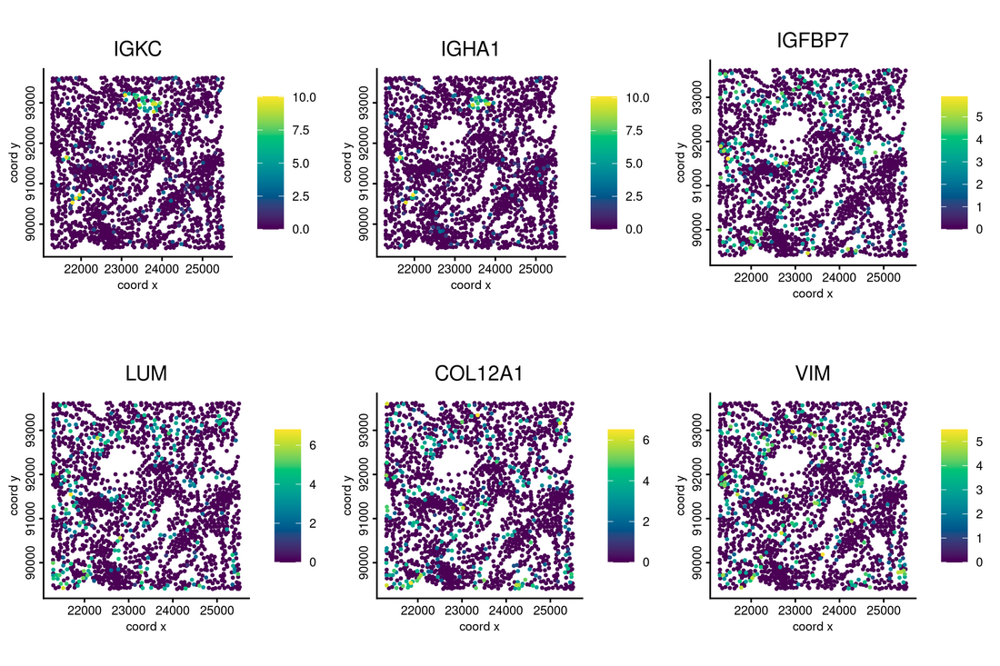

``` r

spat_cor <- detectSpatialCorFeats(mini_cosmx, method = "network",
                                  spatial_network_name = "Delaunay_network",
                                  subset_feats = spatial_genes,
                                  expression_values = "normalized")

# k = 6 was chosen by eye, not optimized
spat_cor <- clusterSpatialCorFeats(spat_cor, name = "spat_netw_clus", k = 6)
```

``` r

heatmSpatialCorFeats(mini_cosmx, spatCorObject = spat_cor,
                     use_clus_name = "spat_netw_clus",
                     col = circlize::colorRamp2(c(-0.12, 0.08, 0.5),
                                                c("#3B4CC0", "white", "#B40426")))
```

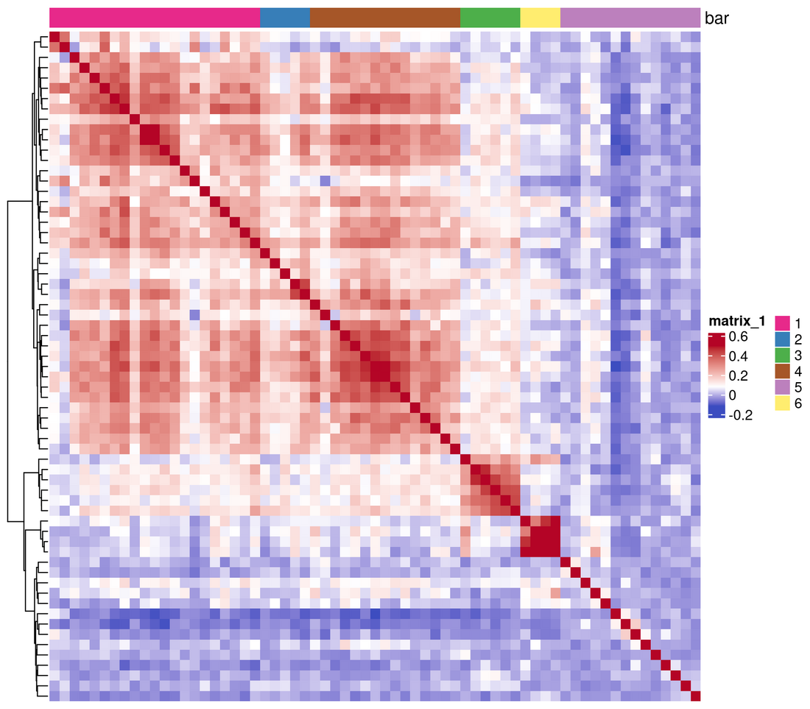

``` r

spat_modules <- spat_cor[["cor_clusters"]][["spat_netw_clus"]]
module_genes <- data.table(module = as.integer(spat_modules),
                           gene   = names(spat_modules))
module_genes[, .(n_genes = .N, genes = paste(gene, collapse = ", ")),
             by = module][order(module)]
```

| module | n_genes | genes |
|---:|---:|:---|
| 1 | 21 | A2M, BGN, C11orf96, C1R, CALD1, COL15A1, COL4A2, EMILIN1, FBN1, FNDC1, FSTL1, IGFBP3, IGFBP5, IGFBP7, LAMA4, PLVAP, SPARCL1, SULF1, TIMP3, VIM, WNT5A |
| 2 | 5 | ACTA2, CCN1, CCN2, PLAU, TAGLN |
| 3 | 6 | C1QC, HLA-DRA, HLA-DRB1, RGS1, RNASE1, SPP1 |
| 4 | 15 | C1S, CDH11, COL12A1, COL5A1, COL6A1, F3, FBLN1, HTRA3, LUM, MMP2, PODN, POSTN, SPON2, TNC, VCAN |
| 5 | 14 | EMP1, HIGD2B, IFNA16, IGHM, IL13RA2, KATNAL1, LIPN, MAB21L4, MMP7, MSTN, OLFM4, PI3, TBX22, XPNPEP2 |
| 6 | 4 | IGHA1, IGKC, JCHAIN, PRMT8 |

## 13 Spatial neighborhood composition

``` r

proximity <- cellProximityEnrichment(
  mini_cosmx, cluster_column = "cell_type_broad",
  spatial_network_name = "Delaunay_network",
  number_of_simulations = 200, set_seed = TRUE, seed_number = SEED)
```

``` r

cellProximityBarplot(mini_cosmx, CPscore = proximity, min_orig_ints = 1,
                     min_sim_ints = 1, p_val = 0.01)
```

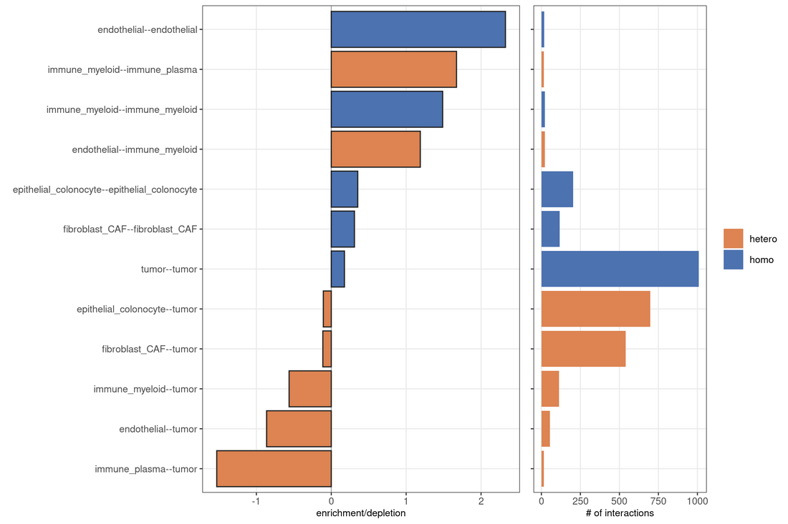

``` r

cellProximityHeatmap(mini_cosmx, CPscore = proximity, order_cell_types = TRUE,
                     scale = TRUE)
```

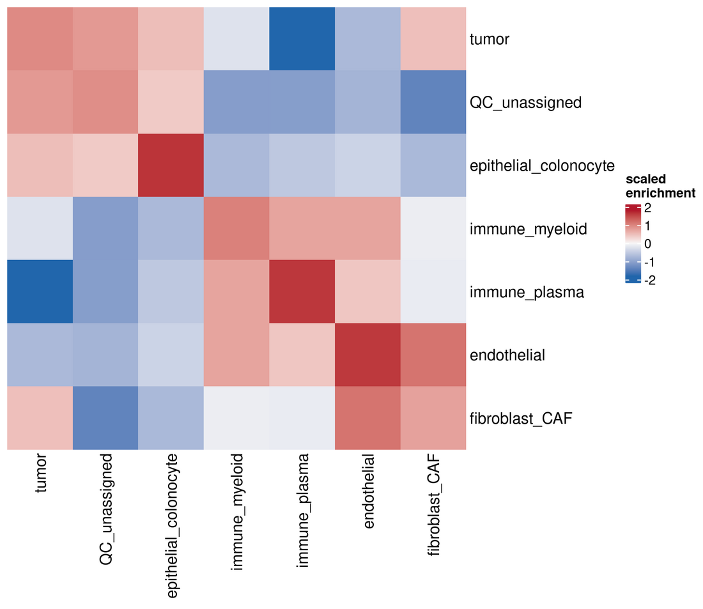

The heatmap shows every pair at once, so the self-association above
appears as a bright diagonal; off-diagonal warmth marks types that
interleave, and cool off-diagonal cells mark compartments that exclude
one another.

``` r

cellProximityNetwork(mini_cosmx, CPscore = proximity, remove_self_edges = TRUE,
                     only_show_enrichment_edges = FALSE, node_size = 4,
                     node_text_size = 5)
```

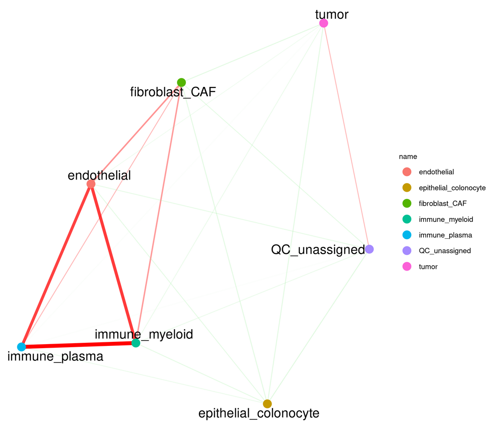

Edge thickness scales with the size of the score and edge color gives
its sign: red where a pair is found together more often than chance,
light green where it is found together less. Dropping the diagonal makes
chains of mutually adjacent cell types easier to see than isolated
pairs.

## 14 Saving the object

[`saveGiotto()`](https://giotto-suite.github.io/GiottoClass/reference/saveGiotto.html)
writes a whole Giotto project (the object, its expression and its
spatial subobjects) into one self-contained directory, which
[`loadGiotto()`](https://giotto-suite.github.io/GiottoClass/reference/loadGiotto.html)
reads back later as the same object.

``` r

saveGiotto(gobject            = mini_cosmx,
           foldername         = "mini_cosmx_object",
           dir                = results_folder,
           include_feat_coord = FALSE,  # drops the transcript coordinates:
                                        # a fast, small in-memory save with
                                        # no GiottoDisk backend needed
           overwrite          = TRUE)
```

## 15 Session information

``` r

sessionInfo()
```

    ## R version 4.5.2 (2025-10-31)
    ## Platform: x86_64-pc-linux-gnu
    ## Running under: AlmaLinux 8.10 (Cerulean Leopard)
    ## 
    ## Matrix products: default
    ## BLAS/LAPACK: FlexiBLAS NETLIB;  LAPACK version 3.12.0
    ## 
    ## locale:
    ##  [1] LC_CTYPE=en_US.UTF-8       LC_NUMERIC=C              
    ##  [3] LC_TIME=en_US.UTF-8        LC_COLLATE=en_US.UTF-8    
    ##  [5] LC_MONETARY=en_US.UTF-8    LC_MESSAGES=en_US.UTF-8   
    ##  [7] LC_PAPER=en_US.UTF-8       LC_NAME=C                 
    ##  [9] LC_ADDRESS=C               LC_TELEPHONE=C            
    ## [11] LC_MEASUREMENT=en_US.UTF-8 LC_IDENTIFICATION=C       
    ## 
    ## time zone: America/New_York
    ## tzcode source: system (glibc)
    ## 
    ## attached base packages:
    ## [1] stats     graphics  grDevices utils     datasets  methods   base     
    ## 
    ## other attached packages:
    ## [1] cowplot_1.2.0        ggplot2_4.0.2        data.table_1.18.4   
    ## [4] GiottoData_0.3.7     GiottoVisuals_0.2.16 Giotto_4.3.0        
    ## [7] GiottoClass_0.7.2   
    ## 
    ## loaded via a namespace (and not attached):
    ##   [1] RColorBrewer_1.1-3          shape_1.4.6.1              
    ##   [3] jsonlite_2.0.0              magrittr_2.0.5             
    ##   [5] magick_2.9.0                farver_2.1.2               
    ##   [7] rmarkdown_2.30              GlobalOptions_0.1.2        
    ##   [9] ragg_1.5.0                  vctrs_0.7.1                
    ##  [11] Cairo_1.7-0                 memoise_2.0.1              
    ##  [13] GiottoUtils_0.2.7           terra_1.8-93               
    ##  [15] htmltools_0.5.9             S4Arrays_1.10.1            
    ##  [17] BiocNeighbors_2.4.0         SparseArray_1.10.8         
    ##  [19] sass_0.4.10                 parallelly_1.47.0          
    ##  [21] bslib_0.10.0                htmlwidgets_1.6.4          
    ##  [23] plotly_4.12.0               cachem_1.1.0               
    ##  [25] igraph_2.2.1                iterators_1.0.14           
    ##  [27] lifecycle_1.0.5             pkgconfig_2.0.3            
    ##  [29] rsvd_1.0.5                  Matrix_1.7-4               
    ##  [31] R6_2.6.1                    fastmap_1.2.0              
    ##  [33] clue_0.3-66                 MatrixGenerics_1.22.0      
    ##  [35] future_1.70.0               digest_0.6.39              
    ##  [37] colorspace_2.1-2            S4Vectors_0.48.0           
    ##  [39] dqrng_0.4.1                 RSpectra_0.16-2            
    ##  [41] irlba_2.3.7                 textshaping_1.0.4          
    ##  [43] GenomicRanges_1.62.1        beachmat_2.26.0            
    ##  [45] labeling_0.4.3              progressr_0.18.0           
    ##  [47] httr_1.4.8                  polyclip_1.10-7            
    ##  [49] abind_1.4-8                 compiler_4.5.2             
    ##  [51] doParallel_1.0.17           withr_3.0.2                
    ##  [53] S7_0.2.1                    backports_1.5.0            
    ##  [55] BiocParallel_1.44.0         viridis_0.6.5              
    ##  [57] ggforce_0.5.0               R.utils_2.13.0             
    ##  [59] MASS_7.3-65                 rappdirs_0.3.4             
    ##  [61] DelayedArray_0.36.0         rjson_0.2.23               
    ##  [63] bluster_1.20.0              gtools_3.9.5               
    ##  [65] tools_4.5.2                 otel_0.2.0                 
    ##  [67] future.apply_1.20.0         R.oo_1.27.1                
    ##  [69] glue_1.8.0                  dbscan_1.2.4               
    ##  [71] grid_4.5.2                  checkmate_2.3.4            
    ##  [73] cluster_2.1.8.3             generics_0.1.4             
    ##  [75] gtable_0.3.6                R.methodsS3_1.8.2          
    ##  [77] tidyr_1.3.2                 BiocSingular_1.26.1        
    ##  [79] tidygraph_1.3.1             ScaledMatrix_1.18.0        
    ##  [81] metapod_1.18.0              XVector_0.50.0             
    ##  [83] BiocGenerics_0.56.0         foreach_1.5.2              
    ##  [85] ggrepel_0.9.6               pillar_1.11.1              
    ##  [87] limma_3.66.0                circlize_0.4.16            
    ##  [89] dplyr_1.2.0                 tweenr_2.0.3               
    ##  [91] lattice_0.22-7              deldir_2.0-4               
    ##  [93] tidyselect_1.2.1            ComplexHeatmap_2.26.1      
    ##  [95] SingleCellExperiment_1.32.0 locfit_1.5-9.12            
    ##  [97] scuttle_1.20.0              knitr_1.51                 
    ##  [99] gridExtra_2.3               IRanges_2.44.0             
    ## [101] Seqinfo_1.0.0               edgeR_4.8.2                
    ## [103] SummarizedExperiment_1.40.0 scattermore_1.2            
    ## [105] stats4_4.5.2                xfun_0.56                  
    ## [107] graphlayouts_1.2.3          Biobase_2.70.0             
    ## [109] statmod_1.5.1               matrixStats_1.5.0          
    ## [111] lazyeval_0.2.2              yaml_2.3.12                
    ## [113] evaluate_1.0.5              codetools_0.2-20           
    ## [115] ggraph_2.2.2                tibble_3.3.1               
    ## [117] colorRamp2_0.1.0            cli_3.6.6                  
    ## [119] uwot_0.2.4                  reticulate_1.45.0          
    ## [121] systemfonts_1.3.1           jquerylib_0.1.4            
    ## [123] dichromat_2.0-0.1           Rcpp_1.1.1-1.1             
    ## [125] globals_0.19.1              png_0.1-8                  
    ## [127] parallel_4.5.2              scran_1.38.1               
    ## [129] sparseMatrixStats_1.22.0    listenv_0.10.1             
    ## [131] SpatialExperiment_1.20.0    viridisLite_0.4.3          
    ## [133] scales_1.4.0                crayon_1.5.3               
    ## [135] purrr_1.2.1                 GetoptLong_1.0.5           
    ## [137] rlang_1.2.0
