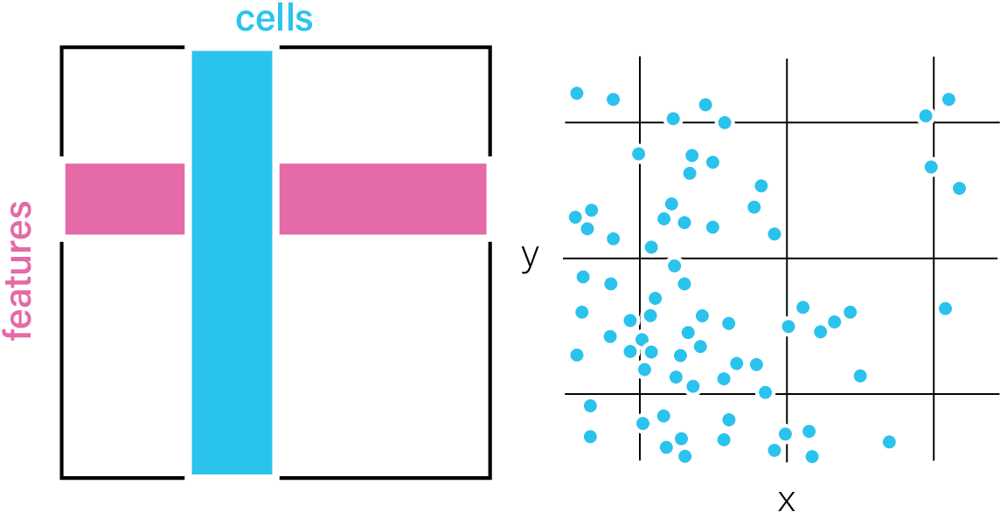
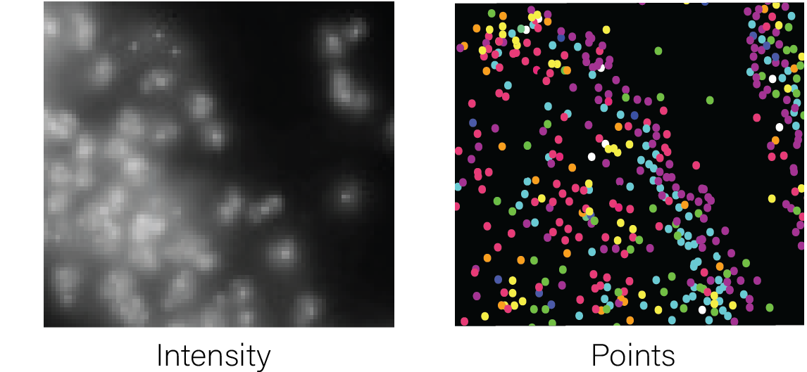
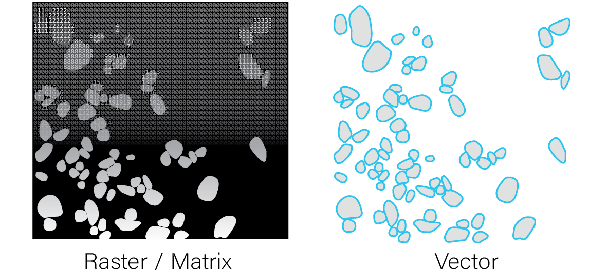
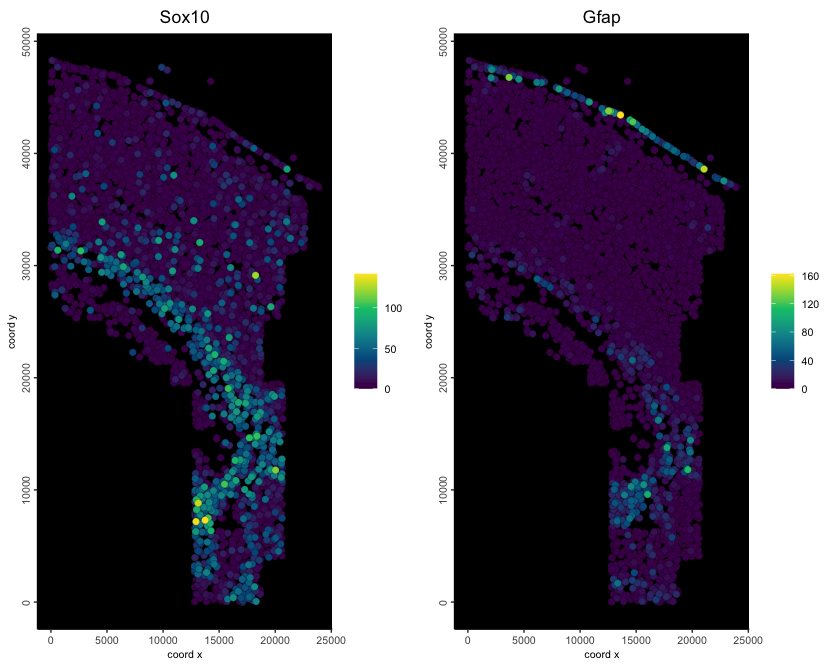
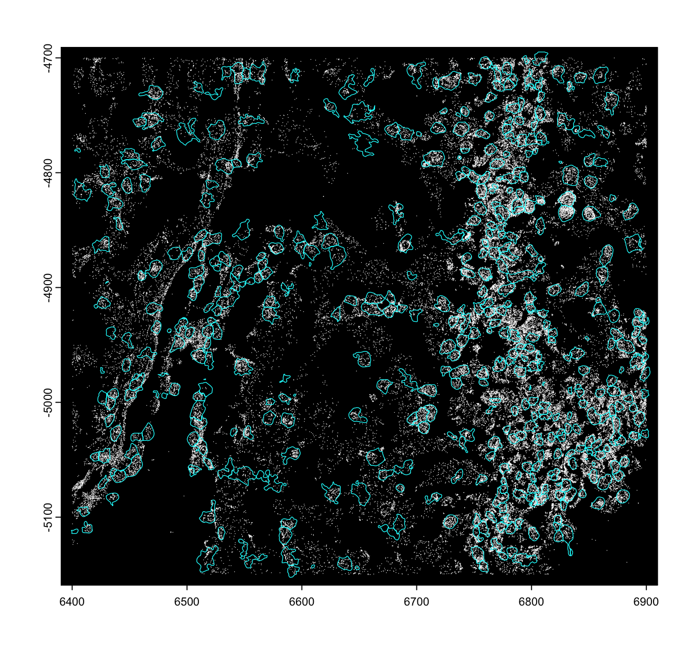
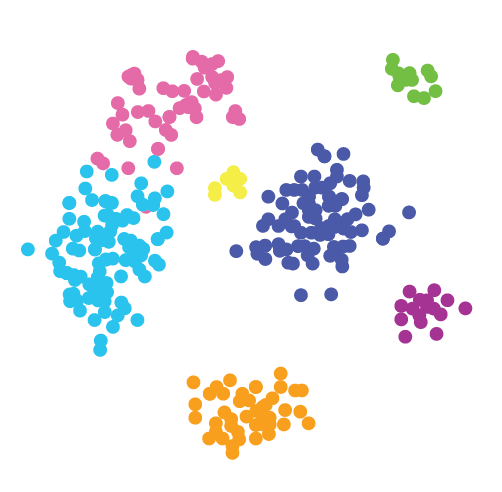

# Giotto Object Creation

## Spatial Omic Datatypes

Spatial omics data can be provided either as aggregated data or raw
features information.

  

Aggregated Data

Feature information that has been calculated for a particular set of
spatial locations.  
These are commonly presented as an expression matrix paired with a set
of xy(z) coordinates in tabular or matrix format.

Raw Features

Feature information about the tissue that has not been aggregated. These
features can be paired with a spatial unit to enable aggregate
data-based analyses.  
Raw features can include molecule detections with an ID and xy(z)
coordinates in tabular format (e.g., transcripts), or a matrix of
intensity values, typically in image format.

Spatial Unit

Spatial units provide functional context to raw features, allowing them
to be aggregated and treated as units of study. These can be artificial
(e.g., spatial bins), biological (e.g., cell or nuclear segmentations),
or technical (e.g., arrays of spots reflecting the assay’s
construction).  
Annotations can either be provided as 2D raster image/matrix-like format
where the integer values of matrix cells or raster pixels both identify
and define the region covered by each annotation, or as a vector-type
format where the vertices of the polygons are provided.

Raw features and spatial units can be combined to generate aggregated
datasets, but the reverse transformation is generally not possible.

**See also:** [feature
aggregation](https://giottosuite.com/dev/articles/feature_aggregation.md)

  
  

## Creating a Spatial-Omics Giotto Analysis Object

Giotto Suite can work with any of the above types of spatial omic data,
and has the flexibility to handle multiple of these modalities when the
data is available. See the following for instructions on setting up a
custom `giotto` object with the respective input data.

**Matrix and Spatial Locations**

**Feature detection (points) and cell annotations (vector polygons)**

**Staining images and cell annotations (raster mask/polygons)**

## Other Datatypes and Methods

[**Single Cell
Datasets**](https://giottosuite.com/dev/articles/obj_create_sc.md)[**Generic
Piecewise Giotto Object
Assembly**](https://giottosuite.com/dev/articles/obj_create_mod.md)

## Convenience functions for specific platforms

There are also several convenience functions we provide for loading in
data from popular platforms. These functions take care of reading the
expected output folder structures, auto-detecting where needed data
items are, formatting items for ingestion, then object creation. These
technologies also have expanded tutorials under the examples tab.

    createGiottoVisiumObject()
    createGiottoVisiumHDObject()
    createGiottoXeniumObject()
    createGiottoCosMxObject()

## Customizing the Giotto Object

By providing values to other
[`createGiottoObject()`](https://giotto-suite.github.io/GiottoClass/reference/create_giotto.html)
or
[`createGiottoObjectSubcellular()`](https://giotto-suite.github.io/GiottoClass/reference/create_giotto.html)
parameters, it is possible to add:

- **Cell** or **feature (gene) metadata**: see
  [addCellMetadata](https://giotto-suite.github.io/GiottoClass/reference/addCellMetadata.html)
  and
  [addFeatMetadata](https://giotto-suite.github.io/GiottoClass/reference/addFeatMetadata.html)
- **Spatial networks** or **grids**: see
  [Visualizations](https://giottosuite.com/dev/articles/visualizations.md)
- **Dimension reduction**: see
  [Clustering](https://giottosuite.com/dev/articles/dimension_reduction.md)
- **Images**: see
  [createGiottoLargeImage](https://giotto-suite.github.io/GiottoClass/reference/createGiottoLargeImage.html)
- **giottoInstructions**: see [Create and change Giotto
  instructions](https://giottosuite.com/dev/articles/instructions.md)

For a more in-depth look at the `giotto` object structure, take a look
at the [introduction to giotto
classes](https://giottosuite.com/dev/articles/structure.md)
