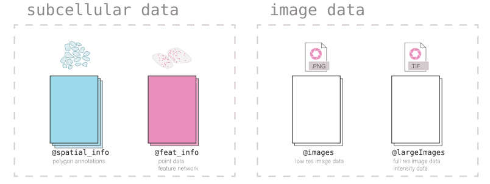
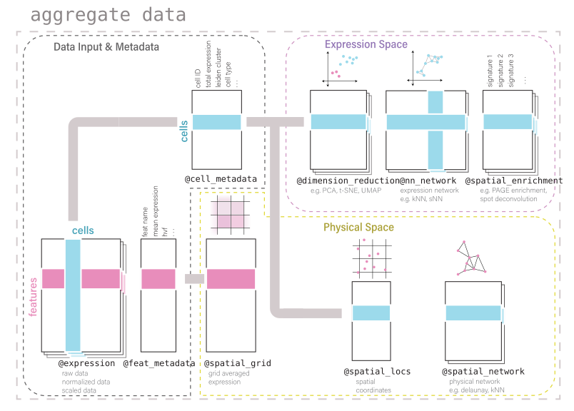

# An introduction to the Giotto Suite classes

*Giotto* is a technique-agnostic framework and toolbox for spatial-omic
analysis. Its structure and classes are designed to be flexible,
intuitive, and readable. The framework supports working with both
aggregate (cell x count) and un-aggregated spatial data where the
polygon annotations are separate from the spatial expression data.

## 1 Giotto Object Structure

Usage of the *Giotto* package revolves around the `giotto` object. This
is an S4 class that holds spatial expression data and facilitates its
manipulation and visualization with the *Giotto* package”s functions.
Additional metadata and other outputs generated from certain functions,
which may be used in downstream analyses, are also be stored within the
`giotto` object. Its self-contained nature provides a convenient
representation of the entire spatial experiment and is why most *Giotto*
functions take a given `giotto` object as input and return a `giotto`
object as output.

Data is organized within the `giotto` object in defined `slots` as
described in the diagram below.



## 2 Nested Organization of the Giotto Object

Biology happens across multiple scales of size and types of modalities.
While it is possible to simply generate a new object for each
combination of the two, the fact that data from most spatial methods are
both high resolution and spatially contiguous, requires a more flexible
approach that permits the coexistence of multiple spatial units within
the same object. This allows the user to define the spatial unit(s) of
biology that are most relevant to the analysis and re-aggregate the
feature information to those units.

With this organization it is convenient to compare expression across
different spatial units. Additionally, by determining spatial overlaps
between these spatial units, it becomes possible to represent the
hierarchical organization of biological subunits and make queries using
it.

### 2.1 Spatial unit and feature type

To accommodate this complexity, information is subnested within many of
the `giotto` object”s slots first by `spat_unit` (spatial unit) and then
by `feat_type` (feature type). This structurally separates each set of
information within *Giotto*”s framework so that there is minimal
ambiguity.

A summary of what information the object contains can be viewed by
directly returning it.

``` r

library(Giotto)
library(data.table)

vizmini <- GiottoData::loadGiottoMini("vizgen")
```

``` r

vizmini
```

Included below is a description of the `giotto` object subnesting for
each data slot and also the accessor functions for setting and getting
information from them.

| Slot | Nested | Example | Internal Accessors |
|----|----|----|----|
| **@expression** | spat_unit - |  | getExpression() |
|  | feat_type - | cell - rna - raw | setExpression() |
|  | name |  |  |
| ————————— | ———————— | ———————————- | ————————- |
| **@cell_metadata** | spat_unit - | cell - rna | getCellMetadata() |
|  | feat_type |  | setCellMetadata() |
| ————————— | ———————— | ———————————- | ————————- |
| **@feat_metadata** | spat_unit - | cell - rna | getFeatMetadata() |
|  | feat_type |  | setFeatMetadata() |
| ————————— | ———————— | ———————————- | ————————- |
| **@spatial_grid** | spat_unit - | grid- grid | getSpatialGrid() |
|  | name |  | setSpatialGrid() |
| ————————— | ———————— | ———————————- | ————————- |
| **@dimension_reduction** | approach - |  |  |
|  | spat_unit - |  | getDimReduction() |
|  | feat_type - | cells - cell - rna - pca - pca | setDimReduction() |
|  | method - |  |  |
|  | name |  |  |
| ————————— | ———————— | ———————————- | ————————- |
| **@multiomics** | spat_unit - |  |  |
|  | feat_type - | cell - rna-protein - WNN - theta_weighted_matrix | getMultiomics() |
|  | method - |  | setMultiomics() |
|  | name |  |  |
| ————————— | ———————— | ———————————- | ————————- |
| **@nn_network** | spat_unit- |  | getNearestNetwork() |
|  | method - | cell - sNN - sNN_results1 | setNearestNetwork() |
|  | name |  |  |
| ————————— | ———————— | ———————————- | ————————- |
| **@spatial_enrichment** | spat_unit - |  | getSpatialEnrichment() |
|  | feat_type - | cell - rna - results1 | setSpatialEnrichment() |
|  | name |  |  |
| ————————— | ———————— | ———————————- | ————————- |
| **@spatial_info** | spat_unit | cell | getPolygonInfo() |
|  |  |  | setPolygonInfo() |
| ————————— | ———————— | ———————————- | ————————- |
| **@spatial_locs** | spat_unit - | cell - raw | getSpatialLocations() |
|  | name |  | setSpatialLocations() |
| ————————— | ———————— | ———————————- | ————————- |
| **@spatial_network** | spat_unit - | cell - Delaunay_network1 | getSpatialNetwork() |
|  | name |  | setSpatialNetwork() |
| ————————— | ———————— | ———————————- | ————————- |
| **@feat_info** | feat_type | rna | getFeatureInfo() |
|  |  |  | setFeatureInfo() |
| ————————— | ———————— | ———————————- | ————————- |
| **@images** | name | image | getGiottoImage() |
|  |  |  | setGiottoImage() |
| ————————— | ———————— | ———————————- | ————————- |
| **@largeImages** | name | image | getGiottoImage() |
|  |  |  | setGiottoImage() |
| ————————— | ———————— | ———————————- | ————————- |
| **@instructions** |  |  | instructions() |
| ————————— | ———————— | ———————————- | ————————- |

### 2.2 Show and list functions

Show and list functions are also provided for determining what
information exists within each of these slots and its nesting.

- `show` functions print a preview of all the data within the slot, but
  do not return information

``` r

showGiottoSpatLocs(vizmini)
```

``` r

list_expression(vizmini)
```

``` r

# Find specific spat_unit objects #
list_expression(vizmini, 
                spat_unit = "z0")
```

- `list names` (internal) functions return a `vector` of object names at
  the specified nesting

``` r

list_expression_names(vizmini, 
                      spat_unit = "z1", 
                      feat_type = "rna")
```

### 2.3 Provenance

Going further, sometimes different sources of information can be used
when aggregating to a particular spatial unit. This is most easily shown
with the subcellular datasets from the Vizgen MERSCOPE platform which
provide both feature polygon information for multiple confocal planes
within a tissue. The aggregated information produced then could be drawn
from different z-planes or combinations thereof. Giotto tracks this
provenance information for each set of aggregated data.

``` r

expr_mat <- getExpression(vizmini, 
                          spat_unit = "aggregate")

prov(expr_mat)
```

## 3 Giotto subobjects

*Giotto* 3.0 update introduced S4 subobjects that are used within the
`giotto` object and its processing. These subobjects provide more
formalized definitions for what information and formatting is needed in
each of the `giotto` object slots in order for it to be functional.
These objects are standalone and extensible and commonly used spatial
manipulation and plotting methods are being implemented for them.

In addition, these subobjects carry several pieces of metadata in
additional slots alongside the main information (e.g. also slots for
`spat_unit` and `feat_type` alongside the `exprDT` slot for the
`exprObj` S4). This makes it so that nesting information is retained
when they are taken out of the `giotto` object and that nesting
information does not need to be supplied anymore when interacting with
the `setter` functions.

`getter` functions now have an `output` param that **defaults** to
extracting the information from the `giotto` object as the S4 subobject.
When extracting information that will be modified and then returned to
the `giotto` object, it is preferred that the information is extracted
as the S4 both so that tagged information is not lost, and because it is
convenient to work with the S4”s main data slot through the `[` and
`[<-` generics (see Section 3.5).

### 3.1 Creating an S4 subobject

#### 3.1.1 Constructors

For directly creating a subobject, constructor functions can be used.

constructors

[`createExprObj()`](https://giotto-suite.github.io/GiottoClass/reference/createExprObj.html)
[`createCellMetaObj()`](https://giotto-suite.github.io/GiottoClass/reference/createCellMetaObj.html)
[`createFeatMetaObj()`](https://giotto-suite.github.io/GiottoClass/reference/createFeatMetaObj.html)
[`createDimObj()`](https://giotto-suite.github.io/GiottoClass/reference/createDimObj.html)
[`createNearestNetObj()`](https://giotto-suite.github.io/GiottoClass/reference/createNearestNetObj.html)
[`createSpatLocsObj()`](https://giotto-suite.github.io/GiottoClass/reference/createSpatLocsObj.html)
[`createSpatNetObj()`](https://giotto-suite.github.io/GiottoClass/reference/createSpatNetObj.html)
[`createSpatEnrObj()`](https://giotto-suite.github.io/GiottoClass/reference/createSpatEnrObj.html)
[`createSpatialGrid()`](https://giotto-suite.github.io/GiottoClass/reference/createSpatialGrid.html)
[`createGiottoPoints()`](https://giotto-suite.github.io/GiottoClass/reference/createGiottoPoints.html)
[`createGiottoPolygonsFromDfr()`](https://giotto-suite.github.io/GiottoClass/reference/createGiottoPolygon.html)
[`createGiottoPolygonsFromMask()`](https://giotto-suite.github.io/GiottoClass/reference/createGiottoPolygon.html)
[`createGiottoImage()`](https://giotto-suite.github.io/GiottoClass/reference/createGiottoImage.html)
[`createGiottoLargeImage()`](https://giotto-suite.github.io/GiottoClass/reference/createGiottoLargeImage.html)

``` r

coords <- data.table(
  sdimx = c(1,2,3),
  sdimy = c(1,2,3),
  cell_ID = c("A","B","C")
)

st <- createSpatLocsObj(name = "test",
                        spat_unit = "cell",
                        coordinates = coords,
                        provenance = "cell")
```

There are non numeric or integer columns for the spatial location input
at column position(s): 3 The first non-numeric column will be considered
as a cell ID to test for consistency with the expression matrix. Other
non numeric columns will be removed

``` r

print(st)
```

#### 3.1.2 Readers

Alternatively, read functions can be used to take named nested lists of
raw data input and convert them to lists of subobjects which are
directly usable by the setter functions.

readers

[`readPolygonData()`](https://giotto-suite.github.io/GiottoClass/reference/readPolygonData.html)
[`readFeatData()`](https://giotto-suite.github.io/GiottoClass/reference/readFeatData.html)
[`readExprData()`](https://giotto-suite.github.io/GiottoClass/reference/readExprData.html)
[`readCellMetadata()`](https://giotto-suite.github.io/GiottoClass/reference/readCellMetadata.html)
[`readFeatMetadata()`](https://giotto-suite.github.io/GiottoClass/reference/readFeatMetadata.html)
[`readSpatLocsData()`](https://giotto-suite.github.io/GiottoClass/reference/readSpatLocsData.html)
[`readSpatNetData()`](https://giotto-suite.github.io/GiottoClass/reference/readSpatNetData.html)
[`readSpatEnrichData()`](https://giotto-suite.github.io/GiottoClass/reference/readSpatEnrichData.html)
[`readDimReducData()`](https://giotto-suite.github.io/GiottoClass/reference/readDimReducData.html)
[`readNearestNetData()`](https://giotto-suite.github.io/GiottoClass/reference/readNearestNetData.html)

``` r

st2 <- readSpatLocsData(list(cell2 = list(test1 = coords,
                                         test2 = coords)))
```

There are non numeric or integer columns for the spatial location input
at column position(s): 3. The first non-numeric column will be
considered as a cell ID to test for consistency with the expression
matrix. Other non numeric columns will be removed

There are non numeric or integer columns for the spatial location input
at column position(s): 3. The first non-numeric column will be
considered as a cell ID to test for consistency with the expression
matrix. Other non numeric columns will be removed

``` r

st2
```

### 3.2 Giotto Accessors

*Giotto* provides `getter` and `setter` functions for manually accessing
the information contained within the `giotto` object. Note that the
`setters` require that the data be provided as compatible S4 subobjects
or lists thereof. External data can read into the appropriate formats
using the above `reader` functions. The `getter` functions return S4
subobjects by default.

getters

[`getExpression()`](https://giotto-suite.github.io/GiottoClass/reference/getExpression.html)
[`getCellMetadata()`](https://giotto-suite.github.io/GiottoClass/reference/getCellMetadata.html)
`getFeatMetadata()`
[`getSpatialLocations()`](https://giotto-suite.github.io/GiottoClass/reference/getSpatialLocations.html)
[`getDimReduction()`](https://giotto-suite.github.io/GiottoClass/reference/getDimReduction.html)
[`getNearestNetwork()`](https://giotto-suite.github.io/GiottoClass/reference/getNearestNetwork.html)
[`getSpatialNetwork()`](https://giotto-suite.github.io/GiottoClass/reference/getSpatialNetwork.html)
[`getPolygonInfo()`](https://giotto-suite.github.io/GiottoClass/reference/getPolygonInfo.html)
[`getFeatureInfo()`](https://giotto-suite.github.io/GiottoClass/reference/getFeatureInfo.html)
[`getSpatialEnrichment()`](https://giotto-suite.github.io/GiottoClass/reference/getSpatialEnrichment.html)
[`getGiottoImage()`](https://giotto-suite.github.io/GiottoClass/reference/getGiottoImage.html)

setters

[`setExpression()`](https://giotto-suite.github.io/GiottoClass/reference/setExpression.html)
[`setCellMetadata()`](https://giotto-suite.github.io/GiottoClass/reference/setCellMetadata.html)
[`setFeatureMetadata()`](https://giotto-suite.github.io/GiottoClass/reference/setFeatureMetadata.html)
[`setSpatialLocations()`](https://giotto-suite.github.io/GiottoClass/reference/setSpatialLocations.html)
[`setDimReduction()`](https://giotto-suite.github.io/GiottoClass/reference/setDimReduction.html)
[`setNearestNetwork()`](https://giotto-suite.github.io/GiottoClass/reference/setNearestNetwork.html)
[`setSpatialNetwork()`](https://giotto-suite.github.io/GiottoClass/reference/setSpatialNetwork.html)
[`setPolygonInfo()`](https://giotto-suite.github.io/GiottoClass/reference/setPolygonInfo.html)
[`setFeatureInfo()`](https://giotto-suite.github.io/GiottoClass/reference/setFeatureInfo.html)
[`setSpatialEnrichment()`](https://giotto-suite.github.io/GiottoClass/reference/setSpatialEnrichment.html)
[`setGiottoImage()`](https://giotto-suite.github.io/GiottoClass/reference/setGiottoImage.html)

``` r

expval <- getExpression(vizmini)

expval
```

### 3.3 Get and set S4 spat_unit, feat_type, provenance

[`spatUnit()`](https://giotto-suite.github.io/GiottoClass/reference/giotto_schema.html),
[`featType()`](https://giotto-suite.github.io/GiottoClass/reference/giotto_schema.html),
and
[`prov()`](https://giotto-suite.github.io/GiottoClass/reference/giotto_schema.html)
are replacement functions for tagged spatial unit, feature type, and
provenance information respectively.

``` r

# spat_unit
spatUnit(expval) <- "new_spat"

spatUnit(expval)
```

``` r

# feat_type
featType(expval) <- "new_feat"

featType(expval)
```

``` r

# provenance
prov(expval) <- "cell"

prov(expval)
```

### 3.4 Setting an S4 subobject

The `spat_unit`, `feat_type`, and `name` params no longer need to be
given when setting an S4 subobject with tagged information into a
`giottoObject`. However, if input is given to the `set` function
parameters then it is prioritized over the tagged information and the
tagged information is updated.

``` r

# set exprObj to tagged nesting location
vizmini <- setExpression(vizmini, 
                         expval)
```

``` r

list_expression(vizmini)
```

### 3.5 Working with S4 subobjects

Giotto”s S4 subobjects each wrap one main data object. The empty `[]`
and `[]<-` operators are defined as shorthand for directly accessing
this slot that contains the data. For example, with a `spatLocsObj`:

`class(spatLocsObj[])` is equivalent to `class(spatLocsObj@coordinates)`

In this way, the S4 subobjects can be used in contexts that the wrapped
objects could be.

``` r

st <- getSpatialLocations(vizmini)

class(st)
```

``` r

# With empty brackets
class(st[])
```

**Setting information**

``` r

st
```

``` r

st[] <- coords

st
```

### 3.6 Session Info

``` r

sessionInfo()
```

``` r
R version 4.4.0 (2024-04-24)
Platform: x86_64-apple-darwin20
Running under: macOS Sonoma 14.5

Matrix products: default
BLAS:   /System/Library/Frameworks/Accelerate.framework/Versions/A/Frameworks/vecLib.framework/Versions/A/libBLAS.dylib 
LAPACK: /Library/Frameworks/R.framework/Versions/4.4-x86_64/Resources/lib/libRlapack.dylib;  LAPACK version 3.12.0

locale:
[1] en_US.UTF-8/en_US.UTF-8/en_US.UTF-8/C/en_US.UTF-8/en_US.UTF-8

time zone: America/New_York
tzcode source: internal

attached base packages:
[1] stats     graphics  grDevices utils     datasets  methods   base     

other attached packages:
[1] data.table_1.15.4 Giotto_4.1.0      GiottoClass_0.3.4

loaded via a namespace (and not attached):
 [1] tidyselect_1.2.1            viridisLite_0.4.2           dplyr_1.1.4                
 [4] GiottoVisuals_0.2.4         lazyeval_0.2.2              fastmap_1.2.0              
 [7] SingleCellExperiment_1.26.0 digest_0.6.36               lifecycle_1.0.4            
[10] terra_1.7-78                magrittr_2.0.3              dbscan_1.2-0               
[13] compiler_4.4.0              rlang_1.1.4                 tools_4.4.0                
[16] igraph_2.0.3                utf8_1.2.4                  yaml_2.3.10                
[19] knitr_1.48                  htmlwidgets_1.6.4           S4Arrays_1.4.1             
[22] sp_2.1-4                    reticulate_1.38.0           DelayedArray_0.30.1        
[25] plyr_1.8.9                  xml2_1.3.6                  RColorBrewer_1.1-3         
[28] abind_1.4-5                 withr_3.0.0                 purrr_1.0.2                
[31] BiocGenerics_0.50.0         grid_4.4.0                  stats4_4.4.0               
[34] fansi_1.0.6                 colorspace_2.1-1            ggplot2_3.5.1              
[37] scales_1.3.0                gtools_3.9.5                SummarizedExperiment_1.34.0
[40] cli_3.6.3                   rmarkdown_2.27              crayon_1.5.3               
[43] generics_0.1.3              rstudioapi_0.16.0           reshape2_1.4.4             
[46] httr_1.4.7                  rjson_0.2.21                stringr_1.5.1              
[49] zlibbioc_1.50.0             parallel_4.4.0              XVector_0.44.0             
[52] matrixStats_1.3.0           vctrs_0.6.5                 Matrix_1.7-0               
[55] jsonlite_1.8.8              GiottoData_0.2.13           IRanges_2.38.1             
[58] S4Vectors_0.42.1            ggrepel_0.9.5               scattermore_1.2            
[61] systemfonts_1.1.0           magick_2.8.4                GiottoUtils_0.1.10         
[64] plotly_4.10.4               tidyr_1.3.1                 glue_1.7.0                 
[67] codetools_0.2-20            cowplot_1.1.3               stringi_1.8.4              
[70] gtable_0.3.5                GenomeInfoDb_1.40.1         deldir_2.0-4               
[73] GenomicRanges_1.56.1        UCSC.utils_1.0.0            munsell_0.5.1              
[76] tibble_3.2.1                pillar_1.9.0                htmltools_0.5.8.1          
[79] GenomeInfoDbData_1.2.12     R6_2.5.1                    evaluate_0.24.0            
[82] kableExtra_1.4.0            lattice_0.22-6              Biobase_2.64.0             
[85] png_0.1-8                   backports_1.5.0             SpatialExperiment_1.14.0   
[88] Rcpp_1.0.13                 svglite_2.1.3               SparseArray_1.4.8          
[91] checkmate_2.3.2             colorRamp2_0.1.0            xfun_0.46                  
[94] MatrixGenerics_1.16.0       pkgconfig_2.0.3 
```
