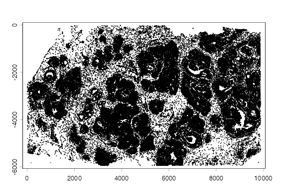
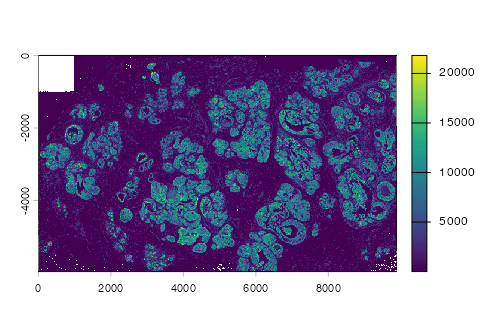
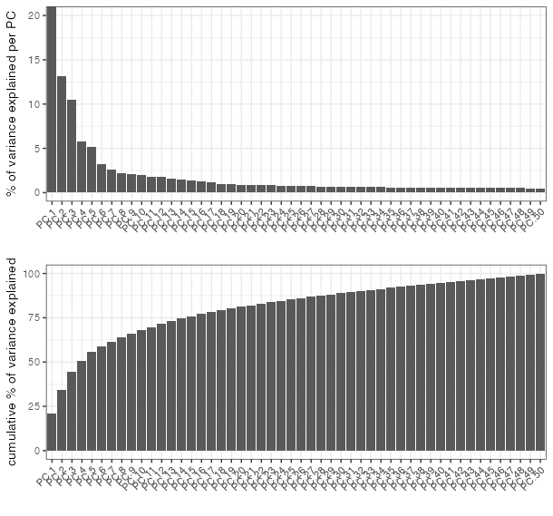
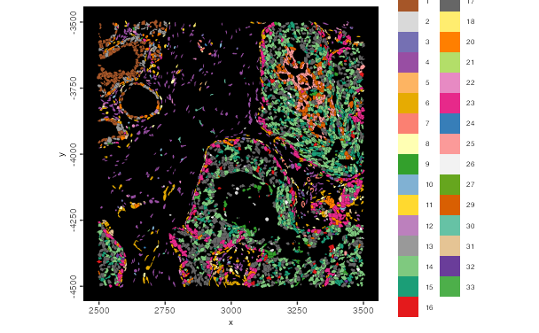
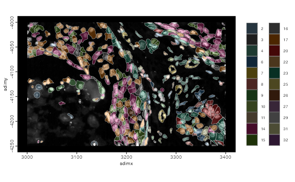

```{r, include=FALSE}
knitr::opts_chunk$set(eval = FALSE)
```

# Overview

This tutorial covers ingestion of the 10x Atera whole-transcriptome human
invasive breast carcinoma FFPE dataset as an on-disk GiottoDisk project,
followed by simple data processing to filter and cluster and visualize the data.

The ingestion includes transcript loading and aggregation, although both can be
skipped in favor of just working the included qv >= 20 expression matrix provided
by 10x.

*Note that currently transcript loading is needed for GiottoLens compatability,
but this is expected to be changed in the future.*

# Install Extra Packages

## _arrow_ installation

Atera datasets require arrow with ZSTD support to be installed to work with
parquet files.
```{r}
has_arrow <- requireNamespace("arrow", quietly = TRUE)
zstd <- TRUE
if (has_arrow) {
    # check arrow_info() to see that zstd support should be TRUE
    # See https://arrow.apache.org/docs/r/articles/install.html for details
    zstd <- arrow::arrow_info()$capabilities[["zstd"]]
}
if (!has_arrow || !zstd) {
    # install with compression library needed for 10x parquet files
    # this may take a while
    Sys.setenv(ARROW_WITH_ZSTD = "ON")
    install.packages("arrow", repos = c("https://apache.r-universe.dev"), type = "source")
}
```

## Giotto Extensions

This tutorial uses GiottoDisk for on-disk processing. These are preview dev builds off the dev and gsource Giotto package branches.
If GiottoDisk has not been installed yet, use the following:

```{r}
# GiottoDisk install
GiottoUtils::suite_install("GiottoDisk")
# Optional for matrix maths speedup:
install.packages('GiottoKernels',
    repos = c('https://giotto-suite.r-universe.dev', 'https://cloud.r-project.org')
)
```

# Dataset Explanation

This vignette covers Giotto object creation and exploratory analysis with
10x Genomics' _Atera In Situ_ platform, using their
[FFPE Human Breast Cancer preview dataset](https://www.10xgenomics.com/datasets/atera-wta-ffpe-human-breast-cancer).
The data were generated with a pre-commercial version of the Atera Whole
Transcriptome Assay (WTA) on an FFPE section of human breast cancer. The panel
targets 18,028 genes, and 170,057 cells are segmented.

10x provides this preview dataset converted to closely resemble the Xenium
Onboard Analysis output format, so the Atera reader in _Giotto_ shares its
implementation with the Xenium one.

## Download Links

The files are available from the
[10x Genomics dataset page](https://www.10xgenomics.com/datasets/atera-wta-ffpe-human-breast-cancer).

<details><summary>`curl` link from 10x genomics</summary>
```
# Output Files
curl -O https://s3-us-west-2.amazonaws.com/10x.files/samples/atera/dev/WTA_Preview_FFPE_Breast_Cancer/WTA_Preview_FFPE_Breast_Cancer_outs.zip
```

</details>

<br>

The zipped outputs are large (about 55 GB, most of it `transcripts.parquet`,
`transcripts.zarr.zip` and `morphology.ome.tif`)

# Setup

This workflow uses the on-disk backend from GiottoDisk.

```{r}
library(arrow) # this must be libraried before terra or GiottoClass
library(Giotto)
library(GiottoDisk)

data_dir    <- "path/to/WTA_Preview_FFPE_Breast_Cancer_outs"
project_dir <- "path/to/atera_project"

# set an appropriate amount of parallel workers for your computer
future::plan(future.mirai::mirai_multisession, workers = 4)
```

# Read the data

Atera data is too large to process in-memory. We will be using a GiottoDisk disk-backed project to handle it.

First we set up a `gDirSource` object using `sourceCreate()` as a handle for a Giotto file directory disk backend.
A backend defines the storage architecture and also associated preferred write formats for data types.
Currently, the only option available is a managed project directory via `gDirSource`, but other solutions are planned.

Next, using `setArtifactDumpDir()`, we point GiottoDisk writes of content such as expression matrices and spatial information directly at the backend.
*This is mostly precautionary to avoid more work later that would have to pull scattered files
into the backend when the object is saved.*

```{r}
# declare a Giotto directory backend to use
gdsrc <- GiottoDisk::sourceCreate(project_dir, type = "gDirSource")
# point data content writes to the backend's artifact subdirectory
GiottoDisk::setArtifactDumpDir(gdsrc)
```

`createGiottoAteraObject()` creates a Giotto object from an Atera output directory.
Passing the `gDirSource` object to the `backend` param sets the object up as a disk-backed project.

```{r}
# convenience function load defaults: 
# * transcripts (qv >= 20)
# * polygons
# * cell metadata
# * expression matrix
# * images

# skipped:
# * aligned images (needs more input)
# * cell metadata
g <- createGiottoAteraObject(data_dir,
    backend = gdsrc, # creates the object as a backed project
    # load_transcripts = FALSE # This takes a while. You can skip this and just load the expression content
)
# items to load can be controlled via `load_*` params
g
```

```
An object of class giotto 
>Active spat_unit:  cell 
>Active feat_type:  rna 
dimensions    : 18028, 170057 (features, cells)
[SUBCELLULAR INFO]
polygons      : cell nucleus 
features      : rna NegControlProbe UnassignedCodeword NegControlCodeword 
[AGGREGATE INFO]
expression -----------------------
  [cell][rna] raw
  [cell][NegControlProbe] raw
  [cell][GenomicControl] raw
  [cell][NegControlCodeword] raw
  [cell][UnassignedCodeword] raw
spatial locations ----------------
  [cell] raw
  [nucleus] raw
attached images ------------------
images      : 4 items...


Use objHistory() to see steps and params used
```

```{r}
# preview the data
getPolygonInfo(g, "cell") |>
    plot()
```

```{r poly-fig, eval = TRUE, echo = FALSE, out.width = "100%"}

```

```{r}
tx <- getFeatureInfo(g, "rna") |>
    plot()
```

```{r tx-fig, eval = TRUE, echo = FALSE, out.width = "100%"}

```

## Save

Backed Giotto projects write snapshots of analysis state to the project directory. Save/load operations are faster than in-memory and can be treated as checkpoints.
```{r}
# name param (optional) assigns the snapshot a name
# The return value is needed since saveGiotto makes changes during the write
# Either use the returned value or immediately load with `loadGiotto()`
g <- saveGiotto(g, name = "ingest")
```

## Aggregate

Aggregate spatial transcripts with the default polygon layer (cell annotations)
This takes a while and can be skipped to just use the 10x-provided expression matrix.

```{r}
g <- aggregateFeatures(g)
g <- saveGiotto(g, name = "aggregated")
```

# Quality control and filtering

```{r}
g <- addStatistics(g, expression_values = "raw")
cx <- pDataDT(g)
cat(sprintf("%s cells | median %d counts, %d features per cell\n",
    format(nrow(cx), big.mark = ","),
    median(cx$total_expr), median(cx$nr_feats))
)
```

```
170,057 cells | median 2046 counts, 1502 features per cell
```

```{r}
g <- filterGiotto(g,
    expression_threshold   = 1,
    feat_det_in_min_cells  = 1,
    min_det_feats_per_cell = 50,
    verbose = FALSE
)
cat(sprintf("%s cells x %s features retained\n",
    format(nrow(pDataDT(g)), big.mark = ","),
    format(nrow(fDataDT(g, feat_type = "rna")), big.mark = ","))
)
```

```
169,420 cells x 18,090 features retained
```

# Normalize and select features

```{r}
g <- normalizeGiotto(g,
    scalefactor = 1e4,
    logbase = exp(1),
    log_offset = 1,
    scale_feats = FALSE,
    scale_cells = FALSE,
    verbose = FALSE
)

g <- calculateHVF(g, 
    method = "cov_loess",
    n_top_feats = 2000,
    verbose = FALSE
)
hvf <- fDataDT(g, feat_type = "rna")[hvf == "yes"]$feat_ID
cat(length(hvf), "highly variable features\n")

g <- saveGiotto(g, name = "normalized")
```

```
2000 highly variable features
```

# Dimension reduction

`scale_unit = TRUE` scales to unit variance on the fly, so no dense z-scored
matrix is ever written.

```{r}
g <- runPCA(g,
    feats_to_use = "hvf",
    ncp = 50,
    method = "auto",
    scale_unit = TRUE,
    center = TRUE,
    verbose = FALSE
)

screePlot(g)
```

```{r scree-fig, eval = TRUE, echo = FALSE, out.width = "100%"}

```

```{r}
dims_to_use = 1:30 # use the top 30 PCs for UMAP and clustering

g <- runUMAP(g,
    dimensions_to_use = dims_to_use,
    n_neighbors = 30,
    min_dist = 0.3,
    verbose = FALSE
)
```

# Clustering

The Leiden resolution here is deliberately high. The
[cell typing tutorial](cell_typing_cluster_tree.html) builds a cluster tree and
a per-cluster specificity measure that sort genuine cell types from fragments,
so it is better to split too much than too little.

```{r}
g <- createNearestNetwork(g,
    dimensions_to_use = dims_to_use,
    k = 20,
    engine = "hnsw",
    verbose = FALSE
)

leiden_res <- 0.8

g <- doLeidenCluster(g,
    resolution = leiden_res, 
    n_iterations = 20, 
    objective_function = "modularity",
    verbose = FALSE
)

spatValues(g, feats = "leiden_clus")$leiden_clus |>
    unique() |>
    length() |>
    cat("clusters at resolution", leiden_res, "\n")
```

```
33 clusters at resolution 0.8 
```

```{r}
g <- saveGiotto(g, name = "clustered")
```

The object is saved to the project directory and can be reloaded with
`loadGiotto(project_dir, name = "clustered")`.

```{r}
plotUMAP(g,
    cell_color = "leiden_clus",
    color_as_factor = TRUE,
    point_border_stroke = 0,
    point_size = 0.1
)
```

```{r umap-fig, eval = TRUE, echo = FALSE, out.width = "100%"}
knitr::include_graphics("images/atera_human_breast_cancer/04_umap_leiden.png")
```

```{r}
spatPlot2D(g,
    cell_color = "leiden_clus",
    color_as_factor = TRUE,
    point_border_stroke = 0,
    point_size = 0.1,
    background_color = "black"
)
```

```{r centroids-fig, eval = TRUE, echo = FALSE, out.width = "100%"}
knitr::include_graphics("images/atera_human_breast_cancer/05_centroids_global.png")
```

Establish an ROI and get a zoomed in plot with the polygons.

```{r}
roi = c(2500, 3500, -4500, -3500) # xmin/xmax/ymin/ymax
g <- crop(g, roi, view = "roi")

spatInSituPlotPoints(g,
    polygon_fill = "leiden_clus",
    polygon_fill_as_factor = TRUE,
    polygon_line_size = 0,
    view = "roi"
)
```

```{r roi-fig, eval = TRUE, echo = FALSE, out.width = "100%"}

```

```{r}
# refine the ROI region and plot with dapi (default) image
spatInSituPlotPoints(g,
    polygon_fill = "leiden_clus",
    polygon_fill_as_factor = TRUE,
    polygon_line_size = 0.2,
    polygon_alpha = 0.3,
    xlim = c(3000, 3400),
    ylim = c(-4250, -4000),
    view = "roi",
    show_image = TRUE
)
```

```{r roi-refine-fig, eval = TRUE, echo = FALSE, out.width = "100%"}

```

# Further reading

Suggested further topics:

* Continue with [Cell typing with a cluster tree](cell_typing_cluster_tree.html)
* GiottoLens for [interactive visualization and annotation](giottolens.html)

# Session info

```{r}
sessionInfo()
```

```
R version 4.5.2 (2025-10-31)
Platform: aarch64-apple-darwin20
Running under: macOS Sequoia 15.5

Matrix products: default
BLAS:   /System/Library/Frameworks/Accelerate.framework/Versions/A/Frameworks/vecLib.framework/Versions/A/libBLAS.dylib 
LAPACK: /Library/Frameworks/R.framework/Versions/4.5-arm64/Resources/lib/libRlapack.dylib;  LAPACK version 3.12.1

locale:
[1] en_US.UTF-8/en_US.UTF-8/en_US.UTF-8/C/en_US.UTF-8/en_US.UTF-8

time zone: America/New_York
tzcode source: internal

attached base packages:
[1] stats     graphics  grDevices utils     datasets  methods   base     

other attached packages:
[1] GiottoDisk_0.0.0.3 Giotto_4.3.0       GiottoClass_0.7.3  arrow_23.0.1.2    

loaded via a namespace (and not attached):
  [1] colorRamp2_0.1.0            gridExtra_2.3              
  [3] rlang_1.2.0                 magrittr_2.0.5             
  [5] GiottoUtils_0.2.7           matrixStats_1.5.0          
  [7] compiler_4.5.2              systemfonts_1.3.1          
  [9] png_0.1-9                   vctrs_0.7.3                
 [11] wk_0.9.5                    pkgconfig_2.0.3            
 [13] SpatialExperiment_1.20.0    fastmap_1.2.0              
 [15] backports_1.5.1             magick_2.9.0               
 [17] XVector_0.50.0              labeling_0.4.3             
 [19] ggraph_2.2.2                ragg_1.5.0                 
 [21] purrr_1.2.1                 bit_4.6.0                  
 [23] bluster_1.20.0              cachem_1.1.0               
 [25] beachmat_2.26.0             jsonlite_2.0.0             
 [27] DelayedArray_0.36.1         BiocParallel_1.44.0        
 [29] tweenr_2.0.3                terra_1.9-27               
 [31] irlba_2.3.7                 parallel_4.5.2             
 [33] cluster_2.1.8.1             R6_2.6.1                   
 [35] RColorBrewer_1.1-3          reticulate_1.46.0          
 [37] parallelly_1.46.1           GenomicRanges_1.62.1       
 [39] scattermore_1.2             Rcpp_1.1.1-1.1             
 [41] Seqinfo_1.0.0               assertthat_0.2.1           
 [43] SummarizedExperiment_1.40.0 R.utils_2.13.0             
 [45] IRanges_2.44.0              Matrix_1.7-4               
 [47] igraph_2.3.2                tidyselect_1.2.1           
 [49] abind_1.4-8                 viridis_0.6.5              
 [51] codetools_0.2-20            listenv_0.10.0             
 [53] lattice_0.22-7              tibble_3.3.1               
 [55] Biobase_2.70.0              withr_3.0.2                
 [57] S7_0.2.1                    sedonadb_0.3.0             
 [59] future_1.69.0               polyclip_1.10-7            
 [61] pillar_1.11.1               MatrixGenerics_1.22.0      
 [63] checkmate_2.3.4             stats4_4.5.2               
 [65] GiottoKernels_0.2.0         plotly_4.12.0              
 [67] generics_0.1.4              RcppHNSW_0.6.0             
 [69] nanoarrow_0.7.0-3           S4Vectors_0.48.1           
 [71] ggplot2_4.0.2               scales_1.4.0               
 [73] globals_0.19.0              gtools_3.9.5               
 [75] glue_1.8.1                  BPCells_0.3.1              
 [77] lazyeval_0.2.2              tools_4.5.2                
 [79] GiottoVisuals_0.2.16        tilework_1.0.0             
 [81] BiocNeighbors_2.4.0         data.table_1.18.4          
 [83] ScaledMatrix_1.18.0         graphlayouts_1.2.2         
 [85] tidygraph_1.3.1             cowplot_1.2.0              
 [87] grid_4.5.2                  tidyr_1.3.2                
 [89] colorspace_2.1-2            SingleCellExperiment_1.32.0
 [91] BiocSingular_1.26.1         ggforce_0.5.0              
 [93] cli_3.6.6                   rsvd_1.0.5                 
 [95] textshaping_1.0.4           S4Arrays_1.10.1            
 [97] viridisLite_0.4.3           ggdendro_0.2.0             
 [99] dplyr_1.2.0                 geoarrow_0.4.2             
[101] gtable_0.3.6                R.methodsS3_1.8.2          
[103] digest_0.6.39               BiocGenerics_0.56.0        
[105] SparseArray_1.10.10         ggrepel_0.9.6              
[107] rjson_0.2.23                htmlwidgets_1.6.4          
[109] farver_2.1.2                R.oo_1.27.1                
[111] memoise_2.0.1               htmltools_0.5.9            
[113] lifecycle_1.0.5             httr_1.4.7                 
[115] bit64_4.6.0-1               MASS_7.3-65    
```