```{r, include=FALSE}
knitr::opts_chunk$set(eval = FALSE)
```

# Overview

This tutorial assigns a cell type to every cluster. It continues from the
[Atera Human Breast Cancer](atera_human_breast_cancer.html) example, which
reads, processes and clusters the data.

The annotation step deliberately overclusters and then uses a **cluster tree**
rather than a flat marker list. A flat list of one-vs-all markers cannot
distinguish a genuine cell type from a fragment of one, and it says nothing
about how clusters relate. A tree gives three things a flat list cannot:

- **conditional markers at each branch** — what separates two sibling groups,
  where a gene that is uninformative overall can be decisive
- **a specificity measure per cluster**, so fragments can be flagged
- **structure to reason over**: broad lineages at the top, refined downward

# Setup

Load the clustered object saved at the end of the
[Atera example](atera_human_breast_cancer.html).

```{r}
library(arrow)
library(Giotto)
library(GiottoDisk)

project_dir <- "path/to/atera_project"
CLUS <- "leiden_clus"

g <- loadGiotto(project_dir, name = "clustered")
```

The overclustered result from the previous example:

```{r umap-fig, eval = TRUE, echo = FALSE, out.width = "100%"}
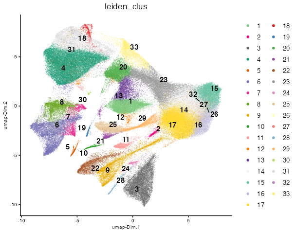
```

```{r centroids-fig, eval = TRUE, echo = FALSE, out.width = "100%"}
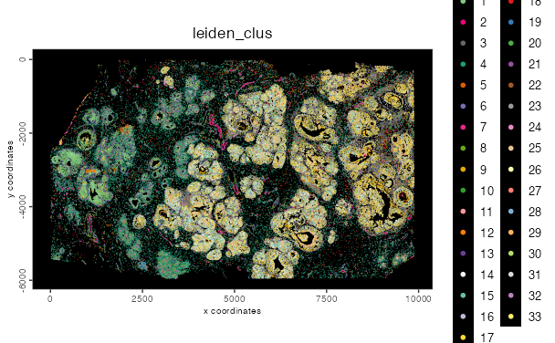
```

We start with clusters that are finer than the biological annotations that we want.
One way to merge these back down to a set of meaningful annotations is by building a hierarchical tree of binary splits between the clusters based on the underlying expression information.

# Build the cluster tree

To calculate the tree, we use `calculateClusterTree()`, which averages the expression information per cluster, correlates every pair of cluster means, then joins clusters by average linkage on 1 − r. We limit the features used in the comparisons to just the highly variable ones that were calculated in the previous example.

`calculateClusterTree()` returns a `giottoTree`, which is a subclass of `hclust` with some additional information attached.
The returned `tree` is kept in order to drive marker detection in later steps.

```{r}
# get the set of highly variable features calculated earlier
# this content is stored in the feature metadata
hvf  <- fDataDT(g, feat_type = "rna")[hvf == "yes"]$feat_ID

tree <- calculateClusterTree(g,
    cluster_column = CLUS,
    feats = hvf,
    cor = "pearson",
    distance = "average"
)
```

`giottoTree` can be directly plotted using `hclust`'s base plotting function.

```{r}
plot(tree, hang = -1)
```

```{r tree-fig, eval = TRUE, echo = FALSE, out.width = "100%"}
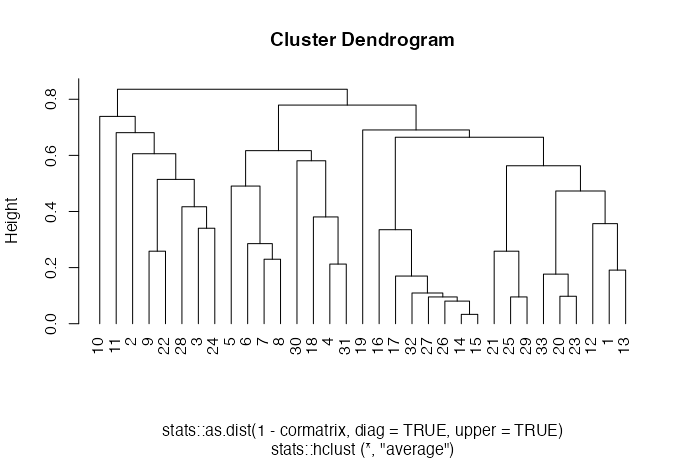
```

The object also retains an attached copy of the correlation matrix used in its calculation.
This can be plotted as a heatmap. It is the matrix the branches were built from, so the colours and branches always agree. To see correlations recomputed from a modified object in the tree's order, use `showClusterHeatmap(g, cluster_column = CLUS, cluster_custom_order = tree$labels[tree$order])`.

<details><summary>Correlation heatmap</summary>

```{r}
plot(tree, what = "heatmap")
```

```{r cor-heatmap-fig, eval = TRUE, echo = FALSE, out.width = "100%"}
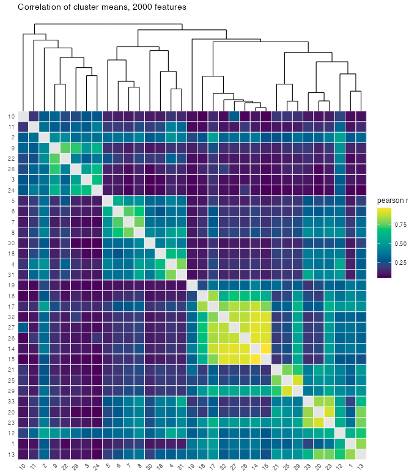
```

</details>

We additionally register an `as.data.frame()` method that converts the tree into a 4 column table with nodeID, node height, and left and right cluster members.

```{r}
splits <- as.data.frame(tree)
splits
```

<details><summary>`splits` print</summary>

```
   nodeID     node_h         left        right
1      32 0.83567196 10, 11, .... 5, 6, 7,....
2      31 0.77926573 5, 6, 7,.... 19, 16, ....
3      30 0.73893069           10 11, 2, 9....
4      29 0.69060516           19 16, 17, ....
5      28 0.68093568           11 2, 9, 22....
6      27 0.66462248 16, 17, .... 21, 25, ....
7      26 0.61684585   5, 6, 7, 8 30, 18, ....
8      25 0.60584668            2 9, 22, 2....
9      24 0.58076332           30    18, 4, 31
10     23 0.56299323   21, 25, 29 33, 20, ....
11     22 0.51437855        9, 22    28, 3, 24
12     21 0.49063392            5      6, 7, 8
13     20 0.47303127   33, 20, 23    12, 1, 13
14     19 0.41686759           28        3, 24
15     18 0.38058714           18        4, 31
16     17 0.35665906           12        1, 13
17     16 0.34030720            3           24
18     15 0.33505513           16 17, 32, ....
19     14 0.28543055            6         7, 8
20     13 0.25850553            9           22
21     12 0.25848853           21       25, 29
22     11 0.22984159            7            8
23     10 0.21256439            4           31
24      9 0.19108510            1           13
25      8 0.17674989           33       20, 23
26      7 0.16987595           17 32, 27, ....
27      6 0.10949094           32 27, 26, ....
28      5 0.09785856           20           23
29      4 0.09545566           25           29
30      3 0.09542765           27   26, 14, 15
31      2 0.08060030           26       14, 15
32      1 0.03333774           14           15
```

</details>

# Markers

We will generate and use 3 sets of complementary markers across the clusters.

## Per-cluster markers

scran (one-vs-all): for each cluster, the genes most strongly up against
all other cells combined, ranked by pi (fold change × significance).

```{r}
mk <- findMarkers_one_vs_all(g,
    method = "scran",
    cluster_column = CLUS,
    min_feats = 10,
    verbose = FALSE
)
mk
```

<details><summary>scran output</summary>

```
        Top       p.value           FDR     logFC    feats cluster ranking        pi
      <int>         <num>         <num>     <num>   <char>  <char>   <num>     <num>
   1:     1  0.000000e+00  0.000000e+00 2.0086708   NHERF1       1       1 617.97290
   2:    23  0.000000e+00  0.000000e+00 1.8958029 ANKRD30A       1       2 583.24880
   3:    18  0.000000e+00  0.000000e+00 1.8235154   NIBAN1       1       3 561.00937
   4:    10  0.000000e+00  0.000000e+00 1.7548495    PREX1       1       4 539.88411
   5:    29  0.000000e+00  0.000000e+00 1.6561292   BMPR1B       1       5 509.51254
  ---                                                                               
4469:   200 1.438573e-158 1.301190e-156 0.5071475   TUBA1A      33     156  80.04921
4470:   215 1.288948e-153 1.084515e-151 0.5012218    DOCK5      33     159  76.63169
4471:   232 1.813975e-147 1.414431e-145 0.5049232    ANXA5      33     158  74.09312
4472:   245 8.578927e-141 6.334400e-139 0.5215053    STAT1      33     150  73.04546
4473:   251 3.521196e-137 2.537786e-135 0.5352538    PMP22      33     143  73.03715
```

</details>

Gini (one-vs-all): for each cluster, the genes concentrated in that cluster
and low everywhere else. This call also returns detection_margin, which flags
clusters with no gene of their own.

```{r}
gi <- findGiniMarkers_one_vs_all(g, 
    cluster_column = CLUS,
    min_feats = 10,
    verbose = FALSE
)
gi
```

<details><summary>gini output</summary>

```
         feats cluster expression expression_gini detection detection_gini
        <char>  <char>      <num>           <num>     <num>          <num>
   1:    HSPB8       1  1.1513473    0.4195066125 0.5912543    0.419014875
   2:   CACNG4       1  1.0030545    0.4235475504 0.5734592    0.412867178
   3:    LYPD3       1  0.6257596    0.4183910435 0.3924696    0.413098035
   4:    REEP1       1  0.2734385    0.4065378277 0.1975911    0.407539851
   5:    CLIC6       1  0.9605914    0.4124796066 0.4968533    0.399046585
  ---                                                                     
9216:   SCUBE2      33  1.0557385    0.0005333577 0.5352480    0.048483295
9217: SIGLEC15      33  1.2010088    0.0384192283 0.6256527    0.005402858
9218:     IST1      33  1.9082174    0.0382881641 0.7894909    0.004318472
9219:    SNX14      33  1.0702414    0.0372580577 0.5744125    0.003896449
9220:   OR4F17      33  3.1115409    0.0369468634 0.9454961    0.002194948
      expression_rank detection_rank   comb_score comb_rank detection_margin
                <int>          <int>        <num>     <int>            <num>
   1:               1              1 1.757795e-01         1         4.188130
   2:               1              1 1.748689e-01         2         6.431605
   3:               1              1 1.728365e-01         3        12.601194
   4:               1              1 1.656804e-01         4         6.645217
   5:               1              1 1.645986e-01         5         1.592331
  ---                                                                       
9216:               2              1 2.585894e-06     16992       -35.519485
9217:               2              2 2.075736e-06     17164       -29.396560
9218:               2              2 1.653464e-06     17314       -20.840830
9219:               2              2 1.451741e-06     17386       -30.352977
9220:               2              2 8.109646e-07     17667        -5.450392
```

</details>

## Specificity

`detection_margin` in the Gini output is how many percentage points more of a
cluster’s cells detect a gene than of the next-highest single cluster’s. A
cluster whose best margin is low has no gene of its own, which usually means
an overclustered fragment or a cell state rather than a distinct type.

```{r}
lvls <- GiottoUtils::mixedsort(unique(as.character(pDataDT(g)[[CLUS]])))

spec <- gi[, .(margin = max(detection_margin),
    best_gene = feats[which.max(detection_margin)]), by = cluster]
spec <- spec[match(lvls, cluster)]
spec[, low_specificity := margin < 25]
cat(sum(spec$low_specificity), "of", nrow(spec), "clusters flagged\n")
```

```
13 of 33 clusters flagged
```

<details><summary>ggplot code</summary>

```{r}
cmeta <- pDataDT(g)
NCELL <- stats::setNames(as.integer(table(as.character(cmeta[[CLUS]]))[lvls]), lvls)
plot_spec <- data.table::copy(spec)

plot_spec[, n_cells := as.integer(NCELL[cluster])]
ggplot2::ggplot(plot_spec, ggplot2::aes(n_cells, margin, colour = low_specificity)) +
    ggplot2::geom_point(size = 2) + ggplot2::scale_x_log10() +
    ggplot2::geom_hline(yintercept = 25, linetype = 2, colour = "grey40") +
    ggplot2::scale_colour_manual(values = c("FALSE" = "#3B7EA1", "TRUE" = "#C4622D"),
                        name = "margin < 25") +
    ggplot2::labs(x = "cells in cluster", y = "best detection margin (points)",
         title = "Cluster specificity") +
    ggplot2::theme_minimal(base_size = 10)
```

</details>

```{r 03-clus-specificity-fig, eval = TRUE, echo = FALSE, out.width = "100%"}
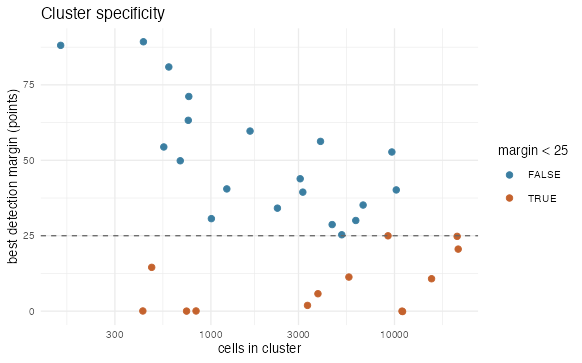
```

## Tree node markers

For each split we count the strong markers: genes with a clear fold change
that are also clearly significant.

```{r}
nm <- findClusterTreeMarkers(g,
    cluster_column = CLUS,
    tree = tree,
    method = "scran",
    verbose = FALSE
)
node_meta <- nm$nodes
node_meta[, weak_split := n_strong < stats::quantile(n_strong, 0.2)]
cat(nrow(node_meta), "nodes,", sum(node_meta$weak_split),
    "flagged as weak splits\n")
```

```
32 nodes, 7 flagged as weak splits
```

<details><summary>ggplot code</summary>

```{r}
ggplot2::ggplot(node_meta, ggplot2::aes(reorder(factor(nodeID), -n_strong), n_strong,
                      fill = weak_split)) +
    ggplot2::geom_col() +
    ggplot2::scale_fill_manual(values = c("FALSE" = "#3B7EA1", "TRUE" = "#C4622D"),
                      name = "weak split") +
    ggplot2::labs(x = "node", y = "separating genes",
         title = "Genes separating the two sides of each split") +
    ggplot2::theme_minimal(base_size = 10) +
    ggplot2::theme(axis.text.x = ggplot2::element_text(size = 6, angle = 90, vjust = 0.5))
```

</details>

A split with few strong markers, here the weakest fifth, means the two sides
barely differ. Those clusters are good candidates for merging into one label.

```{r 04-node-genecount-splits-fig, eval = TRUE, echo = FALSE, out.width = "100%"}
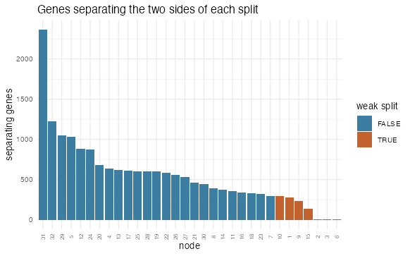
```

# Assemble the annotation prompt

Next, we bring all of this evidence together for annotation.
`writeClusterTreeQuery()` writes a language model prompt that lays out the tree, the
markers at each split, and each cluster's top markers along with its
specificity flag. Use `context` as a freeform place to describe the sample.
Anything that would help someone reading the markers.

We write the prompt to a temp file. The text is also returned directly returned
from the function for inspection.

```{r}
temp <- file.path(tempdir(), "atera_celltyping_prompt.txt")

q <- writeClusterTreeQuery(g,
    cluster_column = CLUS,
    tree = tree,
    markers = mk,
    gini_markers = gi,
    node_markers = nm,
    context = list(
        tissue = "human breast",
        disease = "invasive carcinoma",
        assay = "whole-transcriptome spatial, FFPE section"
    ),
    file_name = temp
)
cat(length(q), "lines\n")
```

```
537 lines
```

```{r}
readLines(temp, n = 10)
```

```
 [1] "# Cell type annotation task"                                          
 [2] ""                                                                     
 [3] "tissue: human breast"                                                 
 [4] "disease: invasive carcinoma"                                          
 [5] "assay: whole-transcriptome spatial, FFPE section"                     
 [6] "169,420 cells in 33 transcriptional clusters."                        
 [7] "Fix broad lineages at the TOP of the tree first, then refine downward"
 [8] "to one cell type per cluster."                                        
 [9] ""                                                                     
[10] "## 1. Cluster tree (root first; indentation = depth)" 
...
```

The request asks for a label for
every cluster *and* for every branch point in the tree, where each branch's
label must describe all the clusters beneath it, for example "T cells" above
"CD4 T cells" and "CD8 T cells". That is what lets us annotate at several
levels of detail from a single answer, in the next step.

Give the file to a model of your choice and save its reply. The reply is a JSON
file, which we read back in below.

For reproducibility, we include an example output:

<details><summary></summary>

```{r}
ans <- jsonlite::fromJSON(simplifyVector = FALSE, '{
  "nodes": [
    {"node": 32, "short": "all", "label": "all cells"},
    {"node": 31, "short": "nonimm", "label": "non-immune cells"},
    {"node": 30, "short": "imm", "label": "immune cells"},
    {"node": 29, "short": "epi", "label": "epithelial cells"},
    {"node": 28, "short": "leuk", "label": "non-mast leukocytes"},
    {"node": 27, "short": "epi_main", "label": "breast epithelium (non-apocrine)"},
    {"node": 26, "short": "strom", "label": "stromal cells"},
    {"node": 25, "short": "mono_imm", "label": "mononuclear immune compartment"},
    {"node": 24, "short": "mes", "label": "mesenchymal stroma"},
    {"node": 23, "short": "epi_het", "label": "heterogeneous ductal epithelium"},
    {"node": 22, "short": "mnl", "label": "mononuclear leukocytes"},
    {"node": 21, "short": "vasc", "label": "vascular cells"},
    {"node": 20, "short": "neo_duct", "label": "neoplastic ductal epithelium"},
    {"node": 19, "short": "lym_assoc", "label": "lymphocyte-associated immune cells"},
    {"node": 18, "short": "fib", "label": "fibroblasts"},
    {"node": 17, "short": "ank_tum", "label": "ANKRD30A+ luminal carcinoma"},
    {"node": 16, "short": "lym", "label": "lymphocytes"},
    {"node": 15, "short": "er_tum", "label": "ER+ luminal carcinoma"},
    {"node": 14, "short": "bv", "label": "blood vascular cells"},
    {"node": 13, "short": "mye", "label": "myeloid cells"},
    {"node": 12, "short": "lp", "label": "luminal progenitor lineage"},
    {"node": 11, "short": "mural", "label": "mural cells"},
    {"node": 10, "short": "fib_main", "label": "stromal fibroblasts"},
    {"node": 9, "short": "ank_tum2", "label": "ANKRD30A+ luminal carcinoma (non-IFN)"},
    {"node": 8, "short": "duct_assoc", "label": "duct-associated epithelium"},
    {"node": 7, "short": "er_tum_nc", "label": "ER+ luminal carcinoma (non-cycling)"},
    {"node": 6, "short": "er_tum_a", "label": "ER+ luminal carcinoma"},
    {"node": 5, "short": "duct_unit", "label": "TFF1-region ductal epithelium"},
    {"node": 4, "short": "gabrp", "label": "GABRP+ luminal epithelium"},
    {"node": 3, "short": "er_tum_b", "label": "ER+ luminal carcinoma"},
    {"node": 2, "short": "er_tum_c", "label": "ER+ luminal carcinoma"},
    {"node": 1, "short": "er_tum_d", "label": "ER+ luminal carcinoma"}
  ],
  "clusters": [
    {"cluster": "1", "cell_type": "ANKRD30A+ luminal carcinoma cells", "confidence": "medium", "markers": ["ANKRD30A", "BMPR1B", "MUC1", "NIBAN1", "PREX1", "STC2", "MLPH", "TSKU"], "merge_with": null},
    {"cluster": "2", "cell_type": "low-quality / artifact cells", "confidence": "low", "markers": ["OR4F17", "IST1", "SIGLEC15", "TRIM49D1", "KRBOX4", "GOLGA6L4", "KRT18"], "merge_with": null},
    {"cluster": "3", "cell_type": "T cells", "confidence": "high", "markers": ["TRAC", "CD3E", "CD3D", "CD247", "ZAP70", "ITK", "LCK", "CD2"], "merge_with": null},
    {"cluster": "4", "cell_type": "CXCL12+ ABCA10+ fibroblasts (normal-like)", "confidence": "medium", "markers": ["CXCL12", "ABCA6", "ABCA9", "ABCA10", "TNXB", "PDGFRA", "LUM", "SRPX"], "merge_with": null},
    {"cluster": "5", "cell_type": "lymphatic endothelial cells", "confidence": "high", "markers": ["MMRN1", "PROX1", "LYVE1", "FLT4", "CCL21", "PDPN", "PKHD1L1"], "merge_with": null},
    {"cluster": "6", "cell_type": "blood vascular endothelial cells", "confidence": "high", "markers": ["VWF", "PECAM1", "KDR", "PLVAP", "ROBO4", "TIE1", "EGFL7", "AQP1"], "merge_with": null},
    {"cluster": "7", "cell_type": "arteriolar vascular smooth muscle cells", "confidence": "medium", "markers": ["NOTCH3", "TAGLN", "RERGL", "TPM2", "MCAM", "GJA5", "SEMA3G", "GJA4"], "merge_with": null},
    {"cluster": "8", "cell_type": "pericytes", "confidence": "high", "markers": ["RGS5", "STEAP4", "ABCC9", "HIGD1B", "NOTCH3", "ITGA7", "GJC1"], "merge_with": null},
    {"cluster": "9", "cell_type": "monocyte / cDC2-like myeloid cells", "confidence": "medium", "markers": ["LYZ", "MNDA", "ITGAX", "CLEC10A", "HLA-DQB1", "CD74", "CSF1R", "SPI1"], "merge_with": null},
    {"cluster": "10", "cell_type": "mast cells", "confidence": "high", "markers": ["CPA3", "TPSB2", "CMA1", "CTSG", "KIT", "MS4A2", "HDC", "IL1RL1"], "merge_with": null},
    {"cluster": "11", "cell_type": "plasma cells", "confidence": "high", "markers": ["MZB1", "JCHAIN", "IGKC", "IGHA1", "IGHA2", "DERL3", "TENT5C", "IRF4"], "merge_with": null},
    {"cluster": "12", "cell_type": "interferon-high luminal carcinoma cells", "confidence": "medium", "markers": ["MX1", "IFIT1", "IFIT3", "ISG15", "CXCL10", "STAT1", "MUC1", "BMPR1B"], "merge_with": null},
    {"cluster": "13", "cell_type": "ANKRD30A+ luminal carcinoma cells", "confidence": "low", "markers": ["ANKRD30A", "BMPR1B", "NIBAN1", "MUC1", "GATA3", "TAGLN", "SFRP1"], "merge_with": "1"},
    {"cluster": "14", "cell_type": "ER+ luminal carcinoma cells", "confidence": "medium", "markers": ["CCND1", "GATA3", "FOXA1", "AGR3", "SCUBE2", "CA12", "TFF3", "TSPAN8"], "merge_with": null},
    {"cluster": "15", "cell_type": "ER+ luminal carcinoma cells", "confidence": "medium", "markers": ["CCND1", "FOXA1", "GATA3", "XBP1", "MSMB", "AGR3"], "merge_with": "14"},
    {"cluster": "16", "cell_type": "cycling ER+ luminal carcinoma cells", "confidence": "high", "markers": ["H1-5", "H3C2", "TYMS", "PRC1", "TUBB", "CCND1", "GATA3", "FOXA1"], "merge_with": "17"},
    {"cluster": "17", "cell_type": "ER+ luminal carcinoma cells", "confidence": "medium", "markers": ["CCND1", "GATA3", "ELAPOR1", "AGR3", "TBC1D9", "XBP1", "CDH1"], "merge_with": null},
    {"cluster": "18", "cell_type": "SFRP4+ GREM1+ fibroblasts", "confidence": "medium", "markers": ["SFRP4", "GREM1", "OGN", "PTGIS", "LEPR", "GAS1", "IGFBP6", "DES"], "merge_with": null},
    {"cluster": "19", "cell_type": "apocrine-like (PIP+ MUCL1+) luminal cells", "confidence": "medium", "markers": ["PIP", "MUCL1", "MYBPC1", "TAT", "KLK2", "SERPINA1", "ANKRD30A"], "merge_with": null},
    {"cluster": "20", "cell_type": "myoepithelial cells", "confidence": "medium", "markers": ["TAGLN", "MYLK", "CSRP1", "TPM2", "TNS4", "COL17A1", "TRIM29", "LGR6"], "merge_with": null},
    {"cluster": "21", "cell_type": "ELF5+ luminal progenitor cells", "confidence": "high", "markers": ["ELF5", "KIT", "EHF", "KRT15", "PIGR", "AQP5", "PADI2", "SFRP1"], "merge_with": null},
    {"cluster": "22", "cell_type": "tissue-resident macrophages (LYVE1+ FOLR2+)", "confidence": "high", "markers": ["C1QA", "C1QC", "F13A1", "LYVE1", "FOLR2", "MRC1", "CD163", "SIGLEC1"], "merge_with": null},
    {"cluster": "23", "cell_type": "TFF1+ luminal carcinoma cells", "confidence": "low", "markers": ["TFF1", "TFF3", "CCND1", "GATA3", "FOXA1", "AGR3"], "merge_with": null},
    {"cluster": "24", "cell_type": "B cells", "confidence": "high", "markers": ["MS4A1", "CD19", "CD79A", "BANK1", "FCRL1", "BLK", "CD22"], "merge_with": null},
    {"cluster": "25", "cell_type": "GABRP+ KIT+ luminal progenitor-like cells", "confidence": "medium", "markers": ["GABRP", "KIT", "PROM1", "CCL28", "VTCN1", "KRT23", "KRT81", "EHF"], "merge_with": null},
    {"cluster": "26", "cell_type": "ER+ luminal carcinoma cells", "confidence": "low", "markers": ["CCND1", "GATA3", "FOXA1", "XBP1"], "merge_with": "14"},
    {"cluster": "27", "cell_type": "ER+ luminal carcinoma cells", "confidence": "low", "markers": ["CCND1", "GATA3", "FOXA1", "XBP1"], "merge_with": "14"},
    {"cluster": "28", "cell_type": "cDC1 (conventional type 1 dendritic cells)", "confidence": "high", "markers": ["XCR1", "WDFY4", "IDO1", "CLNK", "IRF8", "DNASE1L3", "SLC24A4"], "merge_with": null},
    {"cluster": "29", "cell_type": "GABRP+ luminal cells (mixed hormone-sensing)", "confidence": "low", "markers": ["GABRP", "KRT23", "TTYH1", "TBC1D9", "FOXA1", "AGR3"], "merge_with": "25"},
    {"cluster": "30", "cell_type": "adipocytes", "confidence": "high", "markers": ["ADIPOQ", "PLIN1", "PLIN4", "CIDEC", "LPL", "FABP4", "GPD1"], "merge_with": null},
    {"cluster": "31", "cell_type": "matrix cancer-associated fibroblasts (POSTN+ COL10A1+)", "confidence": "high", "markers": ["POSTN", "COL10A1", "COL8A1", "COMP", "MMP11", "COL3A1", "COL1A2"], "merge_with": null},
    {"cluster": "32", "cell_type": "ER+ luminal carcinoma cells", "confidence": "low", "markers": ["CCND1", "GATA3", "FOXA1", "XBP1"], "merge_with": "14"},
    {"cluster": "33", "cell_type": "TNC+ basal-like / EMT-like epithelial cells", "confidence": "medium", "markers": ["TNC", "KRT5", "S100A2", "ITGB6", "FN1", "THBS1", "ITGA2", "L1CAM"], "merge_with": null}
  ]
}')
```

</details>

# Apply the annotation, at several levels

Because every branch has a label, the tree can be cut at any depth: near the
top it gives a few broad groups, near the bottom one label per cluster. `k` is
the number of groups to cut into. Here we ask for 3, 8 and 16 groups, plus one
label per cluster.

```{r}
# see collapsible above for example output
ans <- jsonlite::fromJSON("atera_cell_types.json", simplifyVector = FALSE)

labels <- list(
    clusters = stats::setNames(
        vapply(ans$clusters, function(x) x$cell_type, ""),
        vapply(ans$clusters, function(x) as.character(x$cluster), "")
    ),
    nodes = stats::setNames(
        vapply(ans$nodes, function(x) x$short, ""),
        vapply(ans$nodes, function(x) as.character(x$node), "")
    )
)

g <- annotateClusterTree(g,
    tree = tree,
    labels = labels,
    cluster_column = CLUS,
    k = c(3, 8, 16, length(lvls))
)
```

This adds one annotation column to the cell metadata for each value of `k`,
from broad lineages down to the finest labels.

```{r}
table(g$cell_types_k3)
```

```
  epi   imm strom 
98774 23375 47271 
```

# Results

## The annotated tree

`plotClusterTree()` draws everything in one figure: the tree, a band of labels
for each level of `k`, and tracks showing each cluster's size and detection
margin. Read the bands from top to bottom to see broad labels split into finer
ones. The tracks show which clusters the data really supports.

```{r}
GiottoVisuals::plotClusterTree(g,
    cluster_column = CLUS,
    tree = tree,
    labels = labels,
    k = c(3, 8, 16),
    gini_markers = gi,
    node_labels = FALSE,
    palette = c("orange", "magenta", "red")
)
```

```{r 05-plotclustertree-fig, eval = TRUE, echo = FALSE, out.width = "100%"}
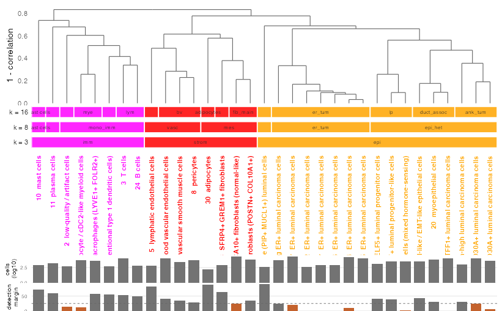
```

A leaf with a short detection margin bar has no gene of its own — a merge candidate,
and a reason to annotate that branch one level coarser.

## coarse annotations

**k3** (coarsest)

```{r}
spatPlot2D(g,
    color_as_factor = TRUE,
    cell_color = "cell_types_k3",
    point_border_stroke = 0,
    point_size = 0.3,
    background_color = "black",
    theme_param = list(
        legend.position = "bottom"
    )
)
```

```{r 06-k3-fig, eval = TRUE, echo = FALSE, out.width = "100%"}
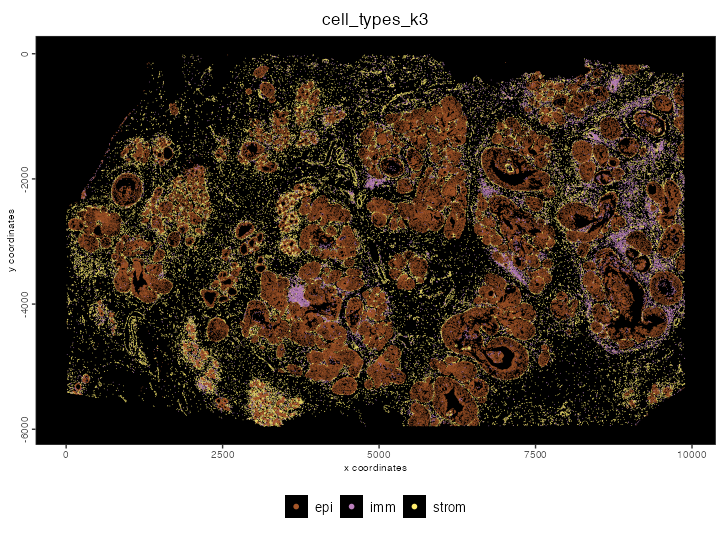
```

**k8** (coarsest)

```{r}
spatPlot2D(g,
    color_as_factor = TRUE,
    cell_color = "cell_types_k8",
    point_border_stroke = 0,
    point_size = 0.3,
    background_color = "black",
    theme_param = list(
        legend.position = "bottom"
    )
)
```

```{r 07-k8-fig, eval = TRUE, echo = FALSE, out.width = "100%"}
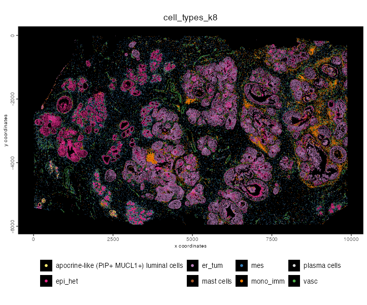
```

## finest annotation

```{r}
# for consistency with downstream plots
fine_clus <- unique(g$cell_types_k33)
fine_colors <- getDistinctColors(length(fine_clus)) |>
    stats::setNames(fine_clus)

plotUMAP(g,
    color_as_factor = TRUE,
    cell_color = "cell_types_k33",
    cell_color_code = fine_colors,
    point_border_stroke = 0,
    point_size = 0.3,
    show_center_label = TRUE,
    label_size = 2,
    show_legend = FALSE
)
```

```{r 08-umap-k33-fig, eval = TRUE, echo = FALSE, out.width = "100%"}
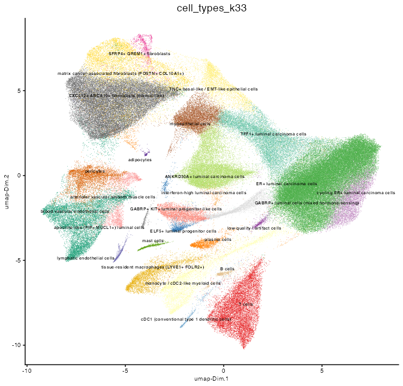
```

```{r}
spatPlot2D(g,
    color_as_factor = TRUE,
    cell_color = "cell_types_k33",
    cell_color_code = fine_colors,
    point_border_stroke = 0,
    point_size = 0.3,
    background_color = "black",
    show_legend = FALSE
)
```

```{r 09-splot-k33-fig, eval = TRUE, echo = FALSE, out.width = "100%"}
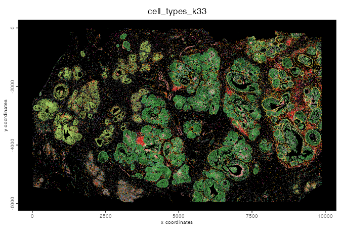
```

The legend was too small to read for the `spatPlot2D()`, but colors match the
UMAP above.

## Each lineage in tissue

The tissue is the real test of the labels. Expression alone can be
misleading, but cell types should sit where we expect them. Epithelial cells
should form duct-like structures. Immune cells, fibroblasts and endothelial
cells should be spread through the stroma between them.

```{r}
cmeta <- pDataDT(g)
lineage_groups <- cmeta[, .(fine = unique(cell_types_k33)), by = cell_types_k3]

coarse_types <- unique(lineage_groups$cell_types_k3)

for (ctype in coarse_types) {
    fine_types <- lineage_groups[cell_types_k3 == ctype, fine]

    spatPlot2D(g,
        color_as_factor = TRUE,
        cell_color = "cell_types_k33",
        cell_color_code = fine_colors,
        select_cell_groups = fine_types,
        point_border_stroke = 0,
        point_size = 0.3,
        show_other_cells = TRUE,
        other_cell_color = "lightgrey",
        other_point_size = 0.1,
        other_cells_alpha = 0.2,
        title = ctype,
        legend_text = 7
    )
}
```


```{r 10-lineage-epi-fig, eval = TRUE, echo = FALSE, out.width = "100%"}
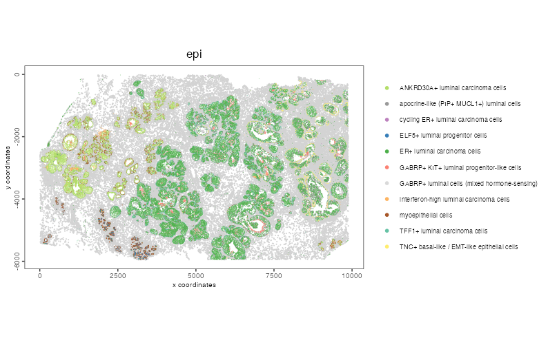
```

```{r 11-lineage-strom-fig, eval = TRUE, echo = FALSE, out.width = "100%"}
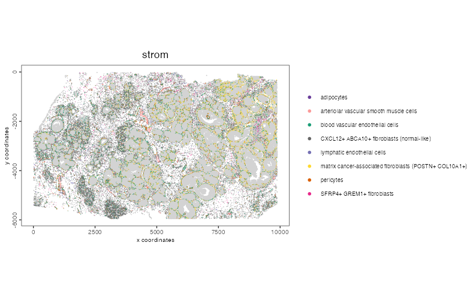
```

```{r 12-lineage-imm-fig, eval = TRUE, echo = FALSE, out.width = "100%"}
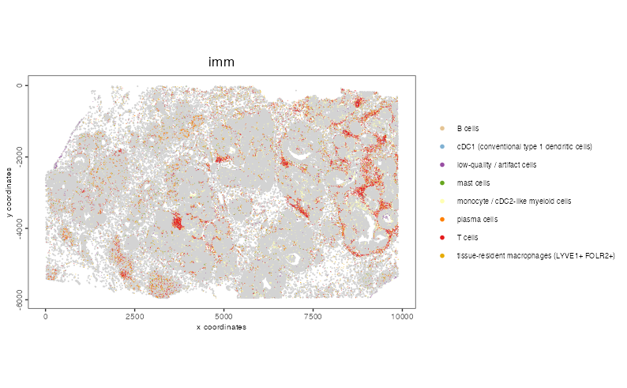
```

## Markers, in tree order

```{r}
ord <- tree$labels[tree$order]
# top 2 markers per cluster, taken in tree order so the dots run diagonally
top2 <- unique(mk[order(match(cluster, ord)), head(.SD, 2), by = cluster]$feats)
cmeta <- pDataDT(g)

ct33 <- stats::setNames(cmeta$cell_types_k33, as.character(cmeta[[CLUS]]))
ct33 <- ct33[!duplicated(names(ct33))]

pl <- dotPlot(g,
    feats = rev(top2), # feats are drawn bottom-up; rev puts cluster 1's at the top
    cluster_column = CLUS,
    cluster_custom_order = ord,
    dot_scale = 4.5,
    dot_size_threshold = 5,
    title = "Top markers per cluster, clusters in tree order",
    axis_text = 8,
    theme_param = list(
        axis.text.x = ggplot2::element_text(angle = 60, hjust = 1),
        axis.text.y = ggplot2::element_text(size = 6)
    ),
    show_plot = FALSE,
    return_plot = TRUE
)

pl + ggplot2::scale_x_discrete(labels = function(x) sprintf("%s  %s", x, ct33[x])) +
    ggplot2::labs(x = NULL, y = NULL, colour = "mean\nnormalized", size = "% detected")
```

```{r 13-dotplot-fig, eval = TRUE, echo = FALSE, out.width = "100%"}
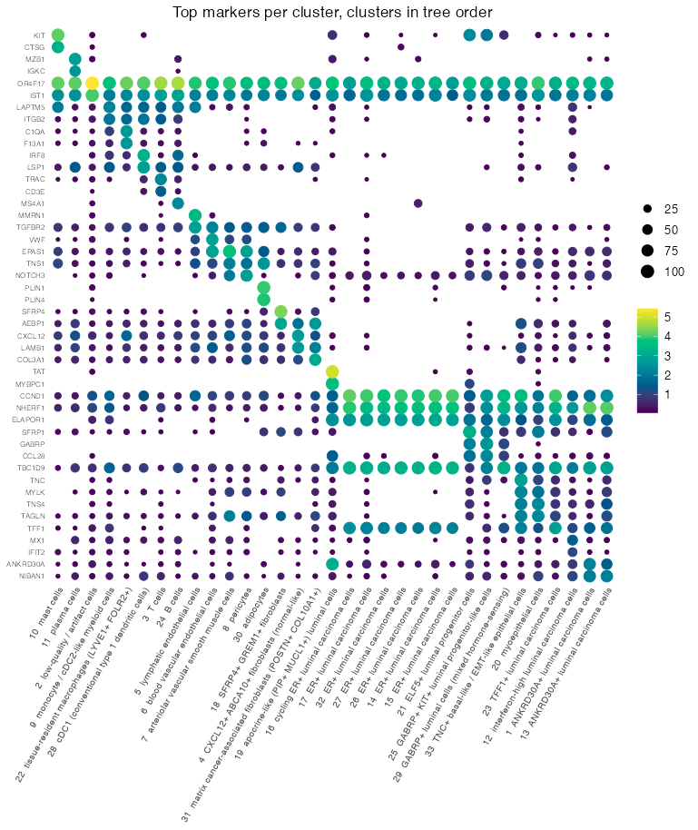
```

# Save

```{r}
g <- saveGiotto(g, name = "annotated")
```

# Session info

```{r}
sessionInfo()
```

```{r}
R version 4.5.2 (2025-10-31)
Platform: aarch64-apple-darwin20
Running under: macOS Sequoia 15.5

Matrix products: default
BLAS:   /System/Library/Frameworks/Accelerate.framework/Versions/A/Frameworks/vecLib.framework/Versions/A/libBLAS.dylib 
LAPACK: /Library/Frameworks/R.framework/Versions/4.5-arm64/Resources/lib/libRlapack.dylib;  LAPACK version 3.12.1

locale:
[1] en_US.UTF-8/en_US.UTF-8/en_US.UTF-8/C/en_US.UTF-8/en_US.UTF-8

time zone: America/New_York
tzcode source: internal

attached base packages:
[1] stats     graphics  grDevices utils     datasets  methods   base     

other attached packages:
[1] GiottoDisk_0.0.0.3 Giotto_4.3.0       GiottoClass_0.7.7  arrow_23.0.1.2    

loaded via a namespace (and not attached):
  [1] colorRamp2_0.1.0            gridExtra_2.3              
  [3] rlang_1.2.0                 magrittr_2.0.5             
  [5] otel_0.2.0                  GiottoUtils_0.2.7          
  [7] matrixStats_1.5.0           compiler_4.5.2             
  [9] callr_3.7.6                 systemfonts_1.3.1          
 [11] png_0.1-9                   vctrs_0.7.3                
 [13] pkgconfig_2.0.3             SpatialExperiment_1.20.0   
 [15] fastmap_1.2.0               backports_1.5.1            
 [17] magick_2.9.0                XVector_0.50.0             
 [19] scuttle_1.20.0              labeling_0.4.3             
 [21] ggraph_2.2.2                ps_1.9.1                   
 [23] ragg_1.5.0                  purrr_1.2.1                
 [25] bit_4.6.0                   xfun_0.56                  
 [27] bluster_1.20.0              cachem_1.1.0               
 [29] beachmat_2.26.0             jsonlite_2.0.0             
 [31] pak_0.9.2                   DelayedArray_0.36.1        
 [33] BiocParallel_1.44.0         tweenr_2.0.3               
 [35] terra_1.9-27                irlba_2.3.7                
 [37] parallel_4.5.2              cluster_2.1.8.1            
 [39] R6_2.6.1                    RColorBrewer_1.1-3         
 [41] limma_3.66.0                reticulate_1.46.0          
 [43] GenomicRanges_1.62.1        scattermore_1.2            
 [45] knitr_1.51                  Rcpp_1.1.1-1.1             
 [47] Seqinfo_1.0.0               assertthat_0.2.1           
 [49] SummarizedExperiment_1.40.0 base64enc_0.1-6            
 [51] IRanges_2.44.0              Matrix_1.7-4               
 [53] igraph_2.3.2                tidyselect_1.2.1           
 [55] abind_1.4-8                 viridis_0.6.5              
 [57] codetools_0.2-20            processx_3.8.6             
 [59] lattice_0.22-7              tibble_3.3.1               
 [61] Biobase_2.70.0              withr_3.0.2                
 [63] S7_0.2.1                    evaluate_1.0.5             
 [65] polyclip_1.10-7             filelock_1.0.3             
 [67] pillar_1.11.1               MatrixGenerics_1.22.0      
 [69] checkmate_2.3.4             stats4_4.5.2               
 [71] plotly_4.12.0               generics_0.1.4             
 [73] RcppHNSW_0.6.0              S4Vectors_0.48.1           
 [75] ggplot2_4.0.2               scales_1.4.0               
 [77] gtools_3.9.5                glue_1.8.1                 
 [79] BPCells_0.3.1               metapod_1.18.0             
 [81] lazyeval_0.2.2              tools_4.5.2                
 [83] GiottoVisuals_0.2.16        tilework_1.0.0             
 [85] BiocNeighbors_2.4.0         data.table_1.18.4          
 [87] ScaledMatrix_1.18.0         locfit_1.5-9.12            
 [89] rgl_1.3.34                  scran_1.38.1               
 [91] graphlayouts_1.2.2          tidygraph_1.3.1            
 [93] cowplot_1.2.0               grid_4.5.2                 
 [95] tidyr_1.3.2                 edgeR_4.8.2                
 [97] colorspace_2.1-2            SingleCellExperiment_1.32.0
 [99] BiocSingular_1.26.1         ggforce_0.5.0              
[101] cli_3.6.6                   rsvd_1.0.5                 
[103] textshaping_1.0.4           S4Arrays_1.10.1            
[105] viridisLite_0.4.3           ggdendro_0.2.0             
[107] dplyr_1.2.0                 gtable_0.3.6               
[109] digest_0.6.39               progressr_0.19.0           
[111] BiocGenerics_0.56.0         dqrng_0.4.1                
[113] SparseArray_1.10.10         ggrepel_0.9.6              
[115] rjson_0.2.23                htmlwidgets_1.6.4          
[117] farver_2.1.2                memoise_2.0.1              
[119] htmltools_0.5.9             lifecycle_1.0.5            
[121] httr_1.4.7                  statmod_1.5.1              
[123] bit64_4.6.0-1               MASS_7.3-65    
```
