```{r setup, include=FALSE, eval = FALSE}
knitr::opts_chunk$set(echo = TRUE, warning = FALSE, message = TRUE,
                      fig.align = "center", dpi = 150, fig.path = "figures/")
set.seed(42)
```

# The dataset

NanoString **CosMx Whole Transcriptome (WTx)**, human colon, slide S0, ~400
fields of view. The donor is a 56-year-old woman with a G1, stage
**IVA T3N0M1a** primary sigmoid adenocarcinoma, so one section carries normal
mucosa with intact crypts, the tumor mass, the desmoplastic stroma around it,
and uninvaded muscularis propria.

The panel is 20,378 features: **18,935 RNA targets**, 50 negative probes and
1,393 SystemControl probes. 493,834 cells are measured; 489,445 survive
segmentation and filtering. The export is Bruker Spatial Biology's
[CosMx Human Whole Transcriptome colon dataset](https://brukerspatialbiology.com/products/cosmx-spatial-molecular-imager/ffpe-dataset/cosmx-human-whole-transcriptome-colon-dataset/).

| vendor file | what it holds |
|---|---|
| `S0_exprMat_file.csv.gz` | cell x gene counts, 839 MB gzipped, 18.75 GB raw |
| `S0-polygons.csv.gz` | one segmentation ring per cell |
| `S0_metadata_file.csv.gz` | per-cell centroid, area, counts |
| `S0_fov_positions_file.csv.gz` | FOV origins on the slide |

# Packages

```r
remotes::install_github("giotto-suite/GiottoUtils", ref = "dev")
GiottoUtils::suite_install("GiottoDisk", install_arrow = TRUE)
BiocManager::install("scran")
```

The count matrix is read by **cosmxscan**, a small R package wrapping a Rust
byte scanner. Its Rust source is compiled once when the package installs, and
it is only needed to build the vault, not to read one that already exists.

```{r install-scanner, eval = FALSE}
remotes::install_github("drieslab/cosmxscan")
```

```{r version-guard, include=FALSE, eval = FALSE}
if (packageVersion("Giotto") < "4.3.0")
  stop("Giotto ", packageVersion("Giotto"), " is too old; see section 2.",
       call. = FALSE)
```

# Setup

```{r config, message=FALSE, eval = FALSE}
suppressMessages({
  library(arrow)
  library(Giotto); library(GiottoClass); library(GiottoVisuals)
  library(GiottoDisk)
  library(data.table); library(ggplot2); library(cowplot)
  library(terra)
})

# hide progress bars in the output, and run GiottoDisk's chunked
# operations (such as PCA) on 4 parallel workers
options(progressr.enable = FALSE, giottodisk.par_workers = 4)

COSMX_DIR <- "/path/to/cosmx/vendor"    # the vendor .gz files, read only
VAULT     <- "vault"                    # the GiottoDisk store

# open the vault as the data source for the Giotto object, and write files
# made by disk-backed operations straight into it instead of a temp folder
giotto_source <- gDirSource(VAULT)
setArtifactDumpDir(giotto_source)

plot_theme <- theme_classic(base_size = 9)

results_folder <- "results"             # where every Giotto figure is saved as a PNG
instructions   <- createGiottoInstructions(save_dir = results_folder,
                                           save_plot = TRUE, show_plot = TRUE,
                                           return_plot = FALSE)
```

# Ingest

## Repairing the vendor export

The export carries two defects from the vendor that lead to an error if not
corrected. Both are repaired as the polygons are read through passing
`correct_polygons()` as the geometry `read_fun`.

```{r fix-polygons, eval = FALSE}
correct_polygons <- function(path, ...) {
  polygons <- fread(path)
  fov_pos  <- fread(file.path(COSMX_DIR, "S0_fov_positions_file.csv.gz"),
                    select = c("FOV", "x_global_px", "y_global_px"))

  # 1. six cells ship rings with fewer than three vertices
  vertex_count <- polygons[, .N, by = cell]
  polygons     <- polygons[!cell %in% vertex_count[N < 3, cell]]

  # 2. polygon global positions are written at twice their correct distance
  #    from the FOV origin while the outlines are already the right size, so
  #    each ring is translated rigidly rather than scaled
  fov_x <- setNames(fov_pos$x_global_px, as.character(fov_pos$FOV))
  fov_y <- setNames(fov_pos$y_global_px, as.character(fov_pos$FOV))
  polygons[, fov_key := as.character(fov)]
  polygons[, `:=`(ring_x = mean(x_global_px), ring_y = mean(y_global_px)),
           by = cell]
  polygons[, `:=`(cx = (fov_x[fov_key] + ring_x) / 2,
                  cy = (fov_y[fov_key] + ring_y) / 2)]
  polygons[, `:=`(x_global_px = x_global_px + (cx - ring_x),
                  y_global_px = y_global_px + (cy - ring_y))]
  polygons[, c("fov_key", "ring_x", "ring_y", "cx", "cy") := NULL]

  # the geometry tile writer identifies the x/y columns by type, and CosMx
  # ships pixel coordinates as integers
  polygons[, `:=`(x_global_px = as.double(x_global_px),
                  y_global_px = as.double(y_global_px),
                  x_local_px  = as.double(x_local_px),
                  y_local_px  = as.double(y_local_px),
                  fov         = as.integer(fov),
                  cellID      = as.integer(cellID))]

  # the store writer takes a lazy query, not a materialized table
  dplyr::select(arrow::as_arrow_table(polygons), dplyr::everything())
}
```

## Create the giotto object

```{r create, eval = FALSE}
reader <- importCosMxDisk(cosmx_dir = COSMX_DIR, backend = giotto_source,
                          slide = 1, version = "v6", poly_pref = "csv")

# expression_path is read by the cosmxscan Rust scanner, which emits only
# nonzeros straight into a parquet store
g_cosmx <- reader@calls$create_gobject(
  polygon_path    = file.path(COSMX_DIR, "S0-polygons.csv.gz"),
  poly_read_fun   = correct_polygons,
  metadata_path   = file.path(COSMX_DIR, "S0_metadata_file.csv.gz"),
  expression_path = file.path(COSMX_DIR, "S0_exprMat_file.csv.gz"),
  feat_type       = c("rna", "negprobes", "falsecode"),
  split_keyword   = list("^Negative", "^SystemControl"),
  instructions    = instructions)
g_cosmx
```

# Quality control and filtering

<details>
<summary><strong>Comparison to vendor data</strong></summary>

```{r polygon-check, eval = FALSE}
# spatial locations are the repaired polygon centroids, so comparing them
# against the vendor's own centers checks the repair where it actually landed
polygon_centroids <- getSpatialLocations(g_cosmx, output = "data.table")
vendor_centers <- fread(file.path(COSMX_DIR, "S0_metadata_file.csv.gz"),
                        select = c("cell", "CenterX_global_px",
                                   "CenterY_global_px"))
setnames(vendor_centers, "cell", "cell_ID")
check_xy <- merge(polygon_centroids, vendor_centers, by = "cell_ID")

data.table(cells = nrow(check_xy),
           median_offset_px = round(median(sqrt(
             (check_xy$sdimx - check_xy$CenterX_global_px)^2 +
             (check_xy$sdimy - check_xy$CenterY_global_px)^2)), 1))
```

| cells | median_offset_px |
|---:|---:|
| 493826 | 25 |

Repaired centroids sit within a few tens of pixels of the vendor's own
`CenterX/Y_global_px`; before the repair they are off by ~3,500.

```{r ingest-check, eval = FALSE}
ingest_summary <- rbindlist(lapply(c("rna", "negprobes", "falsecode"), function(ft) {
  store <- GiottoClass::getExpression(g_cosmx, feat_type = ft, values = "raw")[]
  agg   <- dplyr::collect(dplyr::summarise(storeRead(store, output = "query"),
                                           total = sum(value, na.rm = TRUE),
                                           nnz   = dplyr::n()))
  data.table(feat_type = ft, plex = store@n_genes,
             total = as.numeric(agg$total), nnz = as.numeric(agg$nnz))
}))

n_cells       <- length(GiottoClass::getExpression(g_cosmx, feat_type = "rna",
                                                   values = "raw")[]@cell_ids)
cell_metadata <- pDataDT(g_cosmx)
per_cell_tx   <- ingest_summary[feat_type == "rna", total] / n_cells
per_cell_neg  <- ingest_summary[feat_type == "negprobes", total / plex] / n_cells
per_cell_fc   <- ingest_summary[feat_type == "falsecode", total / plex] / n_cells

check <- data.table(
  metric = c("cells", "FOVs", "mean transcripts / cell",
             "mean unique genes / cell", "mean negative / plex / cell",
             "mean false code / plex / cell", "signal-to-noise (global)"),
  # vendor data summary for the CosMx Human FFPE Colon WTx dataset
  readme = c(493834, 400, 1680.3, 1115.6, 0.034, 0.014, 2.60),
  this_run = c(n_cells, uniqueN(cell_metadata$fov), per_cell_tx,
               ingest_summary[feat_type == "rna", nnz] / n_cells,
               per_cell_neg, per_cell_fc,
               (per_cell_tx / ingest_summary[feat_type == "rna", plex]) / per_cell_neg))
check[, ratio := round(this_run / readme, 3)]
check[, `:=`(readme = round(readme, 2), this_run = round(this_run, 2))][]
```

| metric | readme | this_run | ratio |
|:---|---:|---:|---:|
| cells | 493834.00 | 493826.00 | 1.000 |
| FOVs | 400.00 | 400.00 | 1.000 |
| mean transcripts / cell | 1680.30 | 1680.36 | 1.000 |
| mean unique genes / cell | 1115.60 | 1115.61 | 1.000 |
| mean negative / plex / cell | 0.03 | 0.03 | 1.007 |
| mean false code / plex / cell | 0.01 | 0.01 | 0.973 |
| signal-to-noise (global) | 2.60 | 2.59 | 0.997 |

`cells` reads 493,826 against the vendor's 493,834
because the six polygons with fewer than three vertices were dropped in 4.1 and
expression is sliced to the cells that still have a boundary.

</details>


```{r stats, eval = FALSE}
g_cosmx <- addStatistics(g_cosmx, stats = "cell", expression_values = "raw")
```

`addStatistics()` writes per-cell counts, genes detected and total expression
into the cell metadata. Those columns are enough to draw the slide.

```{r spatial-overview, fig.cap="Every cell on the slide, colored by genes detected. Cell centroids come from the corrected segmentation polygons.", fig.width=8, fig.height=7, dpi=300, eval = FALSE}
gene_limits <- quantile(pDataDT(g_cosmx)$nr_feats, c(0.01, 0.99), na.rm = TRUE)

p_slide <- spatPlot2D(g_cosmx, cell_color = "nr_feats",
                      color_as_factor = FALSE,
                      point_size = 0.25, point_shape = "border",
                      point_border_stroke = 0, coord_fix_ratio = 1,
                      background_color = "white",
                      show_plot = FALSE, return_plot = TRUE,
                      save_plot = FALSE) +
  scale_fill_viridis_c(transform = "sqrt", limits = gene_limits,
                       oob = scales::squish, name = "genes\nper cell")
GiottoVisuals::all_plots_save_function(g_cosmx, p_slide,
                                       default_save_name = "spatPlot2D",
                                       base_width = 8, base_height = 7)
print(p_slide)
```

```{r spatial-overview-fig, echo = FALSE, out.width = "100%"}
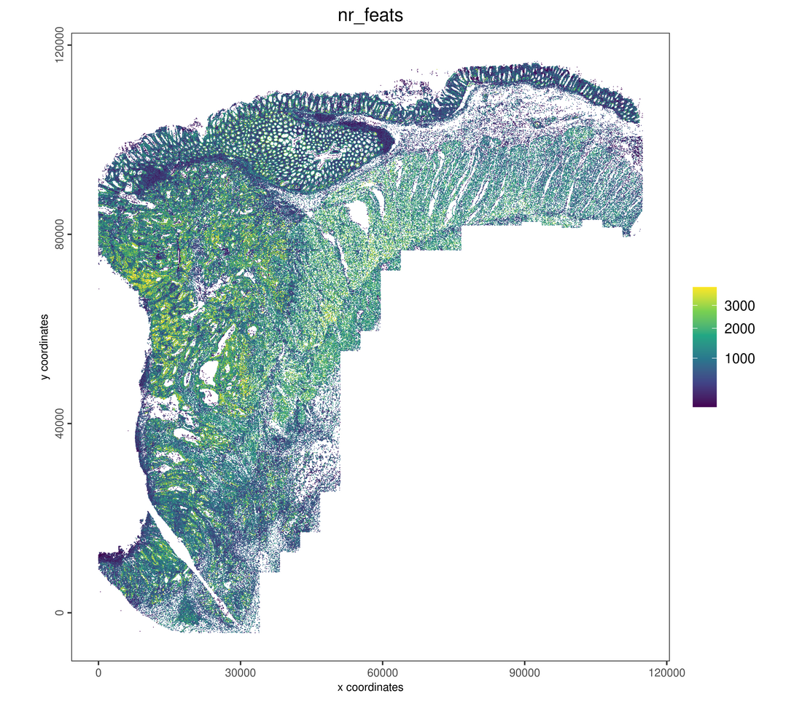
```

```{r qc-figs, fig.cap="Counts and genes per cell before filtering, with the gene threshold drawn.", fig.width=10.6, fig.height=3.4, eval = FALSE}
p_counts <- filterDistributions(g_cosmx, detection = "cells", method = "sum",
                                nr_bins = 90, show_plot = FALSE,
                                return_plot = TRUE, save_plot = FALSE) +
  scale_x_log10() + plot_theme

p_genes <- filterDistributions(g_cosmx, detection = "cells",
                               method = "threshold",
                               expression_threshold = 1, nr_bins = 90,
                               show_plot = FALSE, return_plot = TRUE,
                               save_plot = FALSE) +
  geom_vline(xintercept = 100, color = "#C44E52", linetype = "dashed") +
  plot_theme

p_qc <- plot_grid(p_counts, p_genes, nrow = 1)
GiottoVisuals::all_plots_save_function(g_cosmx, p_qc,
                                       default_save_name = "filterDistributions",
                                       base_width = 10.6, base_height = 3.4)
print(p_qc)
```

```{r qc-figs-fig, echo = FALSE, out.width = "100%"}
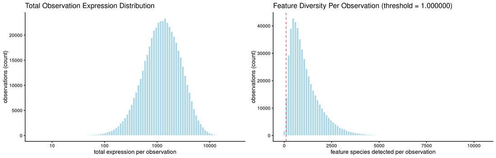
```

```{r qc-table, eval = FALSE}
prefilter_qc <- pDataDT(g_cosmx)
qc_probs <- c(0, 0.5, 0.9, 0.99, 1)
qc_table <- data.table(
  metric = c("counts per cell", "genes per cell"),
  rbind(round(as.numeric(quantile(prefilter_qc$nCount_RNA, qc_probs,
                                  na.rm = TRUE)), 1),
        round(as.numeric(quantile(prefilter_qc$nr_feats, qc_probs,
                                  na.rm = TRUE)), 1)))
setnames(qc_table, 2:6, c("min", "median", "q90", "q99", "max"))
qc_table
```

| metric | min | median | q90 | q99 | max |
|:---|---:|---:|---:|---:|---:|
| counts per cell | 5 | 1258 | 3455 | 7090 | 29055 |
| genes per cell | 2 | 895 | 2219 | 3936 | 10420 |

```{r filter, eval = FALSE}
g_cosmx <- filterGiotto(g_cosmx,
                        expression_threshold    = 1,
                        feat_det_in_min_cells   = 100,
                        min_det_feats_per_cell  = 100)
g_cosmx
```

# Normalization and dimension reduction

```{r reduce, eval = FALSE}
# PC1 is a depth axis (see the figure below), so PCs 2:20 are what the
# neighbor graph and UMAP in section 7 use. SEED is reused by every
# stochastic step.
SEED <- 1234

g_cosmx <- normalizeGiotto(g_cosmx, scale_feats = FALSE, scale_cells = FALSE,
                           scalefactor = 6000)

g_cosmx <- addStatistics(g_cosmx, stats = c("cell", "feature"))

g_cosmx <- calculateHVF(g_cosmx, method = "cov_groups",
                        nr_expression_groups = 20, zscore_threshold = 1.1,
                        n_top_feats = 2000, show_plot = FALSE,
                        save_plot = FALSE, return_plot = FALSE,
                        verbose = FALSE)

gene_metadata <- fDataDT(g_cosmx)
head(gene_metadata[hvf == "yes", feat_ID])
```

```
## [1] "A4GNT"  "AAAS"   "AAGAB"  "ABAT"   "ABCA10" "ABCA12"
```

```{r, eval = FALSE}
g_cosmx <- runPCA(g_cosmx, feats_to_use = "hvf", scale_unit = TRUE,
                  center = TRUE, ncp = 20, method = "auto", set_seed = TRUE,
                  seed_number = SEED, verbose = FALSE)

saveGiotto(g_cosmx, name = "pca", overwrite = TRUE, verbose = FALSE)
```

`scale_feats` and `scale_cells` stay `FALSE` because scaling densifies;
`scale_unit = TRUE` inside `runPCA()` standardizes without materializing.

```{r scree, fig.cap="Variance per principal component. Percentages are of the variance in the components computed.", fig.width=8, fig.height=7, eval = FALSE}
screePlot(g_cosmx, ncp = 20, verbose = FALSE)
```

```{r scree-fig, echo = FALSE, out.width = "100%"}
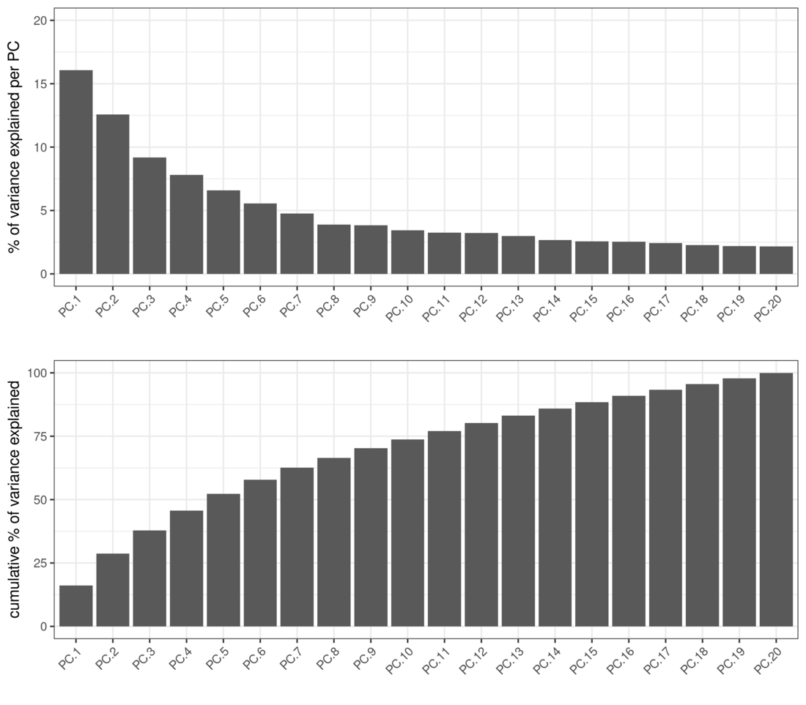
```

```{r pc-depth, fig.cap="Absolute correlation of each PC with log10 total counts. The dashed line is the 0.5 threshold used to decide whether PC1 is a depth axis.", fig.width=6.8, fig.height=3.6, eval = FALSE}
cell_metadata <- pDataDT(g_cosmx)
pc_matrix     <- getDimReduction(g_cosmx, reduction_method = "pca",
                                 output = "matrix")
shared_cells  <- intersect(rownames(pc_matrix), cell_metadata$cell_ID)
cell_depth    <- cell_metadata$nCount_RNA[match(shared_cells,
                                                cell_metadata$cell_ID)]
pc_depth_cor <- data.table(
  pc      = seq_len(ncol(pc_matrix)),
  abs_cor = abs(as.numeric(cor(pc_matrix[shared_cells, , drop = FALSE],
                               log10(pmax(cell_depth, 1))))))

ggplot(pc_depth_cor, aes(pc, abs_cor, fill = abs_cor > 0.5)) +
  geom_col(width = 0.75) + geom_hline(yintercept = 0.5, linetype = "dashed") +
  scale_fill_manual(values = c(`FALSE` = "#BBBBBB", `TRUE` = "#C44E52"),
                    guide = "none") +
  scale_x_continuous(breaks = pc_depth_cor$pc) +
  labs(x = "principal component",
       y = expression("|correlation| with log"[10] * " total counts"),
       subtitle = sprintf("PC1 |r| = %.3f | PCs 2:20 used downstream",
                          pc_depth_cor$abs_cor[1])) + plot_theme
```

```{r pc-depth-fig, echo = FALSE, out.width = "100%"}
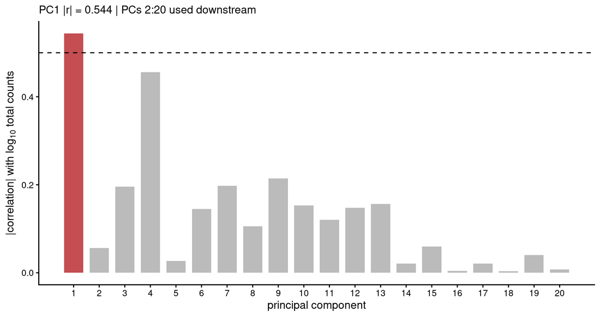
```

PC1 tracks depth at **|r| = 0.544**, so
it is dropped. Decide this from the figure on any new round rather than from
habit.

# Neighbors, UMAP, clustering

```{r cluster, eval = FALSE}
g_cosmx <- createNearestNetwork(g_cosmx, k = 30, dimensions_to_use = 2:20,
                                engine = "hnsw", ef = 400,
                                n_threads_build = 1, verbose = FALSE)

g_cosmx <- doLeidenCluster(g_cosmx, name = "leiden_clus", resolution = 1,
                           n_iterations = 100, set_seed = TRUE,
                           seed_number = SEED)

g_cosmx <- runUMAP(g_cosmx, dimensions_to_use = 2:20, n_neighbors = 30,
                   min_dist = 0.3, spread = 1, n_sgd_threads = 0,
                   nn_engine = "annoy", set_seed = TRUE, seed_number = SEED,
                   verbose = FALSE)

saveGiotto(g_cosmx, name = "processed", overwrite = TRUE, verbose = FALSE)
```


```{r cells-table, eval = FALSE}
cell_metadata <- pDataDT(g_cosmx)
cell_metadata[, clus := factor(leiden_clus,
                               levels = sort(unique(as.integer(leiden_clus))))]
CLUS_LEVELS <- levels(cell_metadata$clus)
LEIDEN_PAL  <- setNames(getDistinctColors(length(CLUS_LEVELS)), CLUS_LEVELS)

data.table(clusters = uniqueN(cell_metadata$clus),
           cells    = nrow(cell_metadata),
           smallest = min(cell_metadata[, .N, by = clus]$N),
           largest  = max(cell_metadata[, .N, by = clus]$N))
```

| clusters | cells | smallest | largest |
|---:|---:|---:|---:|
| 24 | 489445 | 5001 | 54831 |

```{r cluster-figs, fig.cap="Every cell in UMAP space by Leiden cluster, and the same embedding colored by genes detected.", fig.width=13, fig.height=5.4, eval = FALSE}
p_umap_clusters <- plotUMAP(g_cosmx, cell_color = "leiden_clus",
                            cell_color_code = LEIDEN_PAL,
                            point_size = 0.25, point_alpha = 0.4,
                            point_shape = "border", point_border_stroke = 0,
                            show_center_label = FALSE,
                            show_plot = FALSE, return_plot = TRUE,
                            save_plot = FALSE)
p_umap_genes <- plotUMAP(g_cosmx, cell_color = "nr_feats",
                         color_as_factor = FALSE,
                         cell_color_gradient = "viridis",
                         gradient_style = "sequential",
                         point_size = 0.25, point_alpha = 0.4,
                         point_shape = "border", point_border_stroke = 0,
                         show_plot = FALSE, return_plot = TRUE,
                         save_plot = FALSE)
p_umap_genes <- p_umap_genes +
  scale_fill_viridis_c(transform = "log10", name = "genes\nper cell")
p_umaps <- plot_grid(p_umap_clusters, p_umap_genes, nrow = 1,
                     rel_widths = c(1, 0.95))
GiottoVisuals::all_plots_save_function(g_cosmx, p_umaps,
                                       default_save_name = "UMAP",
                                       base_width = 13, base_height = 5.4)
print(p_umaps)
```

```{r cluster-figs-fig, echo = FALSE, out.width = "100%"}
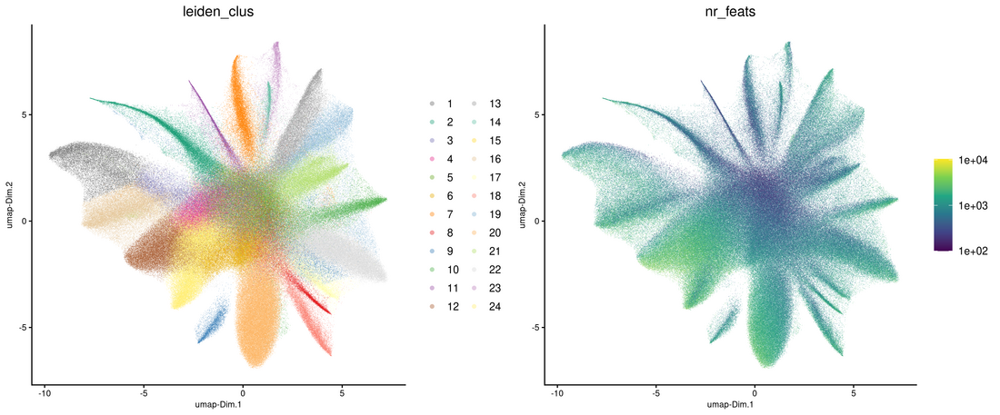
```

# Markers

`findScranMarkers_one_vs_all()` compares each cluster against the pooled
remainder and returns a `ranking` column, which orders the genes within each
cluster.

```{r markers, eval = FALSE}
scran_markers <- findScranMarkers_one_vs_all(g_cosmx,
                                             cluster_column = "leiden_clus",
                                             expression_values = "normalized",
                                             verbose = FALSE)
```

```{r tidy-markers, eval = FALSE}
markers_de <- scran_markers[
  , .(feats, cluster = as.character(cluster), logFC, p_value = p.value, FDR,
      ranking)]
markers_de <- markers_de[logFC >= 0.25 & FDR <= 0.05][order(cluster, ranking)]

data.table(clusters              = uniqueN(cell_metadata$clus),
           marker_rows           = nrow(markers_de),
           clusters_with_markers = uniqueN(markers_de$cluster))
head(markers_de, 5)
```

| clusters | marker_rows | clusters_with_markers |
|---:|---:|---:|
| 24 | 1924 | 23 |

| feats | cluster | logFC | p_value | FDR | ranking |
|:---|---:|---:|---:|---:|---:|
| KRT8 | 1 | 4.043495 | 0 | 0 | 1 |
| CKB | 1 | 3.857217 | 0 | 0 | 2 |
| FABP1 | 1 | 3.523662 | 0 | 0 | 3 |
| LGALS4 | 1 | 3.366537 | 0 | 0 | 4 |
| PIGR | 1 | 3.264485 | 0 | 0 | 5 |

```{r top-markers, eval = FALSE}
top_markers <- markers_de[order(cluster, ranking)][, head(.SD, 10), by = cluster]
cluster_table <- merge(
  cell_metadata[, .(cells = .N), by = .(cluster = as.character(clus))],
  top_markers[, .(top_genes = paste(feats, collapse = ", ")), by = cluster],
  by = "cluster", all.x = TRUE)
cluster_table[is.na(top_genes), top_genes := "(no markers passed the filter)"]
cluster_table[, cluster := factor(cluster, levels = CLUS_LEVELS)]
setorder(cluster_table, cluster)
cluster_table[]
```

| cluster | cells | top_genes |
|------:|------:|:----------------------------------------------------------------|
| 1 | 16419 | KRT8, CKB, FABP1, LGALS4, PIGR, ITM2C, PHGR1, B2M, EPCAM, SLC26A3 |
| 2 | 21589 | KIR3DL1, DEF6, CSF2, BRPF1, BAAT, RERGL, SULT1A2, IGF2BP3, DAPP1, KIAA0825 |
| 3 | 13545 | PIGR, LGALS4, KRT8, CKB, ITM2C, C15orf48, MUC2, FABP1, EPCAM, PHGR1 |
| 4 | 14743 | PIGR, RPS19, CEACAM5, RPS18, EPCAM, RPS21, RPL37A, RPLP2, RPS27, RPS29 |
| 5 | 25964 | (no markers passed the filter) |
| 6 | 21835 | OR10H5, MPV17L, DUX4, ZNF91, SHB, AKR1B10, GID4, NPIPB8, SULT1A3, FRG2 |
| 7 | 20812 | IGHA1, IGKC, JCHAIN, GRP, DPYSL4, SMIM41, TSC22D3, SMCO3, MZB1, DERL3 |
| 8 | 12124 | PRIMA1, CLU, LGI4, CDH19, VIM, SPARC, GPX3, KCNMB4, PMP22, MYH11 |
| 9 | 12904 | COL1A1, COL3A1, MMP1, MT2A, CXCL5, CXCL8, MMP2, SOD2, MMP3, COL1A2 |
| 10 | 16795 | MGP, C3, COL6A3, FBLN1, C7, COL3A1, MMP2, COL1A1, COL1A2, SERPINF1 |
| 11 | 15289 | CXCL8, MPV17L, HCAR3, HCAR2, DUX4, TAF11L3, PLEK, IL1B, PTGS2, G0S2 |
| 12 | 24975 | CEACAM5, PIGR, RPS18, RPS19, EPCAM, H4C11, RPL37A, RPS21, RPLP2, RPS29 |
| 13 | 18246 | HLA-DRB1, CD74, C1QC, HLA-DRA, HLA-DQB1, CD163, C1QA, HLA-DPA1, STAB1, CTSB |
| 14 | 14819 | TPSB2, IL1RL1, CPA3, KIT, HDC, SLC18A2, ALOX5, IL18R1, RGS1, MS4A2 |
| 15 | 8064 | IGHG1, PRKAG3, GCDH, HTR3C, EVA1A, NCAPH |
| 16 | 25300 | MUC2, PIGR, LGALS4, ITLN1, KRT8, ITM2C, SPINK4, FCGBP, B2M, REG4 |
| 17 | 9899 | NOTCH3, IGFBP7, COL4A1, COL18A1, SPARC, COL1A1, COL3A1, A2M, VIM, COL6A2 |
| 18 | 12643 | PECAM1, PLVAP, SPARC, COL4A1, VIM, IGFBP7, SHANK3, VWF, EGFL7, A2M |
| 19 | 16862 | APOE, HLA-DRB1, CTSB, CD74, CTSD, HLA-DRA, SPP1, C1QC, RNASE1, COL1A1 |
| 20 | 54831 | ACTG2, MYH11, DES, TPM2, FLNA, CNN1, MYLK, CSRP1, MYL9, TPM1 |
| 21 | 22917 | MPV17L, PTPRC, CXCR4, HLA-DRB1, IL7R, ZNF91, CD74, TRBC1, ARHGEF1, EVL |
| 22 | 43013 | COL1A1, COL1A2, COL3A1, SPARC, FN1, MMP11, COL6A3, AEBP1, COL6A2, MMP14 |
| 23 | 5001 | IGHG1, IGKC, GCDH, PRKAG3, PRMT8, EVA1A, HTR3C, NCAPH, XBP1, JCHAIN |
| 24 | 40856 | CEACAM5, RPS19, RPS18, TMSB10, EPCAM, PIGR, KRT8, S100A6, CLDN4, RPL37A |

# Naming the clusters

Each cluster is annotated based on the differentially expressed markers found
above, and its QC profile: counts, genes and area. The dot plot below adds a
third check, using curated marker genes that were chosen independently of this
clustering.

```{r cluster-qc, eval = FALSE}
cluster_qc <- cell_metadata[
  , .(cells           = .N,
      median_counts   = as.numeric(median(nCount_RNA)),
      median_genes    = as.numeric(median(nr_feats)),
      median_area_um2 = as.numeric(round(median(Area.um2, na.rm = TRUE), 1))),
  by = .(cluster = as.character(clus))]
cluster_qc[, pct_of_cells := round(100 * cells / sum(cells), 2)]
head(cluster_qc[order(as.integer(cluster))], 5)
```

| cluster | cells | median_counts | median_genes | median_area_um2 | pct_of_cells |
|---:|---:|---:|---:|---:|---:|
| 1 | 16419 | 1555 | 1082 | 77.5 | 3.35 |
| 2 | 21589 | 765 | 604 | 78.4 | 4.41 |
| 3 | 13545 | 794 | 591 | 60.7 | 2.77 |
| 4 | 14743 | 1248 | 851 | 70.8 | 3.01 |
| 5 | 25964 | 489 | 366 | 62.2 | 5.30 |

Cluster 5 is the **lowest of all 24 clusters on every QC profile**: 489 median
counts, 366 median genes, and 62.2 um2 median cell area. No gene passes the
marker filter, so it is low-quality cells rather than a cell type.

## Curated marker panels

One curated gene set per broad cell type, used to read the clusters and to pick
the genes drawn in the dot plot.

```{r panels-data, eval = FALSE}
colon_markers_l1 <- list(
  immune_myeloid = c("CD68", "CD14", "CSF1R", "AIF1", "TYROBP", "FCER1G",
                     "ITGAM", "MNDA"),
  immune_mast = c("TPSB2", "CPA3", "KIT", "MS4A2", "HDC", "SLC18A2", "GATA2"),
  immune_nk_t = c("IL7R", "TRBC1", "PTPRC", "CXCR4", "CD3D", "CD3E", "TRAC",
                  "CD2", "CD7", "CD8A", "NKG7", "GNLY", "KLRD1", "KLRF1"),
  immune_granulocyte = c("HCAR2", "HCAR3", "CXCL8", "IL1B", "PTGS2", "G0S2",
                         "PLEK"),
  immune_b = c("MS4A1", "CD79A", "CD79B", "CD19", "BANK1", "TNFRSF13C",
               "CR2", "FCRL1"),
  immune_plasma = c("IGHA1", "IGHG1", "IGKC", "JCHAIN", "MZB1", "DERL3",
                    "XBP1"),
  fibroblast_CAF = c("COL1A1", "COL1A2", "COL3A1", "DCN", "LUM", "PDGFRB",
                     "THY1"),
  myofibroblast_SMC = c("MYH11", "DES", "ACTG2", "CNN1", "MYLK", "TAGLN",
                        "MYL9"),
  pericyte = c("NOTCH3", "RGS5", "KCNJ8", "HIGD1B", "CSPG4", "ACTA2", "ANPEP"),
  endothelial = c("PECAM1", "CDH5", "CLDN5", "VWF", "EGFL7", "RAMP2", "ERG"),
  epithelial_colonocyte = c("EPCAM", "KRT8", "KRT18", "KRT19", "CDH1", "ELF3",
                            "CLDN7"),
  epithelial_secretory = c("MUC2", "ITLN1", "SPINK4", "REG4", "CLCA1", "FCGBP"),
  tumor = c("CEACAM5", "CEACAM6", "S100P", "TESC", "ETV4", "AXIN2", "NKD1",
            "CLDN2"),
  neural_nerve = c("PLP1", "S100B", "SOX10", "MPZ", "PMP22", "NRXN1", "GFRA3")
)
```

## Attaching labels

Manually assign cell-type annotations per leiden cluster.

```{r label-map, eval = FALSE}
broad_palette <- c(
  epithelial_colonocyte  = "#238B45",
  epithelial_secretory   = "#74C476",
  tumor                  = "#B2182B",
  immune_myeloid         = "#E08214",
  immune_granulocyte     = "#D94801",
  immune_mast            = "#FDB863",
  immune_nk_t            = "#2166AC",
  immune_plasma          = "#67A9CF",
  immune_mixed           = "#8073AC",
  fibroblast_CAF         = "#8C510A",
  myofibroblast_SMC      = "#BCBD22",
  pericyte               = "#7B3294",
  endothelial            = "#00BFC4",
  neural_nerve           = "#C51B7D",
  state_derepressed      = "#CA004C",
  QC_lowdetection        = "gray72",
  QC_unassigned          = "gray70",
  ambient_immunoglobulin = "#8FA5B3",
  ambient_lowspecificity = "gray45",
  unassigned             = "gray85")

BROAD <- c(
  "1"  = "epithelial_colonocyte",
  "2"  = "immune_mixed",
  "3"  = "epithelial_colonocyte",
  "4"  = "tumor",
  "5"  = "QC_lowdetection",
  "6"  = "state_derepressed",
  "7"  = "immune_plasma",
  "8"  = "neural_nerve",
  "9"  = "fibroblast_CAF",
  "10" = "fibroblast_CAF",
  "11" = "immune_granulocyte",
  "12" = "tumor",
  "13" = "immune_myeloid",
  "14" = "immune_mast",
  "15" = "ambient_immunoglobulin",
  "16" = "epithelial_secretory",
  "17" = "pericyte",
  "18" = "endothelial",
  "19" = "immune_myeloid",
  "20" = "myofibroblast_SMC",
  "21" = "immune_nk_t",
  "22" = "fibroblast_CAF",
  "23" = "immune_plasma",
  "24" = "tumor")
```

```{r annotate, eval = FALSE}
g_cosmx <- annotateGiotto(g_cosmx, annotation_vector = BROAD,
                          cluster_column = "leiden_clus",
                          name = "cell_type_broad")

saveGiotto(g_cosmx, name = "annotated", overwrite = TRUE, verbose = FALSE)

cell_metadata <- pDataDT(g_cosmx)

CELL_TYPES       <- names(broad_palette)[names(broad_palette) %in%
                                         cell_metadata$cell_type_broad]
CELL_TYPE_COLORS <- broad_palette[CELL_TYPES]
cell_metadata[, cell_type := factor(cell_type_broad, levels = CELL_TYPES)]

```

```{r dot-broad, fig.cap="Up to three curated panel genes per cell type: color is mean normalized expression, size is the percent of cells detecting the gene.", fig.width=9, fig.height=8, eval = FALSE}
panel_feats <- featIDs(g_cosmx)
dot_genes <- unique(unlist(lapply(
  colon_markers_l1[intersect(CELL_TYPES, names(colon_markers_l1))],
  function(genes) head(genes[genes %in% panel_feats], 3)),
  use.names = FALSE))

dot_values <- spatValues(g_cosmx, feats = dot_genes,
                         expression_values = "normalized", verbose = FALSE)
dot_means <- melt(dot_values, id.vars = "cell_ID", variable.name = "feat")[
  cell_metadata[, .(cell_ID, cell_type)], on = "cell_ID"][
  , .(m = mean(value)), by = .(feat, cell_type)]$m
dot_limits <- round(as.numeric(quantile(dot_means, c(0.05, 0.95),
                                        na.rm = TRUE)), 3)

dotPlot(g_cosmx, feats = dot_genes,
        cluster_column       = "cell_type_broad",
        cluster_custom_order = CELL_TYPES,
        expression_values    = "normalized",
        gradient_style       = "sequential",
        gradient_limits      = dot_limits,
        dot_scale            = 7,
        axis_text            = 6,
        theme_param = list(axis.text.x = element_text(angle = 45, hjust = 1)))
```

```{r dot-broad-fig, echo = FALSE, out.width = "100%"}
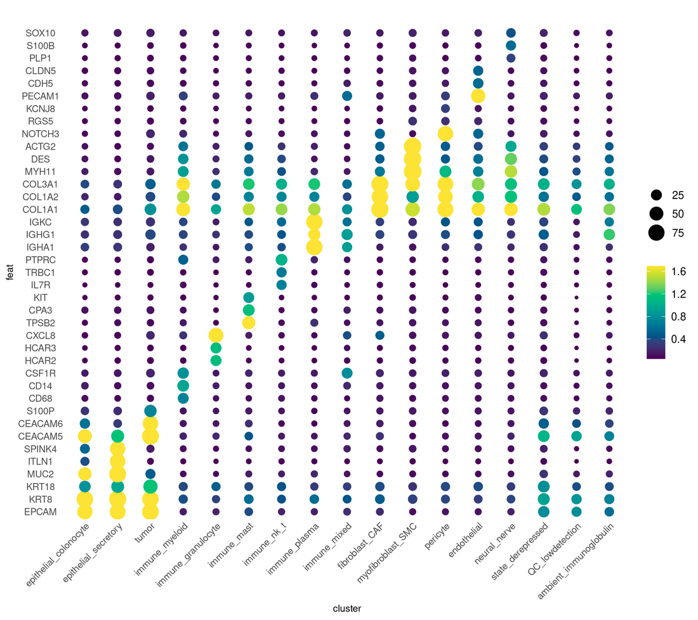
```

```{r marker-heatmap, fig.cap="Top de novo markers per cell type, z-scored across cell types and rescaled.", fig.width=9, fig.height=9, eval = FALSE}
heat_genes <- unique(markers_de[order(cluster, ranking)][
  , head(.SD, 2), by = cluster]$feats)

plotMetaDataHeatmap(g_cosmx, metadata_cols = "cell_type_broad",
                    selected_feats = heat_genes,
                    expression_values = "normalized",
                    show_values = "zscores_rescaled",
                    custom_cluster_order = CELL_TYPES,
                    x_text_angle = 45, x_text_size = 8,
                    y_text_size = 6)
```

```{r marker-heatmap-fig, echo = FALSE, out.width = "100%"}
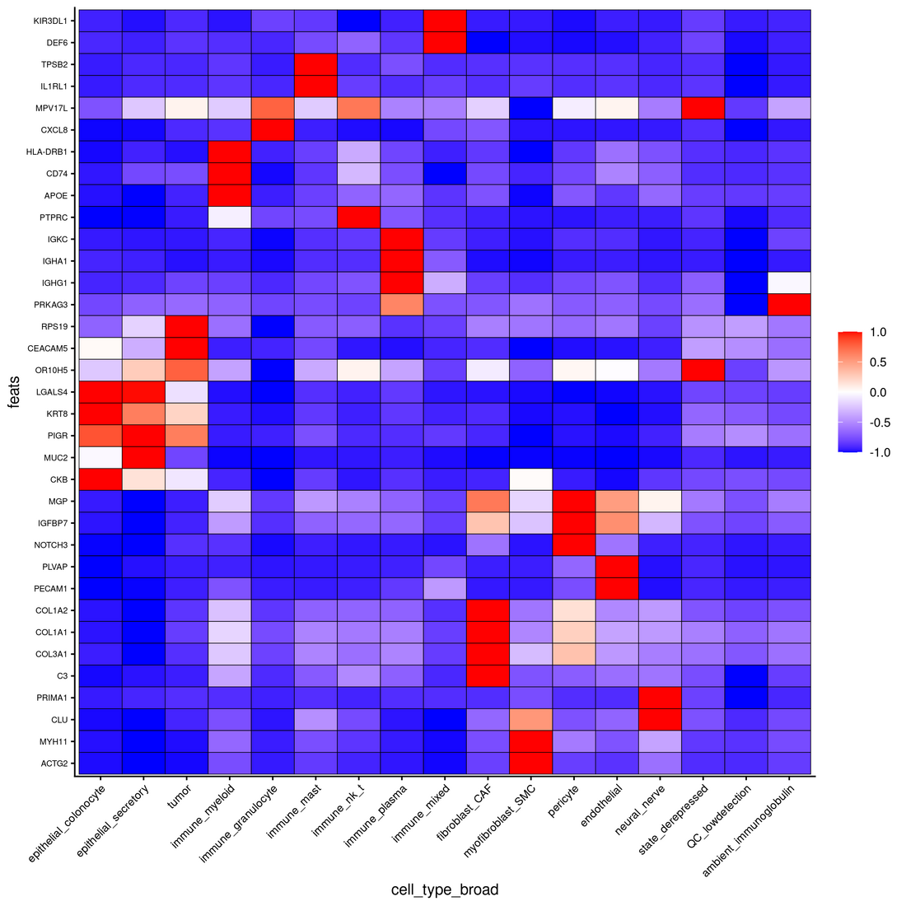
```

```{r celltype-counts, fig.cap="Cells per cell type.", fig.width=7.5, fig.height=5, eval = FALSE}
cell_type_counts <- cell_metadata[, .(cells = .N), by = .(label = as.character(cell_type))]
cell_type_counts[, pct_of_cells := round(100 * cells / sum(cells), 2)]
setorder(cell_type_counts, -cells)
cell_type_counts[, label := factor(label, levels = rev(label))]

ggplot(cell_type_counts, aes(label, cells, fill = label)) +
  geom_col(width = 0.75) +
  scale_fill_manual(values = CELL_TYPE_COLORS, drop = FALSE, na.value = "white",
                    guide = "none") + coord_flip() +
  geom_text(aes(label = sprintf("%s  (%.1f%%)",
                                formatC(cells, big.mark = ",", format = "d"),
                                pct_of_cells)), hjust = -0.06, size = 2.4) +
  scale_y_continuous(expand = expansion(mult = c(0, 0.22))) +
  labs(x = NULL, y = "cells", subtitle = "cells per cell type") + plot_theme
```

```{r celltype-counts-fig, echo = FALSE, out.width = "100%"}
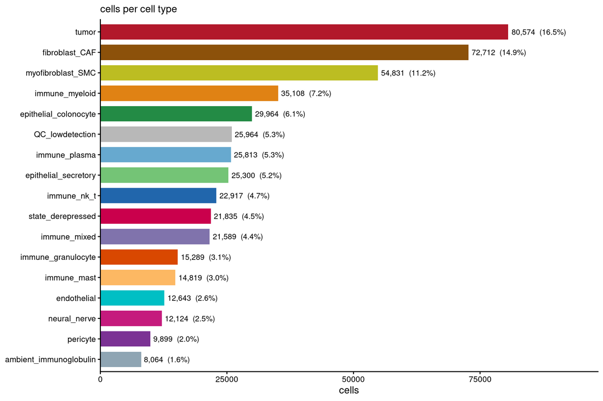
```

# Full annotated slide

```{r umap-celltype, fig.cap="The same embedding as section 7, now in the curated cell type colors.", fig.width=8, fig.height=6.4, eval = FALSE}
p_umap_cell_type <- plotUMAP(g_cosmx, cell_color = "cell_type_broad",
                           cell_color_code = CELL_TYPE_COLORS,
                           point_size = 0.25, point_alpha = 0.4,
                           point_shape = "border", point_border_stroke = 0,
                           show_center_label = FALSE,
                           show_plot = FALSE, return_plot = TRUE,
                           save_plot = FALSE)
p_umap_cell_type <- p_umap_cell_type +
  guides(fill = guide_legend(override.aes = list(alpha = 1, size = 3)),
         colour = guide_legend(override.aes = list(alpha = 1, size = 3)))
GiottoVisuals::all_plots_save_function(g_cosmx, p_umap_cell_type,
                                       default_save_name = "UMAP",
                                       base_width = 8, base_height = 6.4)
print(p_umap_cell_type)
```

```{r umap-celltype-fig, echo = FALSE, out.width = "100%"}
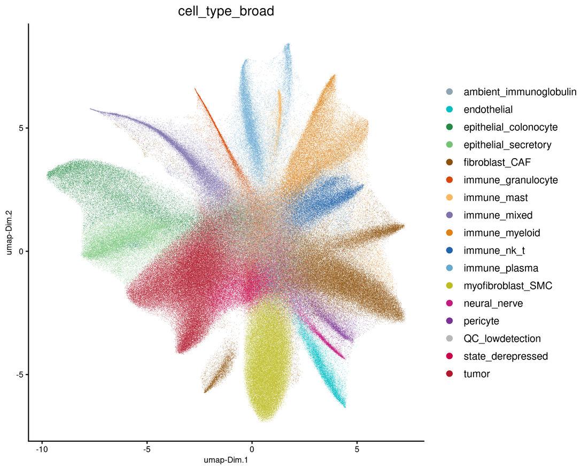
```

```{r spatial-celltype, fig.cap="The whole slide by cell type.", fig.width=9, fig.height=7.6, dpi=300, eval = FALSE}
spatPlot2D(
  g_cosmx, cell_color = "cell_type_broad",
  cell_color_code = CELL_TYPE_COLORS,
  point_size = 0.25, point_shape = "border",
  point_border_stroke = 0, coord_fix_ratio = 1,
  title = sprintf("%s cells | %d clusters | %d cell types",
                  format(nrow(cell_metadata), big.mark = ","),
                  length(CLUS_LEVELS), length(CELL_TYPES)),
  background_color = "white")
```

```{r spatial-celltype-fig, echo = FALSE, out.width = "100%"}
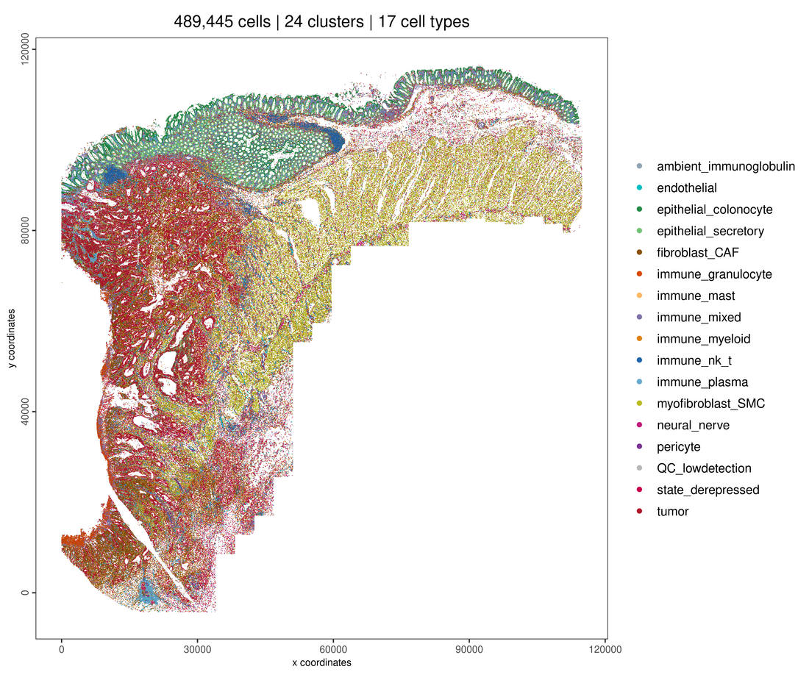
```

The annotation was never given spatial information, so the histology above is an
independent check on it.

```{r spatial-facets, fig.cap="One panel per cell type, every other cell in gray behind it.", fig.width=11, fig.height=9, eval = FALSE}
cell_type_plots <- lapply(CELL_TYPES, function(cell_type)
  spatPlot2D(g_cosmx, cell_color = "cell_type_broad",
             cell_color_code = CELL_TYPE_COLORS,
             select_cell_groups = cell_type, show_other_cells = TRUE,
             other_cell_color = "#ECECEC", other_point_size = 0.06,
             point_size = 0.18, point_shape = "border",
             point_border_stroke = 0, coord_fix_ratio = 1,
             show_legend = FALSE, title = cell_type, background_color = "white",
             show_plot = FALSE, return_plot = TRUE, save_plot = FALSE))
p_facets <- plot_grid(plotlist = cell_type_plots, ncol = 5)
GiottoVisuals::all_plots_save_function(g_cosmx, p_facets,
                                       default_save_name = "spatPlot2D",
                                       base_width = 11, base_height = 9)
print(p_facets)
```

```{r spatial-facets-fig, echo = FALSE, out.width = "100%"}
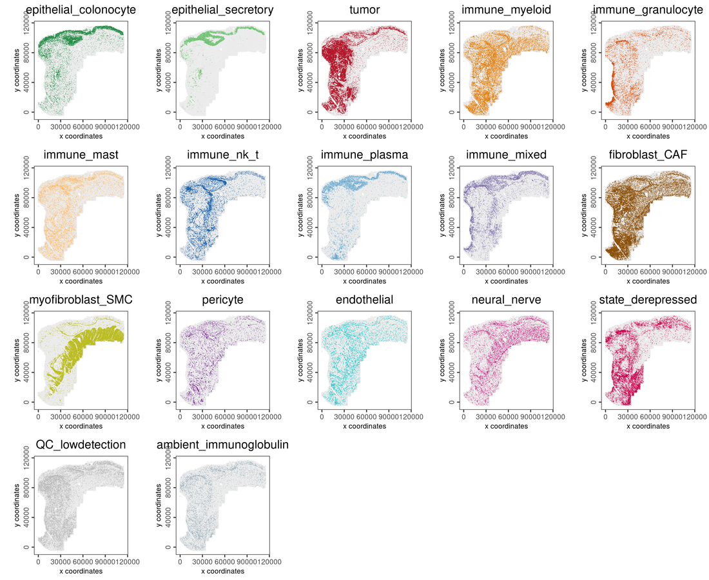
```

# Segmentation boundaries

```{r polygons, fig.cap="A 1,024 x 1,024 um window of CosMx segmentation boundaries, filled by cell type.", fig.width=9.5, fig.height=8, eval = FALSE}
ZOOM_UM <- 1024
side    <- ZOOM_UM / 0.12028   # px2um for this instrument

# center the zoom on the most cell-dense 1,024 um square of the slide
cell_locs <- getSpatialLocations(g_cosmx, output = "data.table")
densest   <- cell_locs[!is.na(sdimx), .N, by = .(bx = floor(sdimx / side),
                                                 by_ = floor(sdimy / side))][
  order(-N)]
cx <- (densest$bx[1] + 0.5) * side
cy <- (densest$by_[1] + 0.5) * side

g_zoom <- subsetGiottoLocs(g_cosmx,
                           x_min = cx - side / 2, x_max = cx + side / 2,
                           y_min = cy - side / 2, y_max = cy + side / 2)

spatInSituPlotPoints(
  g_zoom,
  polygon_feat_type      = "cell",
  show_polygon           = TRUE,
  polygon_fill           = "cell_type_broad",
  polygon_fill_as_factor = TRUE,
  polygon_fill_code      = CELL_TYPE_COLORS,
  polygon_color          = "gray30",
  polygon_line_size      = 0.06,
  background_color       = "white")
```

```{r polygons-fig, echo = FALSE, out.width = "100%"}
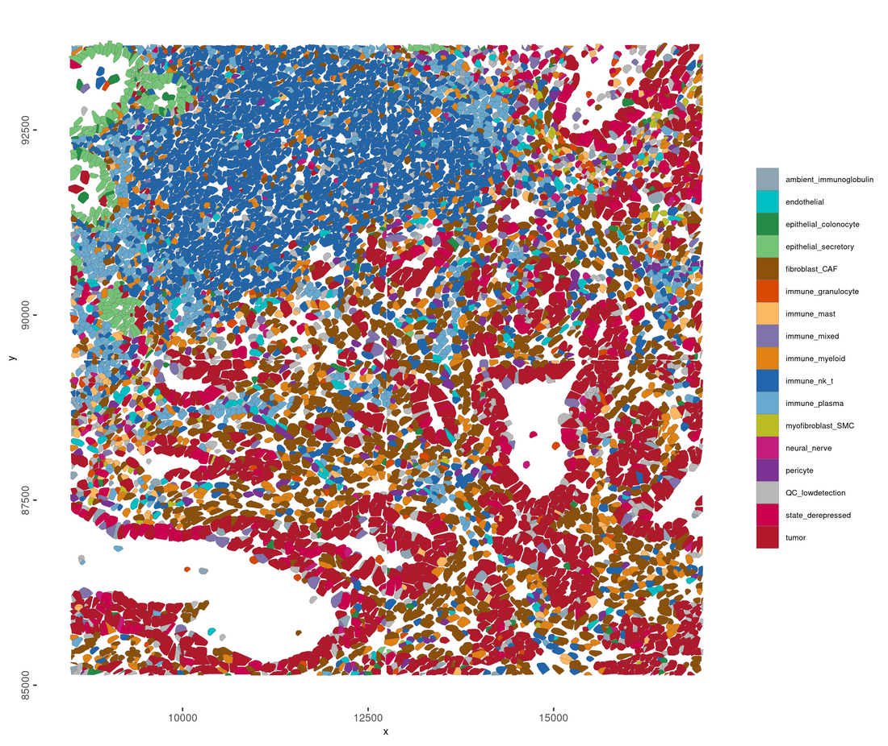
```

# Spatial neighborhood composition

Each cell is linked to its 20 nearest neighbors in space, and the number of
contacts between each pair of cell types is compared against a null where the
labels are shuffled. The network is stored in the vault as an edge store, which
is what `cellProximityEnrichment()` reads.

```{r spatnet, eval = FALSE}
g_cosmx <- createSpatialNetwork(g_cosmx, name = "knn_network",
                                method = "kNN", k = 20, verbose = FALSE)

proximity <- cellProximityEnrichment(
  g_cosmx,
  cluster_column        = "cell_type_broad",
  spatial_network_name  = "knn_network",
  number_of_simulations = 100,
  set_seed = TRUE, seed_number = SEED)

proximity_res <- proximity$enrichm_res

saveGiotto(g_cosmx, name = "proximity", overwrite = TRUE, verbose = FALSE)
```

**Each snapshot saved in this tutorial can be reloaded by name:** `pca` (section 6),
`processed` (section 7), `annotated` (section 9) and `proximity` (section 12). A
snapshot records only the R-side object; the matrix, polygons and edges stay as
parquet in the vault, so a reload re-attaches them rather than rebuilding.

```{r reload, eval = FALSE}
# uncomment below to reload the proximity snapshot
# g_cosmx <- loadGiotto(VAULT, name = "proximity", verbose = FALSE)
```

```{r cp-heatmap, fig.cap="Proximity enrichment for every cell type pair.", fig.width=7.6, fig.height=6.4, eval = FALSE}
cellProximityHeatmap(
  g_cosmx, CPscore = proximity, order_cell_types = TRUE, scale = TRUE)
```

```{r cp-heatmap-fig, echo = FALSE, out.width = "100%"}
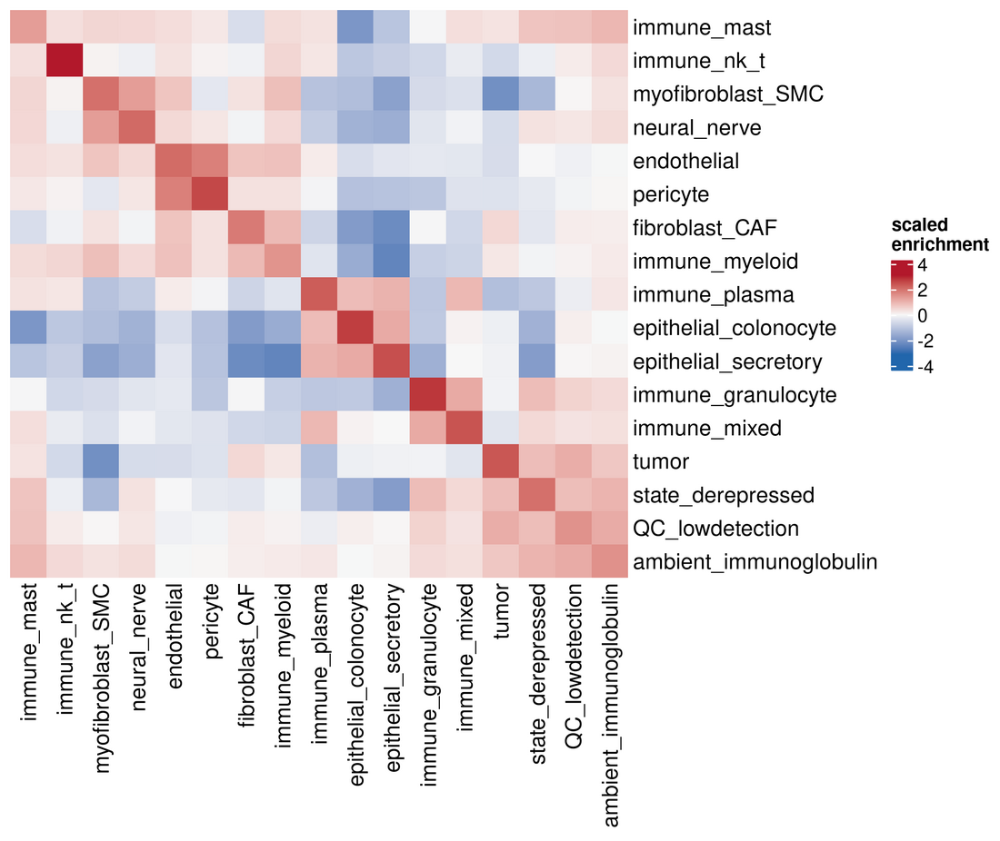
```

```{r cp-barplot, fig.cap="Enriched and depleted cell type pairs against the shuffled null.", fig.width=9, fig.height=6, eval = FALSE}
proximity_top <- proximity
proximity_top$enrichm_res <- proximity_res[
  order(-abs(enrichm))][seq_len(min(20, .N))]

cellProximityBarplot(
  g_cosmx, CPscore = proximity_top, min_orig_ints = 1000,
  min_sim_ints = 1000, p_val = 0.01)
```

```{r cp-barplot-fig, echo = FALSE, out.width = "100%"}
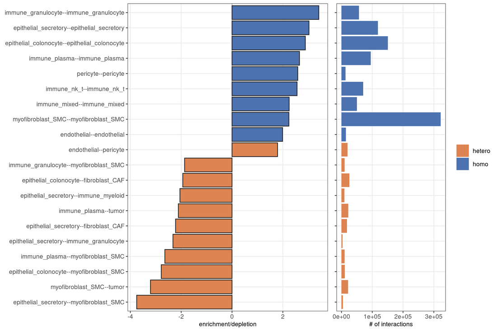
```

```{r cp-network, fig.cap="Cell type proximity network. Edge color separates enrichment from depletion and edge width scales with the enrichment score.", fig.width=9, fig.height=8, eval = FALSE}
cellProximityNetwork(
  g_cosmx, CPscore = proximity, remove_self_edges = TRUE,
  only_show_enrichment_edges = TRUE, layout = "Fruchterman",
  node_size = 5, node_text_size = 5, node_color_code = CELL_TYPE_COLORS)
```

```{r cp-network-fig, echo = FALSE, out.width = "100%"}
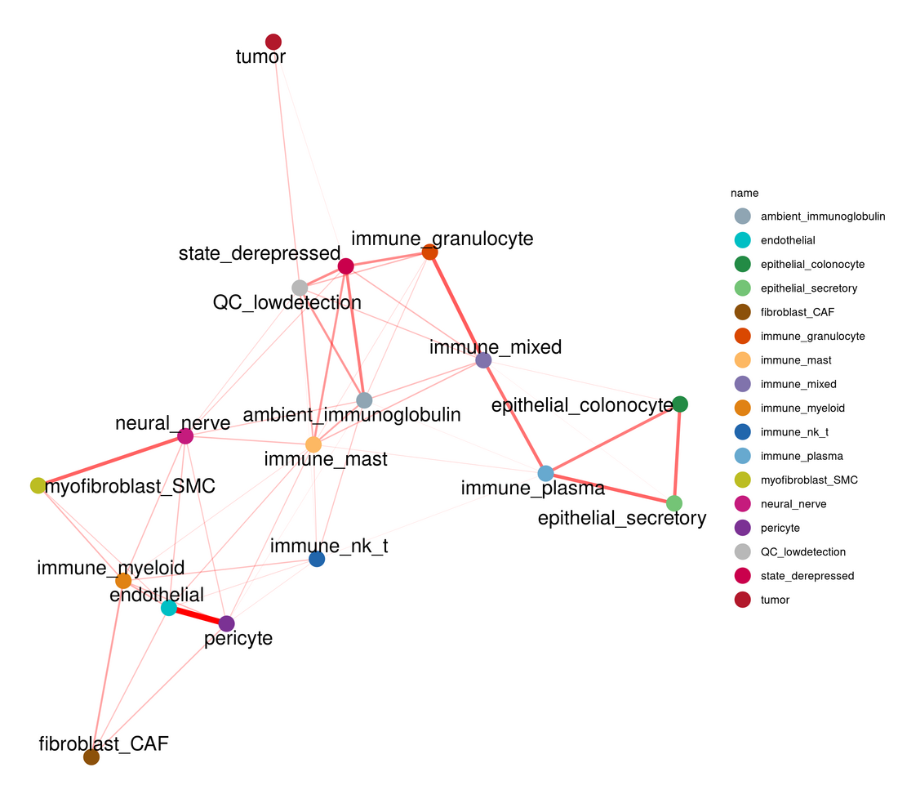
```

# Session information

```{r session, eval = FALSE}
sessionInfo()
```

```
## R version 4.5.2 (2025-10-31)
## Platform: x86_64-pc-linux-gnu
## Running under: AlmaLinux 8.10 (Cerulean Leopard)
## 
## Matrix products: default
## BLAS/LAPACK: FlexiBLAS NETLIB;  LAPACK version 3.12.0
## 
## locale:
##  [1] LC_CTYPE=en_US.UTF-8       LC_NUMERIC=C              
##  [3] LC_TIME=en_US.UTF-8        LC_COLLATE=en_US.UTF-8    
##  [5] LC_MONETARY=en_US.UTF-8    LC_MESSAGES=en_US.UTF-8   
##  [7] LC_PAPER=en_US.UTF-8       LC_NAME=C                 
##  [9] LC_ADDRESS=C               LC_TELEPHONE=C            
## [11] LC_MEASUREMENT=en_US.UTF-8 LC_IDENTIFICATION=C       
## 
## time zone: America/New_York
## tzcode source: system (glibc)
## 
## attached base packages:
## [1] stats     graphics  grDevices utils     datasets  methods   base     
## 
## other attached packages:
##  [1] future_1.70.0        terra_1.8-93         cowplot_1.2.0       
##  [4] ggplot2_4.0.2        data.table_1.18.4    GiottoDisk_0.0.0.3  
##  [7] GiottoVisuals_0.2.16 Giotto_4.3.0         GiottoClass_0.7.2   
## [10] arrow_25.0.0        
## 
## loaded via a namespace (and not attached):
##   [1] RColorBrewer_1.1-3          shape_1.4.6.1              
##   [3] wk_0.9.4                    jsonlite_2.0.0             
##   [5] magrittr_2.0.5              magick_2.9.0               
##   [7] farver_2.1.2                rmarkdown_2.30             
##   [9] GlobalOptions_0.1.2         ragg_1.5.0                 
##  [11] vctrs_0.7.1                 Cairo_1.7-0                
##  [13] memoise_2.0.1               GiottoUtils_0.2.6          
##  [15] htmltools_0.5.9             S4Arrays_1.10.1            
##  [17] BiocNeighbors_2.4.0         SparseArray_1.10.8         
##  [19] sass_0.4.10                 parallelly_1.47.0          
##  [21] bslib_0.10.0                htmlwidgets_1.6.4          
##  [23] plotly_4.12.0               cachem_1.1.0               
##  [25] igraph_2.2.1                iterators_1.0.14           
##  [27] lifecycle_1.0.5             pkgconfig_2.0.3            
##  [29] rsvd_1.0.5                  Matrix_1.7-4               
##  [31] R6_2.6.1                    fastmap_1.2.0              
##  [33] clue_0.3-66                 MatrixGenerics_1.22.0      
##  [35] digest_0.6.39               colorspace_2.1-2           
##  [37] S4Vectors_0.48.0            dqrng_0.4.1                
##  [39] irlba_2.3.7                 textshaping_1.0.4          
##  [41] GenomicRanges_1.62.1        beachmat_2.26.0            
##  [43] filelock_1.0.3              labeling_0.4.3             
##  [45] progressr_0.18.0            httr_1.4.8                 
##  [47] polyclip_1.10-7             abind_1.4-8                
##  [49] compiler_4.5.2              doParallel_1.0.17          
##  [51] bit64_4.6.0-1               withr_3.0.2                
##  [53] S7_0.2.1                    backports_1.5.0            
##  [55] BiocParallel_1.44.0         viridis_0.6.5              
##  [57] ggforce_0.5.0               R.utils_2.13.0             
##  [59] MASS_7.3-65                 rappdirs_0.3.4             
##  [61] DelayedArray_0.36.0         rjson_0.2.23               
##  [63] cosmxscan_0.1.0             bluster_1.20.0             
##  [65] gtools_3.9.5                tools_4.5.2                
##  [67] otel_0.2.0                  future.apply_1.20.0        
##  [69] R.oo_1.27.1                 glue_1.8.0                 
##  [71] dbscan_1.2.4                grid_4.5.2                 
##  [73] checkmate_2.3.4             cluster_2.1.8.3            
##  [75] generics_0.1.4              gtable_0.3.6               
##  [77] R.methodsS3_1.8.2           tidyr_1.3.2                
##  [79] metapod_1.18.0              BiocSingular_1.26.1        
##  [81] tidygraph_1.3.1             ScaledMatrix_1.18.0        
##  [83] XVector_0.50.0              BiocGenerics_0.56.0        
##  [85] tilework_1.0.0              RcppAnnoy_0.0.23           
##  [87] foreach_1.5.2               ggrepel_0.9.6              
##  [89] pillar_1.11.1               limma_3.66.0               
##  [91] RcppHNSW_0.6.0              circlize_0.4.16            
##  [93] dplyr_1.2.0                 tweenr_2.0.3               
##  [95] lattice_0.22-7              bit_4.6.0                  
##  [97] tidyselect_1.2.1            ComplexHeatmap_2.26.1      
##  [99] locfit_1.5-9.12             SingleCellExperiment_1.32.0
## [101] scuttle_1.20.0              knitr_1.51                 
## [103] gridExtra_2.3               IRanges_2.44.0             
## [105] Seqinfo_1.0.0               edgeR_4.8.2                
## [107] SummarizedExperiment_1.40.0 scattermore_1.2            
## [109] stats4_4.5.2                xfun_0.56                  
## [111] graphlayouts_1.2.3          Biobase_2.70.0             
## [113] statmod_1.5.1               matrixStats_1.5.0          
## [115] lazyeval_0.2.2              yaml_2.3.12                
## [117] evaluate_1.0.5              codetools_0.2-20           
## [119] ggraph_2.2.2                tibble_3.3.1               
## [121] colorRamp2_0.1.0            cli_3.6.6                  
## [123] uwot_0.2.4                  reticulate_1.45.0          
## [125] systemfonts_1.3.1           jquerylib_0.1.4            
## [127] dichromat_2.0-0.1           Rcpp_1.1.1-1.1             
## [129] globals_0.19.1              png_0.1-8                  
## [131] parallel_4.5.2              assertthat_0.2.1           
## [133] scran_1.38.1                listenv_0.10.1             
## [135] SpatialExperiment_1.20.0    viridisLite_0.4.3          
## [137] scales_1.4.0                crayon_1.5.3               
## [139] purrr_1.2.1                 GetoptLong_1.0.5           
## [141] rlang_1.2.0
```
