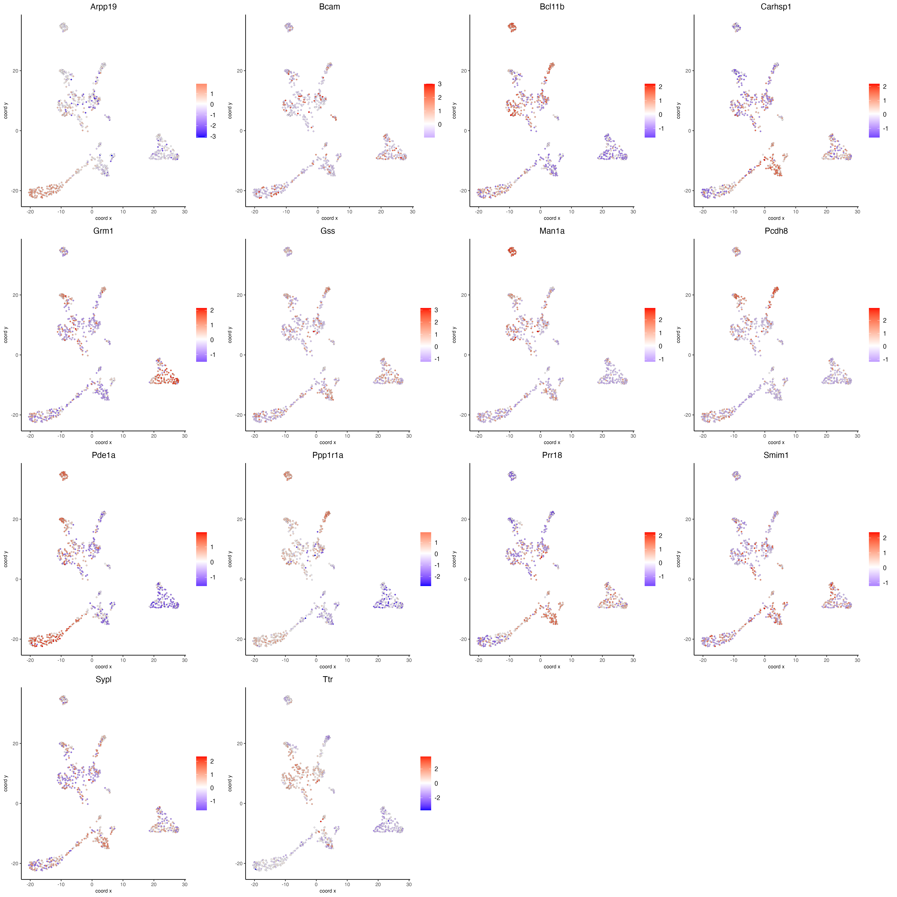

Visium spatial transcriptomics does not provide single-cell resolution, making cell type annotation a harder problem. Giotto provides ways to calculate enrichment of specific cell-type signature gene lists.

Spatial Dampened Weighted Least Squares (DWLS) estimates the proportions of different cell types across spots in a tissue.

# Setup and load example dataset

```{r, eval=FALSE}
# Ensure Giotto Suite is installed
if(!"Giotto" %in% installed.packages()) {
  pak::pkg_install("drieslab/Giotto")
}

# Ensure Giotto Data is installed
if(!"GiottoData" %in% installed.packages()) {
  pak::pkg_install("drieslab/GiottoData")
}

library(Giotto)

# Ensure the Python environment for Giotto has been installed
genv_exists <- checkGiottoEnvironment()

if(!genv_exists){
  # The following command need only be run once to install the Giotto environment
  installGiottoEnvironment()
}
```

```{r, eval=FALSE}
# load the object
g <- GiottoData::loadGiottoMini("visium")
```

# Download the single-cell dataset

```{r, eval=FALSE}
GiottoData::getSpatialDataset(dataset = "scRNA_mouse_brain", 
                              directory = "data/scRNA_mouse_brain")
```

# Create the single-cell object and run the normalization step

```{r, eval=FALSE}
results_folder <- "path/to/results"

python_path <- NULL

instructions <- createGiottoInstructions(
    save_dir = results_folder,
    save_plot = TRUE,
    show_plot = FALSE,
    python_path = python_path
)

sc_expression <- "data/scRNA_mouse_brain/brain_sc_expression_matrix.txt.gz"
sc_metadata <- data.table::fread("data/scRNA_mouse_brain/brain_sc_metadata.csv")

giotto_SC <- createGiottoObject(expression = sc_expression,
                                instructions = instructions)

giotto_SC <- addCellMetadata(giotto_SC, 
                             new_metadata = sc_metadata[,2:129])

giotto_SC <- normalizeGiotto(giotto_SC)
```

# Calculate the cell type markers

```{r, eval=FALSE}
markers_scran <- findMarkers_one_vs_all(gobject = giotto_SC, 
                                        method = "scran",
                                        expression_values = "normalized",
                                        cluster_column = "Class", 
                                        min_feats = 3)

top_markers <- markers_scran[, head(.SD, 10), by = "cluster"]$feats
```

# Create the signature matrix

```{r, eval=FALSE}
sign_matrix <- makeSignMatrixDWLSfromMatrix(
    matrix = getExpression(giotto_SC,
                           values = "normalized",
                           output = "matrix"),
    cell_type = pDataDT(giotto_SC)$Class,
    sign_gene = top_markers)
```

# Run the DWLS Deconvolution

This step may take a couple of minutes to run.

```{r, eval=FALSE}
g <- runDWLSDeconv(gobject = g, 
                   sign_matrix = sign_matrix)
```

# Visualize

Plot the DWLS deconvolution result creating with pie plots showing the proportion of each cell type per spot.

```{r, eval=FALSE}
spatDeconvPlot(g, 
               show_image = FALSE,
               radius = 50)
```

```{r, echo=FALSE, out.width="80%", fig.align='center'}

```


# Session info

```{r, eval=FALSE}
sessionInfo()
```

```{r, eval=FALSE}

```

