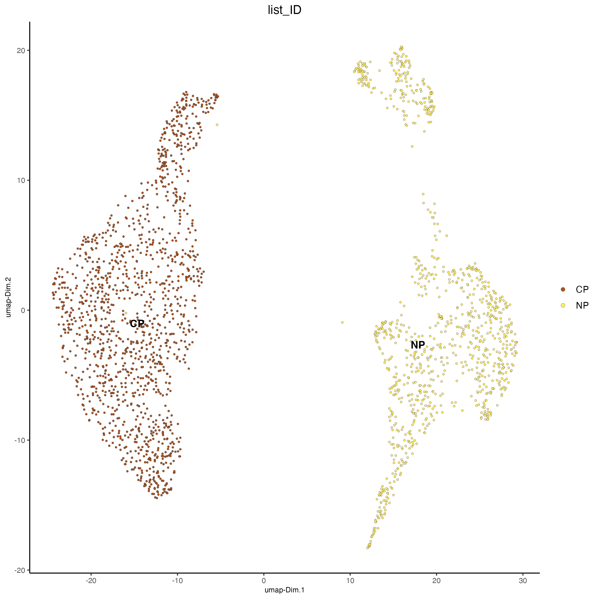
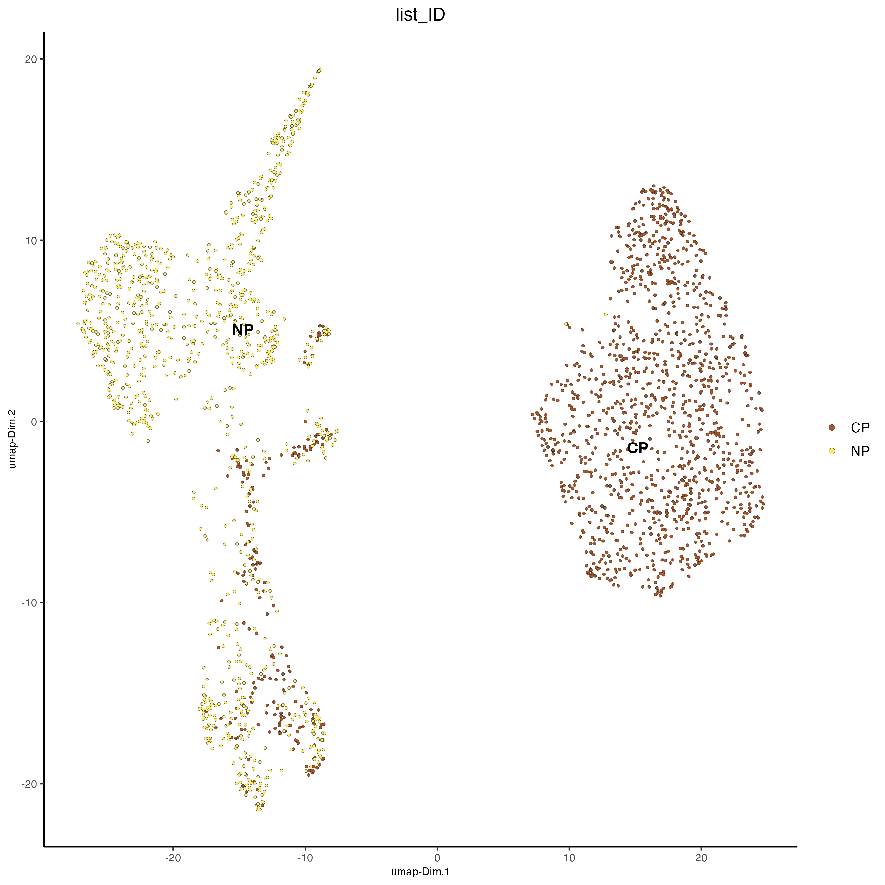
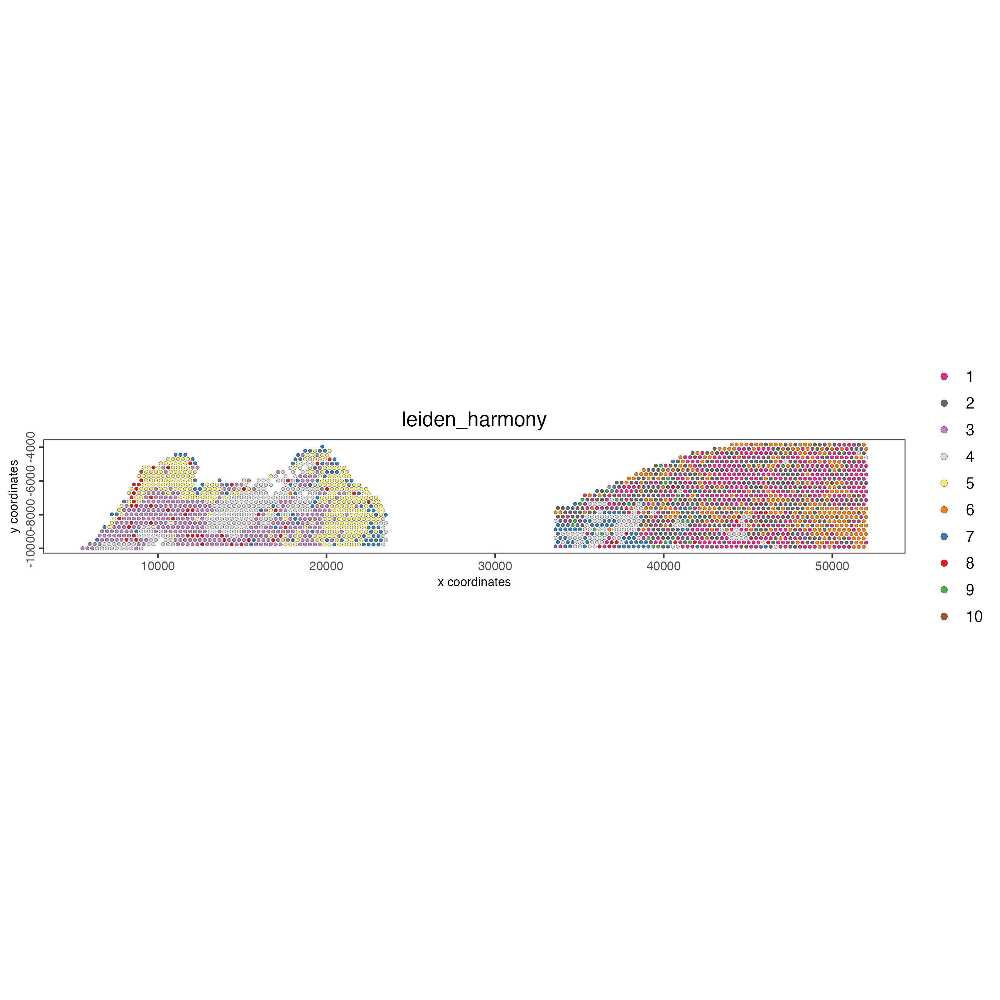

When handling multiple samples, it's possible that they exhibit a batch effect. This can be corrected using diverse methods. Giotto has the Harmony method available.

# Setup and load example dataset

```{r, eval=FALSE}
# Ensure Giotto Suite is installed
if(!"Giotto" %in% installed.packages()) {
  pak::pkg_install("drieslab/Giotto")
}

# Ensure Giotto Data is installed
if(!"GiottoData" %in% installed.packages()) {
  pak::pkg_install("drieslab/GiottoData")
}

library(Giotto)

# Ensure the Python environment for Giotto has been installed
genv_exists <- checkGiottoEnvironment()

if(!genv_exists){
  # The following command need only be run once to install the Giotto environment
  installGiottoEnvironment()
}
```

```{r, eval=FALSE}
# load the object
g <- GiottoData::loadGiottoMini("visium_multisample")
```

# Run harmony integration

```{r, eval=FALSE}
g <- runGiottoHarmony(g, 
                      vars_use = "list_ID")
```

# Clustering

Now that we have the integration, we can use it instead of the pca to calculate the downstream steps of the analysis.

- Calculate UMAP using the default pca

```{r, eval=FALSE}
g <- runUMAP(g)
```

```{r, eval=FALSE}
plotUMAP(g,
         cell_color = "list_ID")
```

```{r, echo=FALSE, out.width="70%", fig.align='center'}

```

- Calculate UMAP using the harmony results

```{r, eval=FALSE}
g <- runUMAP(g, 
             dim_reduction_name = "harmony", 
             dim_reduction_to_use = "harmony", 
             name = "umap_harmony")
```

```{r, eval=FALSE}
plotUMAP(g,
         dim_reduction_name =  "umap_harmony",
         cell_color = "list_ID")
```

```{r, echo=FALSE, out.width="70%", fig.align='center'}

```

- Calculate Nearest Network using the harmony results

```{r, eval=FALSE}
g <- createNearestNetwork(gobject = g,
                          dim_reduction_to_use = "harmony", 
                          dim_reduction_name = "harmony", 
                          name = "NN.harmony",
                          dimensions_to_use = 1:10, 
                          k = 15)
```

- Calculate Leiden Clusters using the harmony results

```{r, eval=FALSE}
g <- doLeidenCluster(gobject = g,
                     network_name = "NN.harmony", 
                     resolution = 0.4, 
                     n_iterations = 1000, 
                     name = "leiden_harmony")
```

- Plot 

```{r, eval=FALSE}
spatPlot2D(gobject = g,
           cell_color = "leiden_harmony",
           point_size = 1
)
```

```{r, echo=FALSE, out.width="100%", fig.align='center'}

```

# Session Info

```{r, eval=FALSE}
sessionInfo()
```

```{r, eval=FALSE}
R version 4.4.2 (2024-10-31)
Platform: x86_64-apple-darwin20
Running under: macOS Sequoia 15.0.1

Matrix products: default
BLAS:   /System/Library/Frameworks/Accelerate.framework/Versions/A/Frameworks/vecLib.framework/Versions/A/libBLAS.dylib 
LAPACK: /Library/Frameworks/R.framework/Versions/4.4-x86_64/Resources/lib/libRlapack.dylib;  LAPACK version 3.12.0

locale:
[1] en_US.UTF-8/en_US.UTF-8/en_US.UTF-8/C/en_US.UTF-8/en_US.UTF-8

time zone: America/New_York
tzcode source: internal

attached base packages:
[1] stats     graphics  grDevices utils     datasets  methods   base     

other attached packages:
[1] Giotto_4.1.4      GiottoClass_0.4.4

loaded via a namespace (and not attached):
 [1] tidyselect_1.2.1            viridisLite_0.4.2          
 [3] dplyr_1.1.4                 GiottoVisuals_0.2.8        
 [5] fastmap_1.2.0               SingleCellExperiment_1.26.0
 [7] lazyeval_0.2.2              digest_0.6.37              
 [9] lifecycle_1.0.4             terra_1.7-78               
[11] dbscan_1.2-0                magrittr_2.0.3             
[13] compiler_4.4.2              rlang_1.1.4                
[15] tools_4.4.2                 igraph_2.0.3               
[17] utf8_1.2.4                  yaml_2.3.10                
[19] data.table_1.16.0           FNN_1.1.4.1                
[21] knitr_1.48                  S4Arrays_1.4.1             
[23] htmlwidgets_1.6.4           reticulate_1.39.0          
[25] DelayedArray_0.30.1         abind_1.4-8                
[27] withr_3.0.1                 purrr_1.0.2                
[29] BiocGenerics_0.50.0         grid_4.4.2                 
[31] stats4_4.4.2                fansi_1.0.6                
[33] colorspace_2.1-1            ggplot2_3.5.1              
[35] scales_1.3.0                gtools_3.9.5               
[37] SummarizedExperiment_1.34.0 cli_3.6.3                  
[39] rmarkdown_2.28              crayon_1.5.3               
[41] generics_0.1.3              rstudioapi_0.16.0          
[43] httr_1.4.7                  rjson_0.2.23               
[45] zlibbioc_1.50.0             parallel_4.4.2             
[47] XVector_0.44.0              matrixStats_1.4.1          
[49] vctrs_0.6.5                 Matrix_1.7-1               
[51] jsonlite_1.8.9              GiottoData_0.2.16          
[53] IRanges_2.38.1              S4Vectors_0.42.1           
[55] ggrepel_0.9.6               irlba_2.3.5.1              
[57] scattermore_1.2             magick_2.8.5               
[59] GiottoUtils_0.2.1           harmony_1.2.1              
[61] plotly_4.10.4               tidyr_1.3.1                
[63] glue_1.8.0                  codetools_0.2-20           
[65] uwot_0.2.2                  cowplot_1.1.3              
[67] gtable_0.3.5                GenomeInfoDb_1.40.1        
[69] GenomicRanges_1.56.1        UCSC.utils_1.0.0           
[71] munsell_0.5.1               tibble_3.2.1               
[73] pillar_1.9.0                htmltools_0.5.8.1          
[75] GenomeInfoDbData_1.2.12     R6_2.5.1                   
[77] evaluate_1.0.0              lattice_0.22-6             
[79] Biobase_2.64.0              png_0.1-8                  
[81] backports_1.5.0             RhpcBLASctl_0.23-42        
[83] SpatialExperiment_1.14.0    Rcpp_1.0.13                
[85] SparseArray_1.4.8           checkmate_2.3.2            
[87] colorRamp2_0.1.0            xfun_0.47                  
[89] MatrixGenerics_1.16.0       pkgconfig_2.0.3 
```
