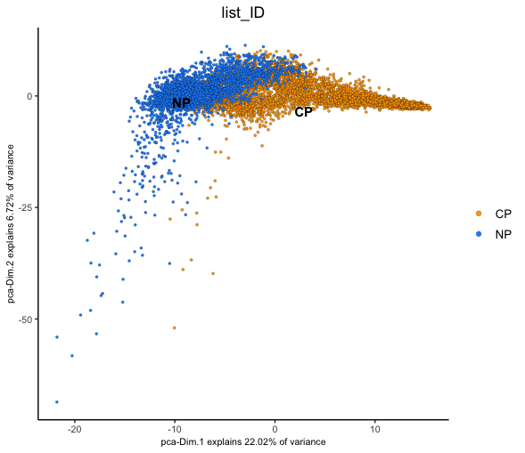
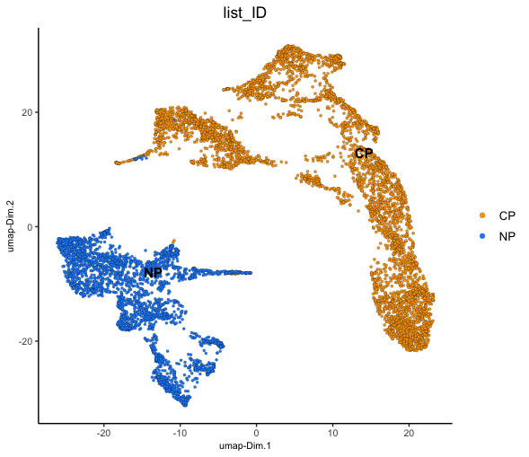
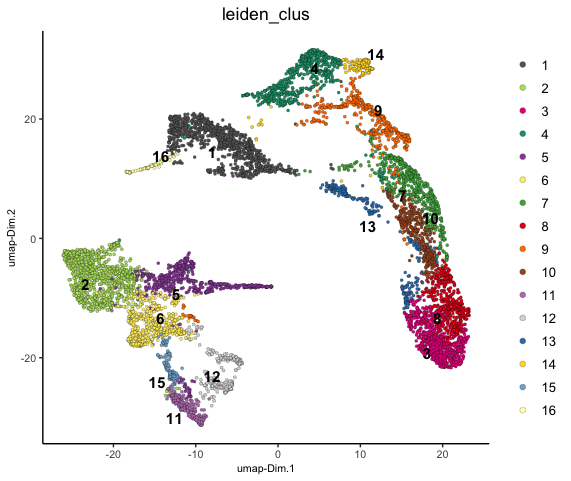
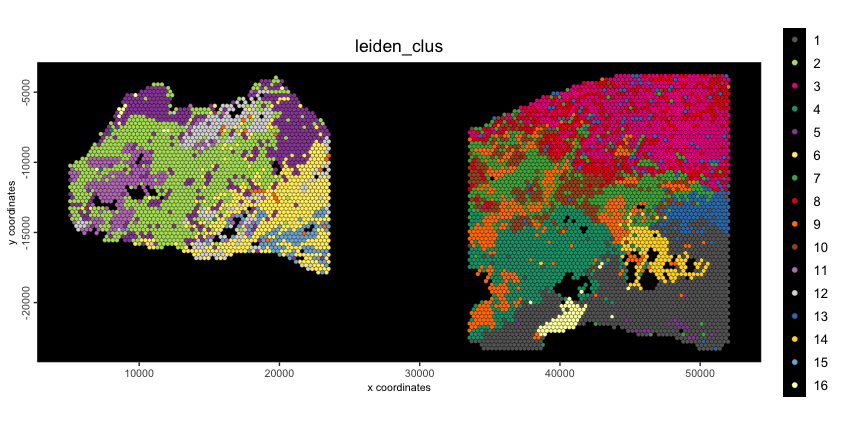
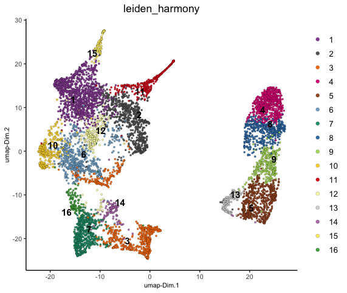
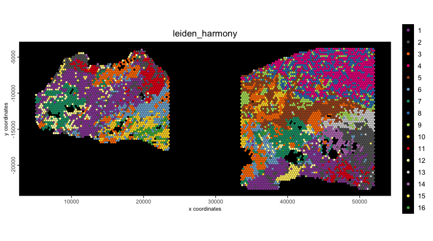

When working with multiple samples, there may be technical batch effects between them that interfere with real biological signal. These samples are perfectly fine to be analyzed separately and internally consistent, but comparing across the samples or joining their expression information will run into issues if there are batch effects. These effects are most obvious when examining them colored in by batch in dimension reductions such as PCA and UMAP. Here we work through an excerpt from the [visium prostate example](visium_prostate_integration.html) to highlight the necessity of data integration, and walk through how it can be dealt with in Giotto via {Harmony}.

# Setup

```{r, eval=FALSE}
# Ensure Giotto Suite is installed
if(!"Giotto" %in% installed.packages()) {
  pak::pkg_install("drieslab/Giotto")
}

library(Giotto)

# Ensure the Python environment for Giotto has been installed
genv_exists <- checkGiottoEnvironment()

if(!genv_exists){
  # The following command need only be run once to install the Giotto environment
  installGiottoEnvironment()
}
```


# Dataset explanation

The Visium Normal Prostate data to run this tutorial can be found 
[here](https://www.10xgenomics.com/resources/datasets/normal-human-prostate-ffpe-1-standard-1-3-0)

The Visium Cancer Prostate data to run this tutorial can be found [here](https://www.10xgenomics.com/resources/datasets/human-prostate-cancer-adenocarcinoma-with-invasive-carcinoma-ffpe-1-standard-1-3-0)

## download dataset

Download the normal and cancer dataset info to separate directories called

* Visium_FFPE_Human_Normal_Prostate
* Visium_FFPE_Human_Prostate_Cancer

<details><summary>`curl` links from 10x genomics</summary>
```
# Normal
curl -O https://cf.10xgenomics.com/samples/spatial-exp/1.3.0/Visium_FFPE_Human_Normal_Prostate/Visium_FFPE_Human_Normal_Prostate_raw_feature_bc_matrix.tar.gz
curl -O https://cf.10xgenomics.com/samples/spatial-exp/1.3.0/Visium_FFPE_Human_Normal_Prostate/Visium_FFPE_Human_Normal_Prostate_spatial.tar.gz

# Cancer
curl -O https://cf.10xgenomics.com/samples/spatial-exp/1.3.0/Visium_FFPE_Human_Prostate_Cancer/Visium_FFPE_Human_Prostate_Cancer_raw_feature_bc_matrix.tar.gz
curl -O https://cf.10xgenomics.com/samples/spatial-exp/1.3.0/Visium_FFPE_Human_Prostate_Cancer/Visium_FFPE_Human_Prostate_Cancer_spatial.tar.gz
```

Within these folders, unzip the .gz files.


# Load example dataset

```{r, eval=FALSE}
# This dataset must be downlaoded manually; please do so and change the path below as appropriate
data_path <- "/path/to/data/"

## normal
N_pros <- createGiottoVisiumObject(
    visium_dir = file.path(data_path, "Visium_FFPE_Human_Normal_Prostate"),
    gene_column_index = 2
)

## cancer
C_pros <- createGiottoVisiumObject(
    visium_dir = file.path(data_path, "Visium_FFPE_Human_Prostate_Cancer/"),
    gene_column_index = 2
)

# join giotto objects
# joining with x_shift has the advantage that you can join both 2D and 3D data
# x_padding determines how much distance is between each dataset
# if x_shift = NULL, then the total shift will be guessed from the giotto image
g <- joinGiottoObjects(gobject_list = list(N_pros, C_pros),
    gobject_names = c("NP", "CP"),
    join_method = "shift", 
    x_padding = 1000
)
```

# Data processing

```{r, eval=FALSE}
# filter to in-tissue spots
g <- subset(g, subset = in_tissue == 1)
g <- filterGiotto(g,
    expression_threshold = 1,
    feat_det_in_min_cells = 50,
    min_det_feats_per_cell = 500
)

# normalize
g <- normalizeGiotto(g)
# find highly variable (interesting) features to build PCA space on
g <- calculateHVF(g)
# dimension reductions
g <- runPCA(g) # screePlot (omitted) finds first 10 PCs as sufficient
g <- runUMAP(g, dimensions_to_use = 1:10)
```

# Check for batch effects

We can now plot the Visium spots in PCA and UMAP dimension reduction spaces
to gauge how much batch effect there is between the two samples.

We can color the cells based on the `'list_ID'` that is recorded in the cell
metadata (`pDataDT()`) which differentiates which sample the spots are from
in the joined object.

```{r, eval=FALSE}
plotPCA(g, cell_color = "list_ID", cell_color_code = c("orange", "dodgerblue"))
```

```{r, echo=FALSE, out.width="60%", fig.align="center"}

```

```{r, eval=FALSE}
plotUMAP(g, cell_color = "list_ID", cell_color_code = c("orange", "dodgerblue"))
```

```{r, echo=FALSE, out.width="60%", fig.align="center"}

```

From both of these dimension reductions, you can see that the spots corresponding
to each of the two datasets generally cluster based on which sample they were from.
This technical difference will overwhelm any real biological information and
complicate cell clustering/typing.

To illustrate this, we can continue on with network creation on the PCA space
and then use that network with Leiden community detection clustering. These 
clusters can then be plotted in UMAP and spatial.

```{r, eval=FALSE}
g <- createNearestNetwork(g, dimensions_to_use = 1:10, k = 15)
g <- doLeidenCluster(g, resolution = 0.4, n_iterations = 1000)
plotUMAP(g, cell_color = "leiden_clus")
spatPlot2D(g, cell_color = "leiden_clus", point_size = 1.5, background_color = "black")
```

```{r, echo=FALSE, out.width="60%", fig.align="center"}

```

```{r, echo=FALSE, out.width="80%", fig.align="center"}

```
As shown, the spots have been clustered, but most clusters are not shared between
the two samples. This is biologically unrealistic since this is the same tissue,
and we would expect at least some tissue/celltype similarity between the two.

# Harmony integration

{Harmony} is an algorithm for integrating multiple datasets that may contain
batch effects or other unwanted variations. It does not edit the raw expression
values, but instead creates a new embedding space starting from the PCA coordinates
of the two batches.

It iteratively performs kmeans clustering and determines the probability that
a particular data point belongs to cluster/batch combinations, with an optimization
to ensure that clusters contain a mix of the different batches, with the proportion
being based on batch size.

For each cluster-batch combination, correction vectors are computed that
indicate how cells from that batch should be shifted in the PCA space to align
with other batches in the same cluster. Each data point receives a personalized
correction based on its probability of belonging to each cluster. These
iterative corrections are performed until the distance shifted by data points
falls below a threshold, after which the process has converged.

To run harmony, we use `runGiottoHarmony()`. Under the hood, this function calls
`?harmony::RunHarmony()`. Additional parameters can be passed through `runGiottoHarmony()`
to the underlying function to fine tune this process. Particularly important is
the `theta` param which increases diversity of batch/cluster.

`theta` of 2 or 5 will push clusters to have more balanced compositions, while
lower values will focus more on the original structure of the data
(minimum is 0 for no diversity).

```{r, eval=FALSE}
g <- runGiottoHarmony(g, vars_use = "list_ID", dimensions_to_use = 1:10)
```


```{r, eval=FALSE}
# recalculate UMAP using Harmony embedding space
g <- runUMAP(g,
    dim_reduction_name = "harmony", 
    dim_reduction_to_use = "harmony", 
    name = "umap_harmony"
)
# Calculate Nearest Network for use with community clustering using the harmony results.
g <- createNearestNetwork(g,
    dim_reduction_to_use = "harmony", 
    dim_reduction_name = "harmony", 
    name = "NN.harmony",
    dimensions_to_use = 1:10, 
    k = 15
)
# Calculate Leiden Clusters using the harmony results
g <- doLeidenCluster(g,
    network_name = "NN.harmony", 
    resolution = 0.4, 
    n_iterations = 1000, 
    name = "leiden_harmony"
)
# Plot
plotUMAP(g,
    dim_reduction_name = "umap_harmony",
    cell_color = "leiden_harmony"
)
spatPlot2D(g,
    cell_color = "leiden_harmony",
    point_size = 1.5,
    background = "black"
)
```

```{r, echo=FALSE, out.width="60%", fig.align="center"}

```

```{r, echo=FALSE, out.width="80%", fig.align="center"}

```

This clustering is much better and shows that there are many shared clusters
between the two datasets for similar tissue/cell types. This also makes them
much easier to compare across the two datasets.


# Session Info

```{r, eval=FALSE}
sessionInfo()
```

```
R version 4.4.1 (2024-06-14)
Platform: aarch64-apple-darwin20
Running under: macOS 15.3.1

Matrix products: default
BLAS:   /System/Library/Frameworks/Accelerate.framework/Versions/A/Frameworks/vecLib.framework/Versions/A/libBLAS.dylib 
LAPACK: /Library/Frameworks/R.framework/Versions/4.4-arm64/Resources/lib/libRlapack.dylib;  LAPACK version 3.12.0

locale:
[1] en_US.UTF-8/en_US.UTF-8/en_US.UTF-8/C/en_US.UTF-8/en_US.UTF-8

time zone: America/New_York
tzcode source: internal

attached base packages:
[1] stats     graphics  grDevices utils     datasets  methods   base     

other attached packages:
[1] GiottoVisuals_0.2.12 Giotto_4.2.1         testthat_3.2.1.1     GiottoClass_0.4.7   

loaded via a namespace (and not attached):
  [1] RcppAnnoy_0.0.22            later_1.3.2                 tibble_3.2.1               
  [4] R.oo_1.26.0                 polyclip_1.10-7             dbMatrix_0.0.0.9023        
  [7] lifecycle_1.0.4             edgeR_4.2.0                 rprojroot_2.0.4            
 [10] globals_0.16.3              lattice_0.22-6              MASS_7.3-60.2              
 [13] crosstalk_1.2.1             backports_1.5.0             magrittr_2.0.3             
 [16] limma_3.60.0                plotly_4.10.4               rmarkdown_2.29             
 [19] yaml_2.3.10                 remotes_2.5.0               metapod_1.12.0             
 [22] httpuv_1.6.15               sessioninfo_1.2.2           pkgbuild_1.4.4             
 [25] reticulate_1.39.0           cowplot_1.1.3               RColorBrewer_1.1-3         
 [28] abind_1.4-8                 pkgload_1.3.4               zlibbioc_1.50.0            
 [31] GenomicRanges_1.56.0        purrr_1.0.2                 R.utils_2.12.3             
 [34] ggraph_2.2.1                BiocGenerics_0.50.0         tweenr_2.0.3               
 [37] GenomeInfoDbData_1.2.12     IRanges_2.38.0              S4Vectors_0.42.0           
 [40] ggrepel_0.9.6               irlba_2.3.5.1               listenv_0.9.1              
 [43] terra_1.8-29                parallelly_1.38.0           dqrng_0.4.1                
 [46] DelayedMatrixStats_1.26.0   colorRamp2_0.1.0            codetools_0.2-20           
 [49] DelayedArray_0.30.0         scuttle_1.14.0              ggforce_0.4.2              
 [52] tidyselect_1.2.1            UCSC.utils_1.0.0            farver_2.1.2               
 [55] ScaledMatrix_1.12.0         viridis_0.6.5               matrixStats_1.4.1          
 [58] stats4_4.4.1                GiottoData_0.2.15           jsonlite_1.8.9             
 [61] BiocNeighbors_1.22.0        progressr_0.14.0            ellipsis_0.3.2             
 [64] tidygraph_1.3.1             ggridges_0.5.6              systemfonts_1.1.0          
 [67] dbscan_1.2-0                tools_4.4.1                 ragg_1.3.2                 
 [70] Rcpp_1.0.13-1               glue_1.8.0                  gridExtra_2.3              
 [73] SparseArray_1.4.1           xfun_0.49                   MatrixGenerics_1.16.0      
 [76] usethis_2.2.3               GenomeInfoDb_1.40.0         dplyr_1.1.4                
 [79] withr_3.0.2                 fastmap_1.2.0               bluster_1.14.0             
 [82] fansi_1.0.6                 digest_0.6.37               rsvd_1.0.5                 
 [85] R6_2.5.1                    mime_0.12                   textshaping_0.3.7          
 [88] colorspace_2.1-1            scattermore_1.2             gtools_3.9.5               
 [91] R.methodsS3_1.8.2           RhpcBLASctl_0.23-42         utf8_1.2.4                 
 [94] tidyr_1.3.1                 generics_0.1.3              data.table_1.16.2          
 [97] graphlayouts_1.1.1          httr_1.4.7                  htmlwidgets_1.6.4          
[100] S4Arrays_1.4.0              uwot_0.2.3                  pkgconfig_2.0.3            
[103] gtable_0.3.6                SingleCellExperiment_1.26.0 XVector_0.44.0             
[106] brio_1.1.5                  htmltools_0.5.8.1           profvis_0.3.8              
[109] scales_1.3.0                Biobase_2.64.0              GiottoUtils_0.2.4          
[112] png_0.1-8                   harmony_1.2.0               SpatialExperiment_1.14.0   
[115] geometry_0.4.7              scran_1.32.0                knitr_1.49                 
[118] rstudioapi_0.16.0           rjson_0.2.21                magic_1.6-1                
[121] checkmate_2.3.2             cachem_1.1.0                stringr_1.5.1              
[124] parallel_4.4.1              miniUI_0.1.1.1              desc_1.4.3                 
[127] pillar_1.9.0                grid_4.4.1                  vctrs_0.6.5                
[130] urlchecker_1.0.1            promises_1.3.0              BiocSingular_1.20.0        
[133] beachmat_2.20.0             xtable_1.8-4                cluster_2.1.6              
[136] evaluate_1.0.1              magick_2.8.5                cli_3.6.3                  
[139] locfit_1.5-9.9              compiler_4.4.1              rlang_1.1.4                
[142] crayon_1.5.3                future.apply_1.11.2         labeling_0.4.3             
[145] fs_1.6.5                    stringi_1.8.4               viridisLite_0.4.2          
[148] BiocParallel_1.38.0         munsell_0.5.1               lazyeval_0.2.2             
[151] devtools_2.4.5              Matrix_1.7-0                future_1.34.0              
[154] sparseMatrixStats_1.16.0    ggplot2_3.5.1               statmod_1.5.0              
[157] shiny_1.9.1                 SummarizedExperiment_1.34.0 igraph_2.1.1               
[160] memoise_2.0.1        
```
