# Dataset explanation

This dataset was created using a fresh frozen eyeball issue sample from a mouse (Strain: C57BL/6; Sex: Male; Age: 6-8 week), using a Kit version Stereo-seq T FF V1.3 on a ship size : 0.5 cm × 0.5 cm with a section thickness of 10 μm and H&E staining. You can find more information [here](https://en.stomics.tech/col1251/index.html)

# Download dataset

Download the dataset from the [STOmics website](https://en.stomics.tech/col1251/index.html). The demo data has a different file structure than data coming from a real sequencing experiment. Once you have downloaded the demo dataset, please re-arrange the files to use the Giotto reader, your folder should look similar to this:

```{r, echo=FALSE, out.width="40%", fig.align="center", fig.alt="Dataset file structure"}
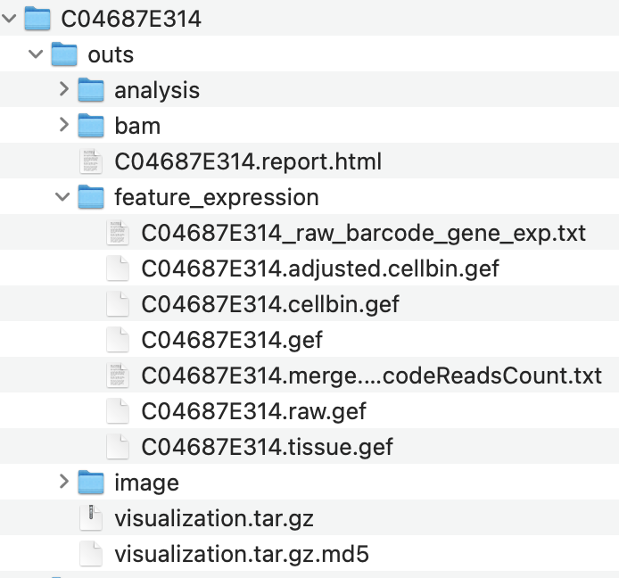
```

# Set up Giotto environment

Ensure that the Giotto package is installed. Additionally, check that the mini conda Giotto environment with Python dependencies is installed.

If you have installation troubles, visit the [Installation](https://drieslab.github.io/Giotto_website/articles/installation.html) and [Frequently Asked Questions](https://drieslab.github.io/Giotto_website/articles/faqs.html) sections.

```{r, eval=FALSE}
# Ensure Giotto Suite is installed.
if(!"Giotto" %in% installed.packages()) {
  pak::pkg_install("drieslab/Giotto")
}

# Ensure the Python environment for Giotto has been installed.
genv_exists <- Giotto::checkGiottoEnvironment()
if(!genv_exists){
  # The following command need only be run once to install the Giotto environment.
  Giotto::installGiottoEnvironment()
}
```

# Set the Giotto instructions

{Giotto} instructions are used to apply settings to giotto object behavior at the project level. Each giotto object needs a set of instructions information that can either be manually set or generated with defaults when the giotto object is first created. Once added, these instructions are stored in the giotto object @instructions slot.

```{r, eval=FALSE}
library(Giotto)

# Set the results directory to save plots
results_folder <- "path/to/results"

# Optional: Specify the path to a Python executable within a conda or miniconda 
# environment. If set to NULL (default), the Python executable within the previously installed Giotto environment will be used.
python_path <- NULL # alternatively, "/local/python/path/python" if desired.

# Create Giotto Instructions
instructions <- createGiottoInstructions(save_dir = results_folder,
                                         save_plot = TRUE,
                                         show_plot = FALSE,
                                         return_plot = FALSE,
                                         python_path = python_path)
```

# Create the Giotto object 

createGiottoStereoSeqObject() will look for the standardized files organization from the STOmics technology in the data folder and will automatically load the expression and spatial information to create the Giotto object.

```{r, eval=FALSE}
## provide path to data folder. It should point to the main folder, containing "outs", "pipeline-logs" and "STEREO_ANALYSIS_WORKFLOW_PROCESSING" sub folders.
data_path <- "/path/to/data/"
```

##  Create the Giotto object at different bins size

When reading the expression information at the bin level, you can select from different resolutions ("bin1", "bin5", "bin10", "bin20", "bin50", "bin100", "bin150", or "bin200").

```{r, eval=FALSE}
## read the data
g <- createGiottoStereoSeqObject(stereoseq_dir = data_path,
                               type = "squarebin",
                               bin_size = "bin100",
                               gene_column = "geneName",
                               instructions = instructions)
```

At this bin size, this dataset has 1309 bins and 26535 genes.

Visualize the Giotto object at the bin size = 100

```{r, eval=FALSE}
spatPlot2D(g,
           show_image = TRUE,
           point_size = 4,
           point_alpha = 0.5)
```

```{r, echo=FALSE, out.width="60%", fig.align="center", fig.alt="Spatial distribution of bins"}
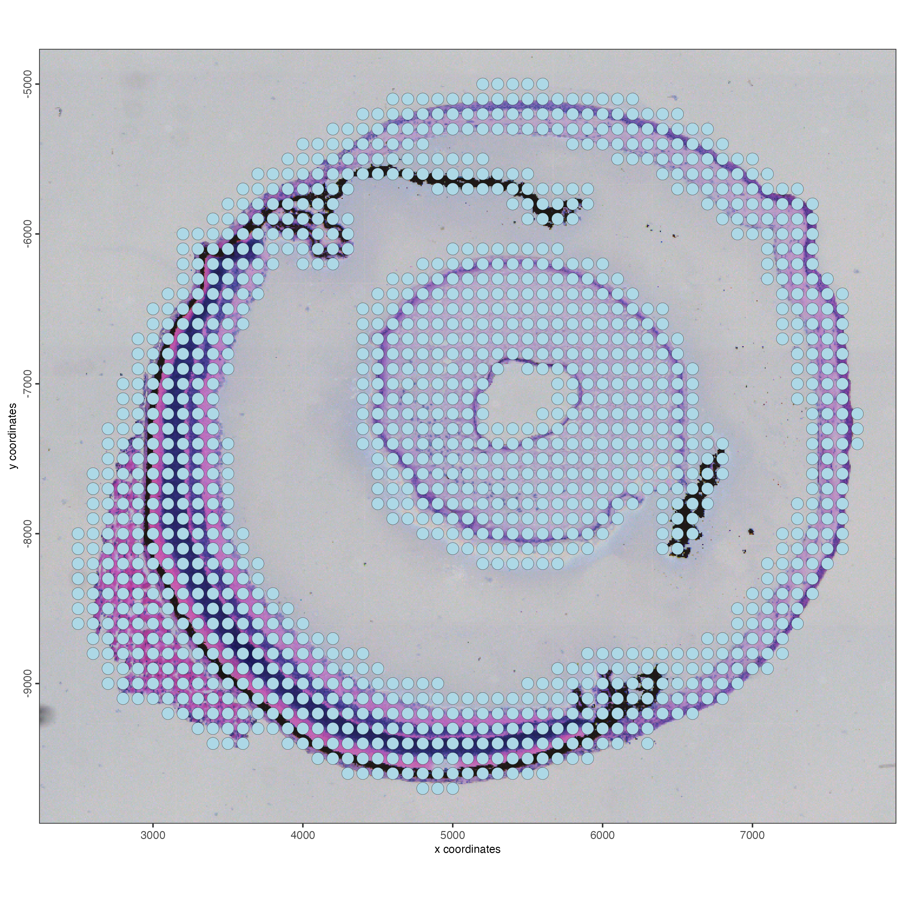
```

## Process the Giotto object at the bin level

- Filtering

```{r, eval=FALSE}
g <- filterGiotto(gobject = g,
                  expression_threshold = 1,
                  feat_det_in_min_cells = 10,
                  min_det_feats_per_cell = 50,
                  expression_values = "raw",
                  verbose = TRUE)
```

- Normalization

```{r, eval=FALSE}
g <- normalizeGiotto(gobject = g, 
                     scalefactor = 6000, 
                     verbose = TRUE)
```

- Feature selection

```{r, eval=FALSE}
g <- calculateHVF(gobject = g, 
                  save_plot = TRUE)
```

```{r, echo=FALSE, out.width="60%", fig.align="center", fig.alt="Covariance of HVFs using the binned method"}
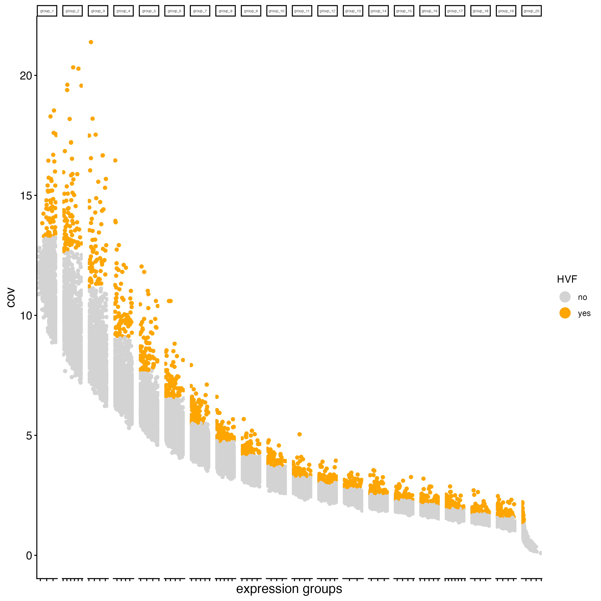
```

- Dimension reduction

```{r, eval=FALSE}
g <- runPCA(gobject = g,
            ncp = 50)

g <- runUMAP(g, 
             dimensions_to_use = 1:10)

g <- runtSNE(g, 
             dimensions_to_use = 1:10)
```

- Create Nearest network

```{r, eval=FALSE}
g <- createNearestNetwork(gobject = g, 
                          dimensions_to_use = 1:10)
```

- Run the Leiden clustering algorithm.

```{r, eval=FALSE}
g <- doLeidenCluster(gobject = g, 
                     resolution = 1)
```

```{r, eval=FALSE}
plotUMAP(gobject = g,
         cell_color = "leiden_clus", 
         show_NN_network = TRUE, 
         point_size = 1.5)
```

```{r, echo=FALSE, out.width="60%", fig.align="center", fig.alt="UMAP using the 10 first principal components. Bin spots are colored by Leiden cluster"}
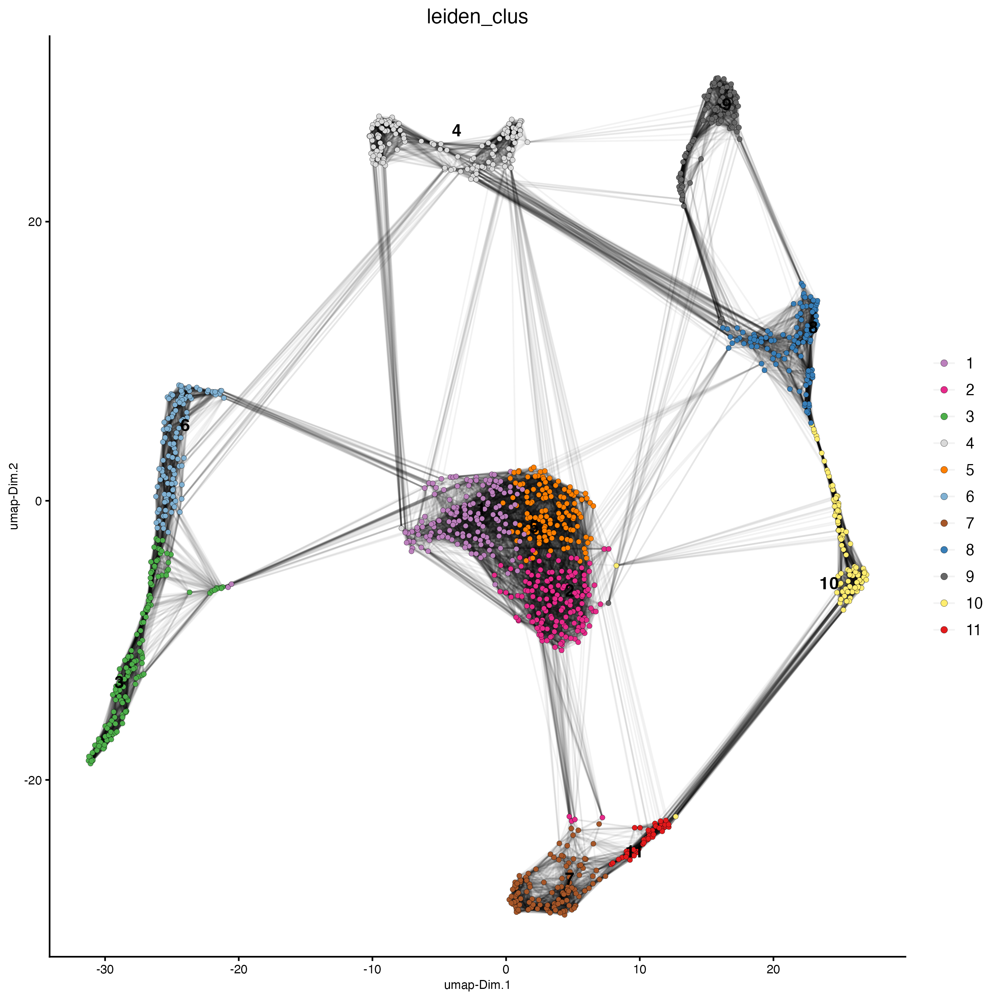
```

```{r, eval=FALSE}
spatPlot2D(gobject = g, 
           point_size = 4,
           show_image = FALSE, 
           point_alpha = 0.7,
           background_color = "black",
           cell_color = "leiden_clus")
```

```{r, echo=FALSE, out.width="60%", fig.align="center", fig.alt="Spatial plot, colors indicate the Leiden clusters"}
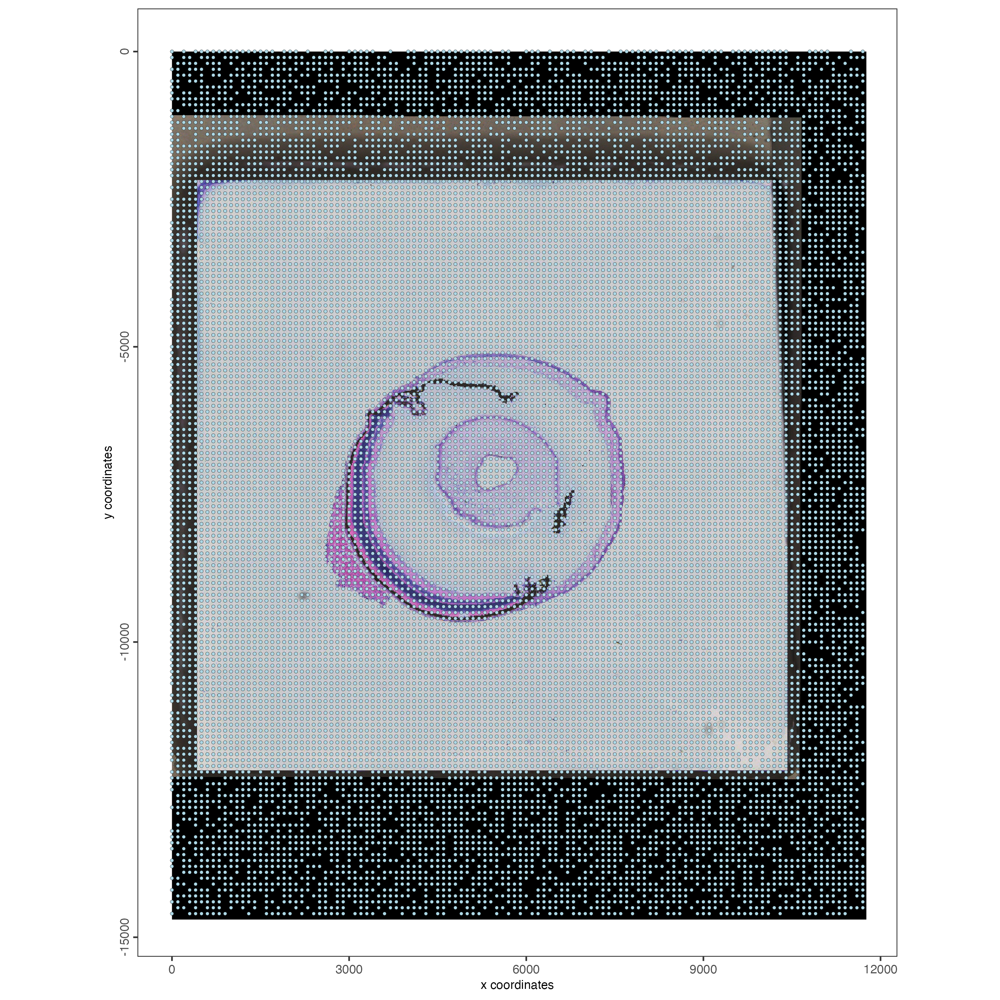
```

##  Create the Giotto object at the cell level

To read the expression information at the cell level, set the value of the parameter "type" to "cellbin". You can also select what gene IDs format to use; by default, it would read the common gene name (gene_column = "geneName"), but you can choose to use the ENSEMBL names instead (gene_column = "geneID").

```{r, eval=FALSE}
## read the data
g <- createGiottoStereoSeqObject(stereoseq_dir = data_path,
                               type = "cellbin",
                               gene_column = "geneName",
                               instructions = instructions)
```

At the cell size, this dataset has 7527 cells and 25646 genes.

Visualize the Giotto object at the cell level.

```{r, eval=FALSE}
spatPlot2D(g,
           show_image = TRUE,
           point_size = 2,
           point_alpha = 0.5)
```

```{r, echo=FALSE, out.width="60%", fig.align="center", fig.alt="Spatial distribution of cells"}
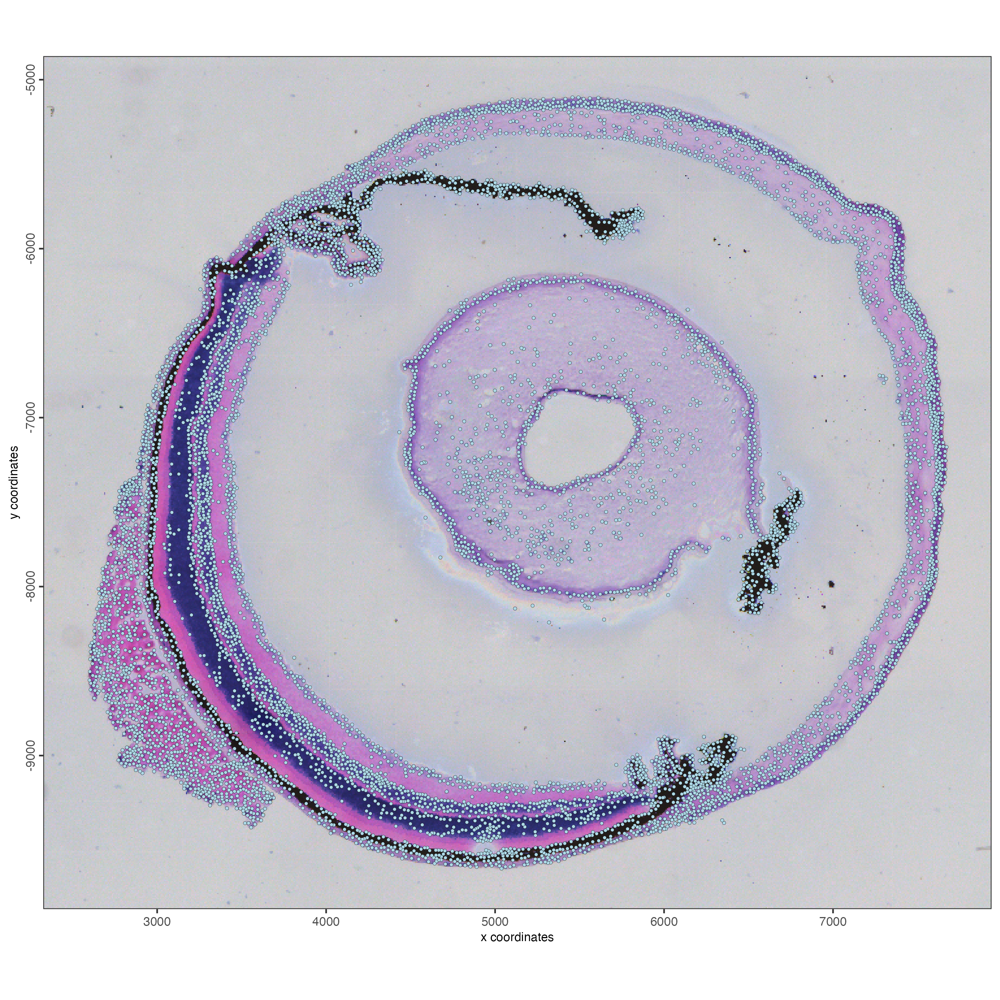
```

```{r, eval=FALSE}
## show associated images with giotto object
showGiottoImageNames(g) # "image" is the default name
```

# Quality control

Use the function addStatistics() to count the number of features per cell. The statistics information will be stored in the metadata table under the new column “nr_feats”. Then, use this column to visualize the number of features per cell across the sample.

```{r, eval=FALSE}
g_statistics <- addStatistics(gobject = g,
                              expression_values = "raw")

## visualize
spatPlot2D(gobject = g_statistics, 
           point_size = 2,
           cell_color = "nr_feats", 
           color_as_factor = FALSE)
```

```{r, echo=FALSE, out.width="60%", fig.align="center", fig.alt="Spatial distribution of features per cell."}
knitr::include_graphics("images/stereoseq_mouse_eyeball/5-spatPlot2D.png")
```

filterDistributions() creates a histogram to show the distribution of features per cell across the sample.

```{r, eval=FALSE}
filterDistributions(gobject = g_statistics, 
                    detection = "cells")
```

```{r, echo=FALSE, out.width="60%", fig.align="center", fig.alt="Distribution of features per cell."}
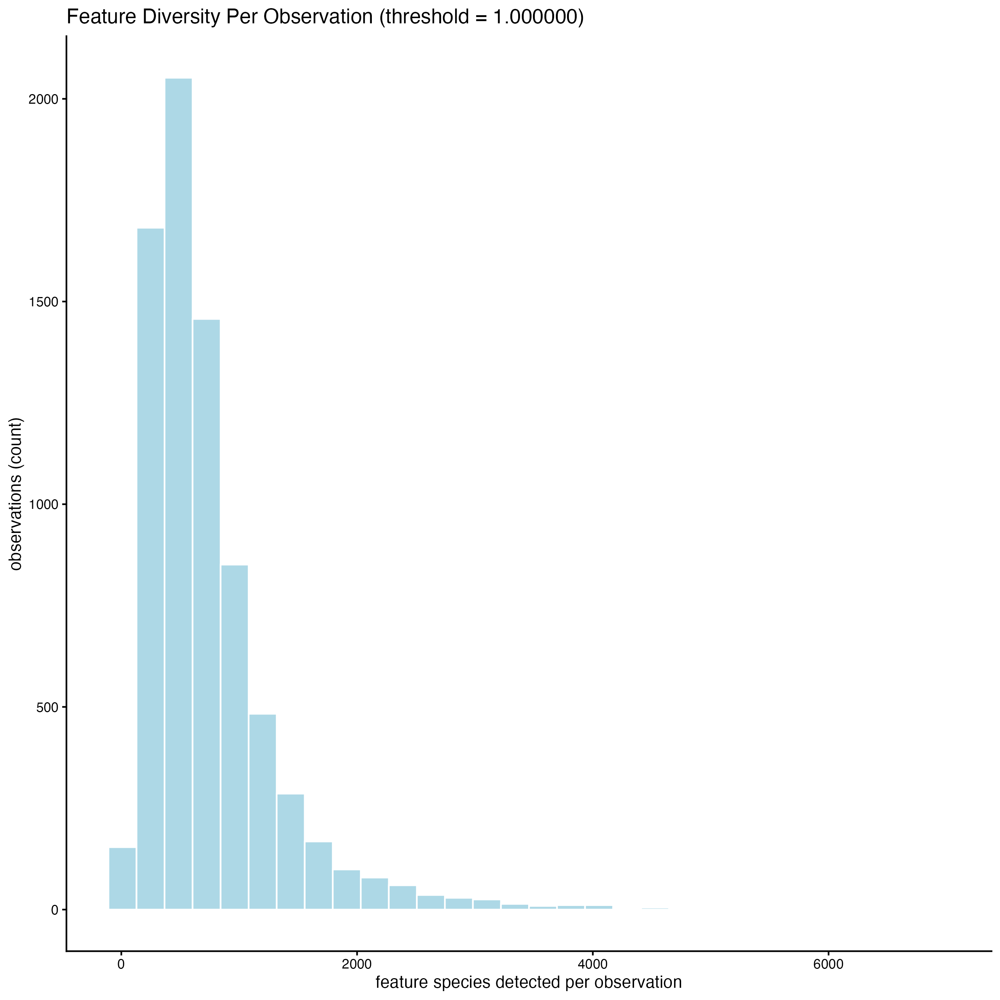
```

When setting the detection = "feats", the histogram shows the distribution of cells with certain number of features across the sample.

```{r, eval=FALSE}
filterDistributions(gobject = g_statistics, 
                    detection = "feats")
```

```{r, echo=FALSE, out.width="60%", fig.align="center", fig.alt="Distribution of cells with different features per cell."}
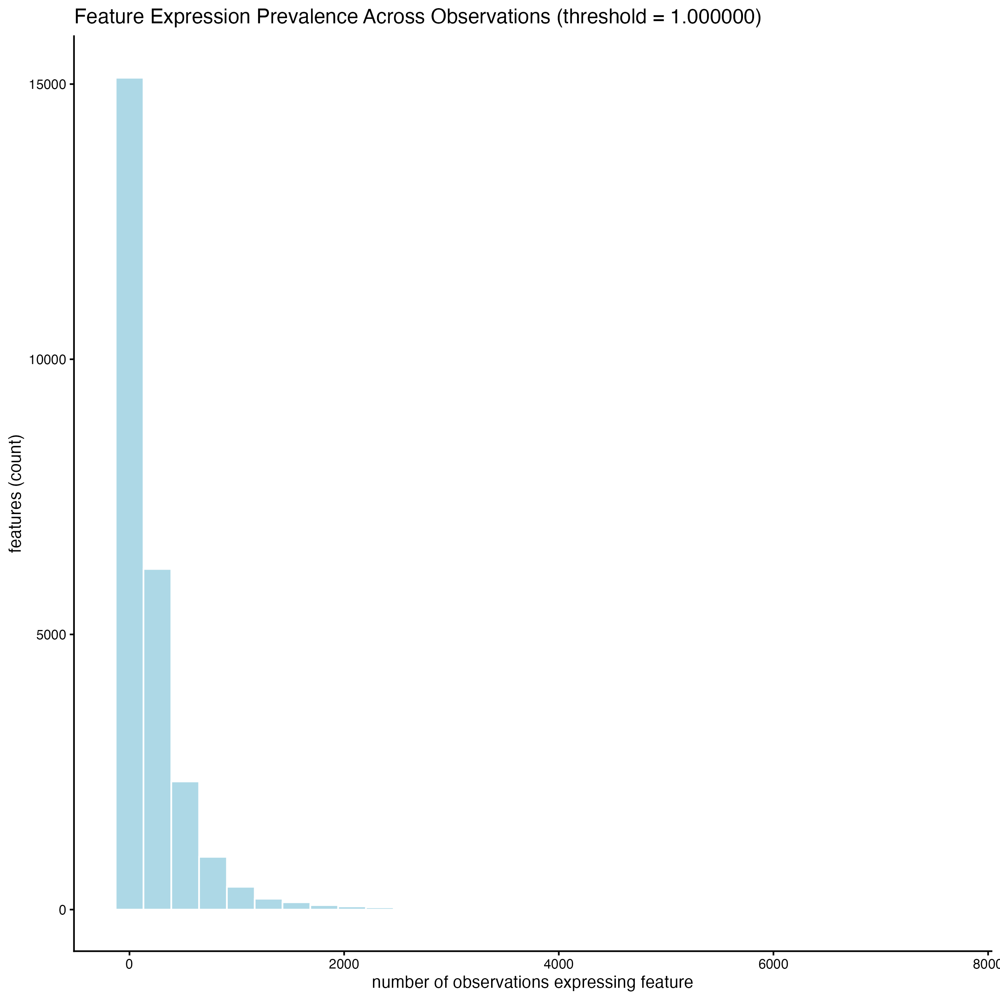
```

# Filtering

Use the arguments feat_det_in_min_cells and min_det_feats_per_cell to set the minimal number of cells where an individual feature must be detected and the minimal number of features per cell, respectively, to filter the giotto object. All the features and cells under those thresholds will be removed from the sample.

```{r, eval=FALSE}
# filter
g <- filterGiotto(gobject = g,
                  expression_threshold = 1,
                  feat_det_in_min_cells = 10,
                  min_det_feats_per_cell = 100,
                  expression_values = "raw",
                  verbose = TRUE)
```

# Normalization

Use scalefactor to set the scale factor to use after library size normalization. The default value is 6000, but you can use a different one.

```{r, eval=FALSE}
g <- normalizeGiotto(gobject = g, 
                     scalefactor = 6000, 
                     verbose = TRUE)
```

Calculate the normalized number of features per cell and save the statistics in the metadata table.

```{r, eval=FALSE}
g <- addStatistics(gobject = g)

## visualize
spatPlot2D(gobject = g, 
           point_size = 2,
           show_image = TRUE, 
           point_alpha = 0.7,
           cell_color = "nr_feats", 
           color_as_factor = FALSE)
```

```{r, echo=FALSE, out.width="60%", fig.align="center", fig.alt="Spatial distribution of the number of features per cell."}
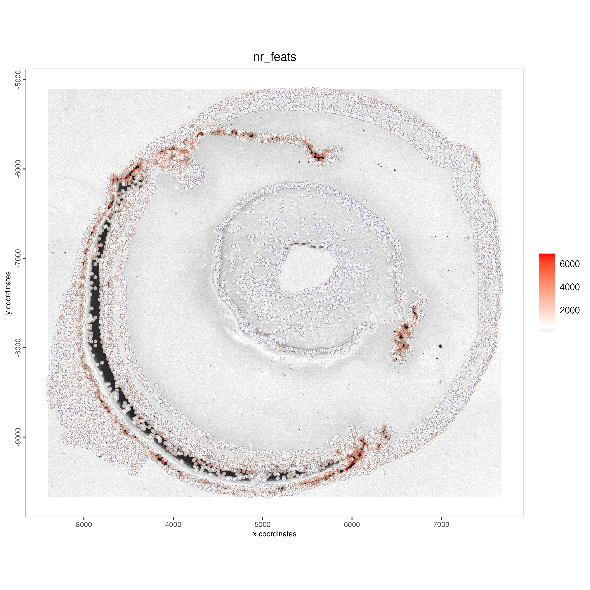
```

You can also visualize the number of transcripts per cell.

```{r, eval=FALSE}
spatPlot2D(gobject = g, 
           point_size = 2,
           show_image = TRUE, 
           point_alpha = 0.7,
           cell_color = "total_expr", 
           color_as_factor = FALSE)
```

```{r, echo=FALSE, out.width="60%", fig.align="center", fig.alt="Spatial distribution of the number of transcripts per cell."}
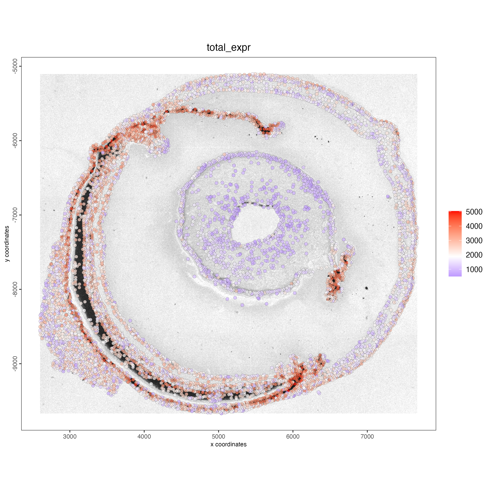
```

# Feature selection

Calculating Highly Variable Features (HVF) is necessary to identify genes (or features) that display significant variability across the cells. 

```{r, eval=FALSE}
g <- calculateHVF(gobject = g, 
                  save_plot = TRUE)
```

```{r, echo=FALSE, out.width="60%", fig.align="center", fig.alt="Covariance of HVFs using the binned method."}
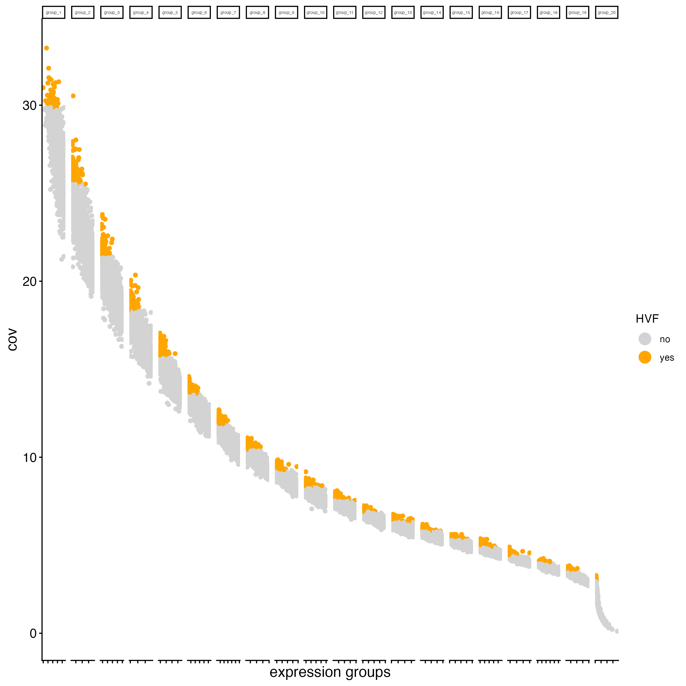
```

# Dimension reduction

## PCA

Principal Components Analysis (PCA) is applied to reduce the dimensionality of gene expression data by transforming it into principal components, which are linear combinations of genes ranked by the variance they explain, with the first components capturing the most variance.

- runPCA() will look for the previous calculation of highly variable features, stored as a column in the feature metadata. If the HVF labels are not found in the giotto object, or the parameter "feats_to_use" is set to NULL, then runPCA() will use all the features available in the sample to calculate the Principal Components.

```{r, eval=FALSE}
g <- runPCA(gobject = g,
            ncp = 50)
```

Create a screeplot to visualize the percentage of variance explained by each component.

```{r, eval=FALSE}
screePlot(gobject = g, 
          ncp = 50)
```

```{r, echo=FALSE, out.width="60%", fig.align="center", fig.alt="Screeplot showing the variance explained per principal component."}
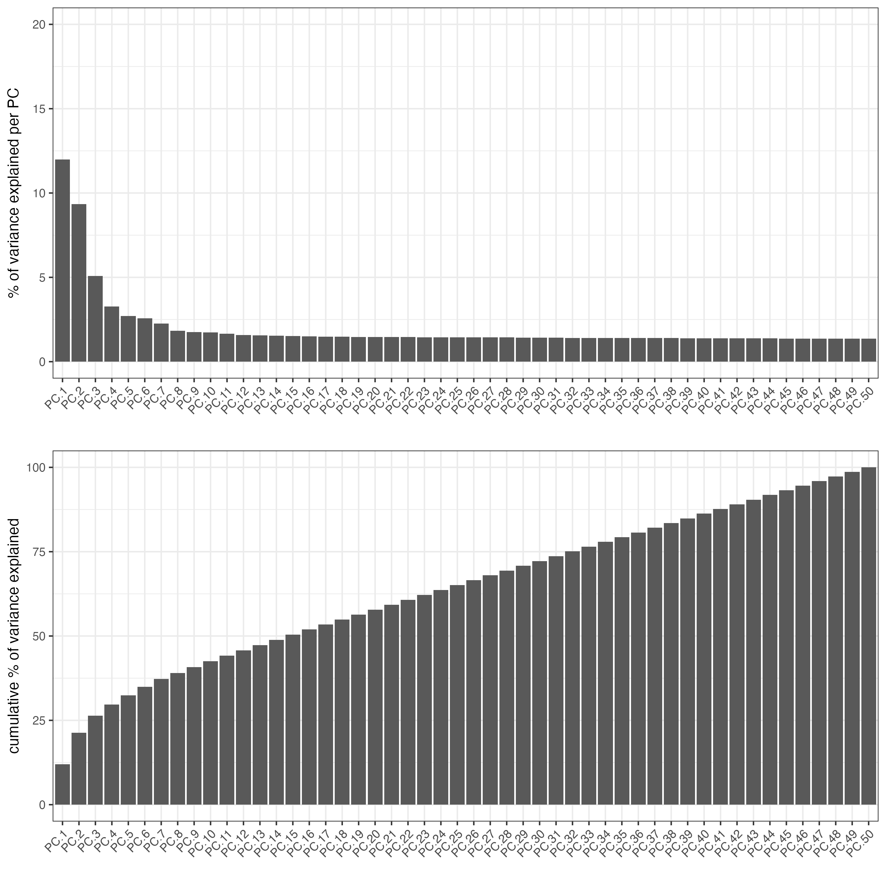
```

- Visualize the PCA calculated using the HVFs.

```{r, eval=FALSE}
plotPCA(gobject = g)
```

```{r, echo=FALSE, out.width="60%", fig.align="center", fig.alt="PCA plot using HVFs."}
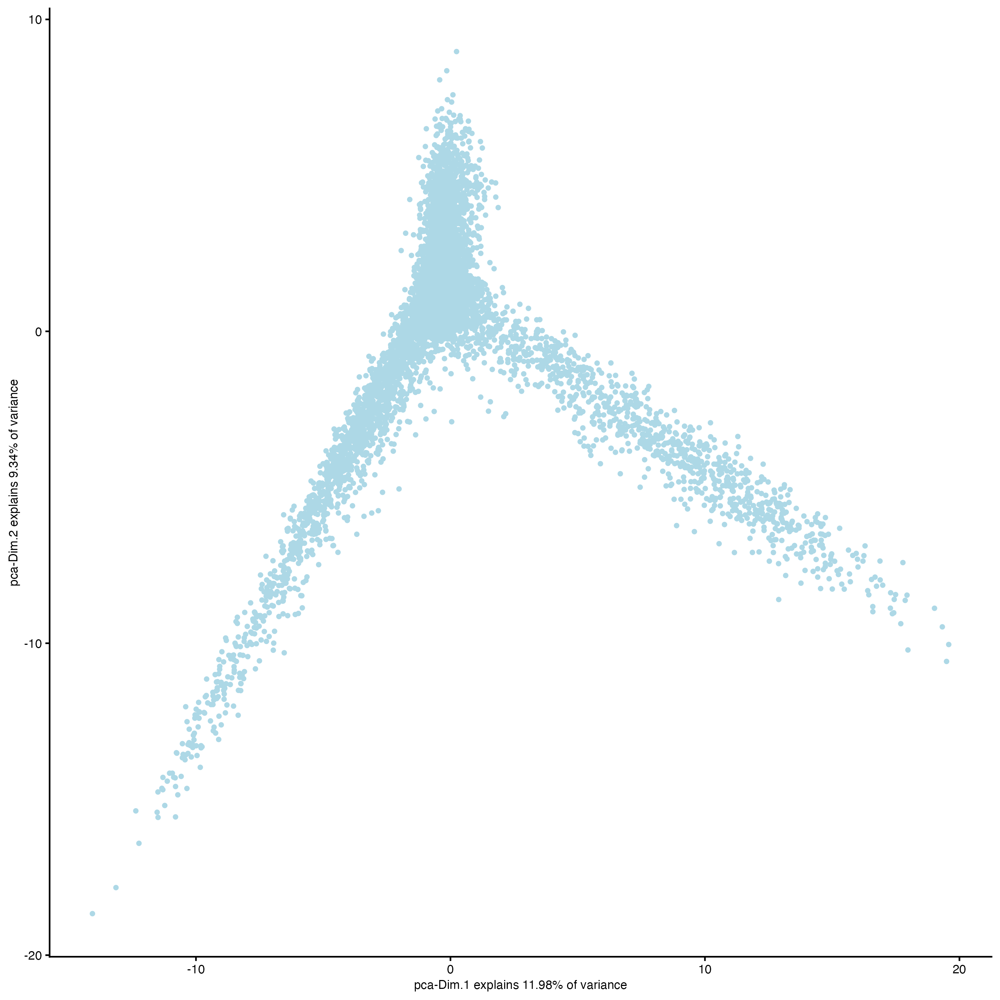
```

## UMAP

Unlike PCA, Uniform Manifold Approximation and Projection (UMAP) and t-Stochastic Neighbor Embedding (t-SNE) do not assume linearity. After running PCA, UMAP or t-SNE allows you to visualize the dataset in 2D.

```{r, eval=FALSE}
## run UMAP on PCA space (default)
g <- runUMAP(g, 
             dimensions_to_use = 1:10)

plotUMAP(gobject = g)
```

```{r, echo=FALSE, out.width="60%", fig.align="center", fig.alt="UMAP using the 10 first principal components."}
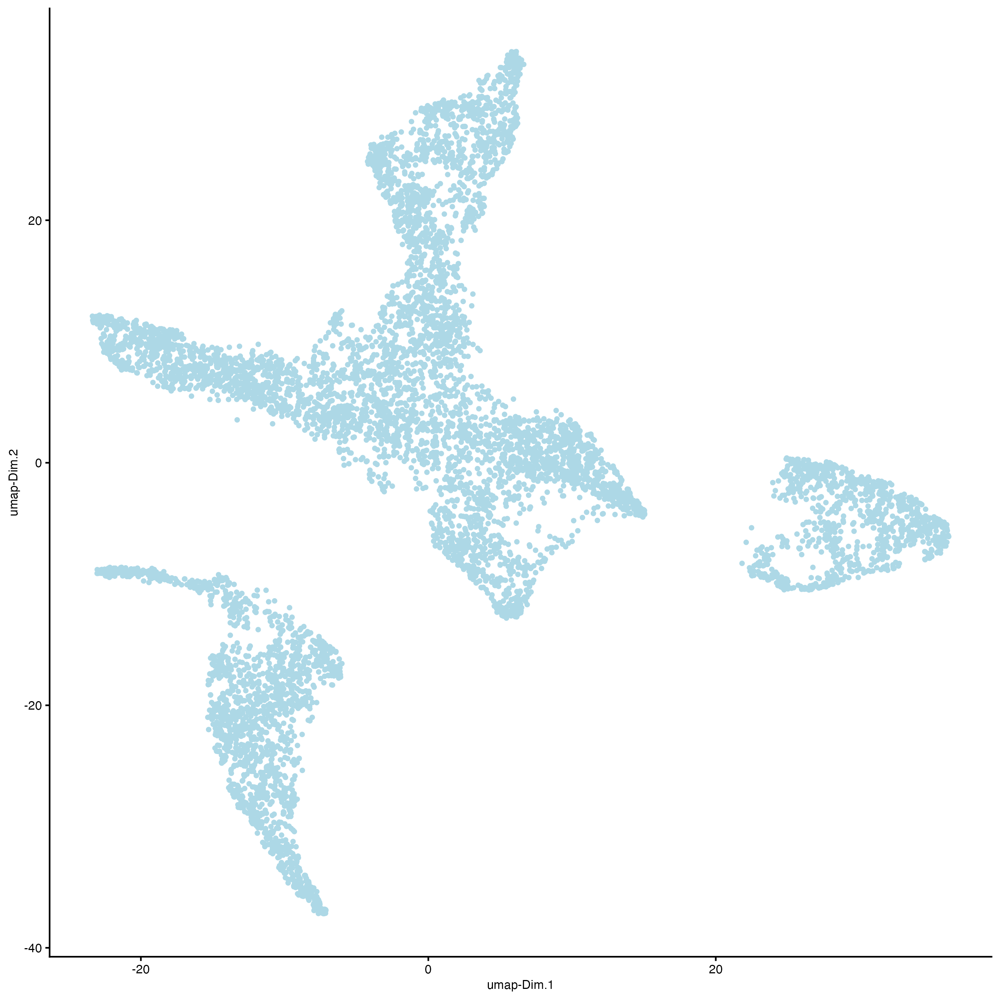
```

## tSNE

```{r, eval=FALSE}
g <- runtSNE(g, 
             dimensions_to_use = 1:10,
             check_duplicates = FALSE)

plotTSNE(gobject = g)
```

```{r, echo=FALSE, out.width="60%", fig.align="center", fig.alt="tSNE using the 10 first principal components."}
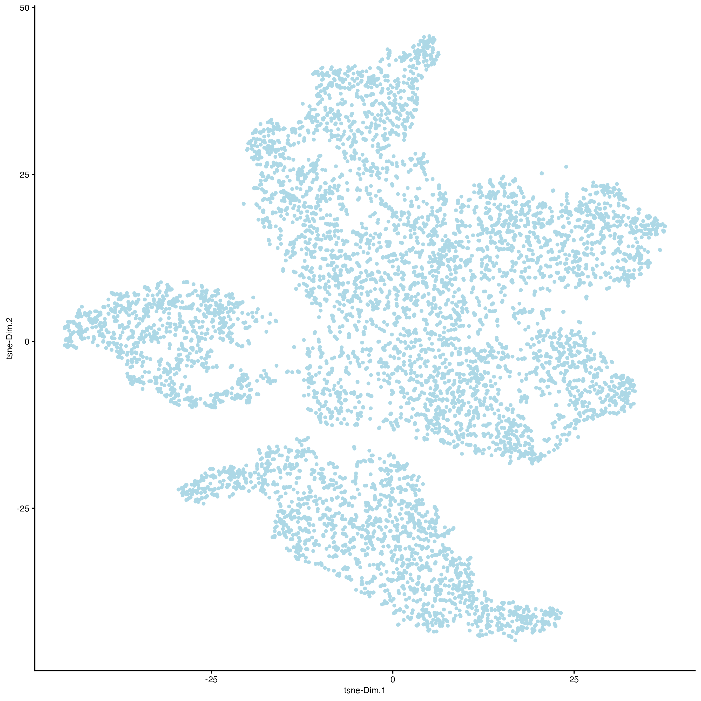
```

# Clustering

## Calculate the nearest neighbors

In preparation for the clustering calculation, finding the cells with similar expression patterns is needed. There are two methods available in Giotto:

- Create a sNN network (default)

The shared Nearest Neighbor algorithm defines the similarity between a pair of points in terms of their shared nearest neighbors. That is, the similarity between two points is "confirmed" by their common (shared) near neighbors. If point A is close to point B and if they are both close to a set of points C then we can say that A and B are close with greater confidence since their similarity is "confirmed" by the points in set C. You can find more information about this method [here](https://d1wqtxts1xzle7.cloudfront.net/67759720/siam_hd_snn_cluster-libre.pdf?1624717643=&response-content-disposition=inline%3B+filename%3DA_new_shared_nearest_neighbor_clustering.pdf&Expires=1744241905&Signature=EKZIFpKKGUPYegDxxL58WDtO6UhM9suqxSvauIzd8SWExXv5SPbhSgnvsnbMTOSWy56Vk-gyQUgazWCfh~lRg65CIZQqFStuNptUdIB4RvnWFJPT2jYfLgojTpDBKWLX8fn3Ab-sPxlUaqPV5m9E6WCunZqlQMNClLTKOK6L4D5NJs2XJl5u7bHGfHuMCLzPLLzBBfB-QLWDrXvhBmpX1ZOcX0O1YcOD1aNyQ2bCjNdCKRlSEMtX2Cboxe7B-Xf5bKRlA31JDTC~MUn3JGxHuDKpFKlwCZss980SIb1dbNz0vULD86nO6qIYbS1oQRIJHG260jox5s65TCJvO8rRIA__&Key-Pair-Id=APKAJLOHF5GGSLRBV4ZA). By default, createNearestNetwork() calculates 30 shared Nearest Neighbors for each cell, but you can modify this number using the "k" parameter.

```{r, eval=FALSE}
g <- createNearestNetwork(gobject = g, 
                          dimensions_to_use = 1:10)
```

- Create a kNN network

The K-Nearest Neighbors (kNN) algorithm operates on the principle of likelihood of similarity. It posits that similar data points tend to cluster near each other in space. You can find more information about this method [here.](https://link.springer.com/article/10.1186/s40537-024-00973-y) By default, createNearestNetwork() finds the 30 K-Nearest Neighbors to each cell, but you can modify this number using the "k" parameter.

```{r, eval=FALSE}
g <- createNearestNetwork(gobject = g, 
                          dimensions_to_use = 1:10, 
                          type = "kNN")
```

## Leiden clustering

This algorithm is more complicated than the Louvain algorithm and have an accurate and fast result for the computation time. The Leiden algorithm consists of three phases. The first phase is the modularity optimization process, the second phase is the refinement of partition, and the third phase is the community aggregation process. This algorithm performs well on small, medium and large-scale networks. You can find more information about Louvain and Leiden clustering [here](https://iopscience.iop.org/article/10.1088/1742-6596/2129/1/012028/pdf)

- Run the Leiden clustering algorithm.

```{r, eval=FALSE}
g <- doLeidenCluster(gobject = g, 
                     resolution = 1)
```

- Plot dimension and spatial plots using the Leiden clusters information.

```{r, eval=FALSE}
plotPCA(gobject = g,
        cell_color = "leiden_clus")
```

```{r, echo=FALSE, out.width="60%", fig.align="center", fig.alt="PCA plot, colors indicate the Leiden clusters."}
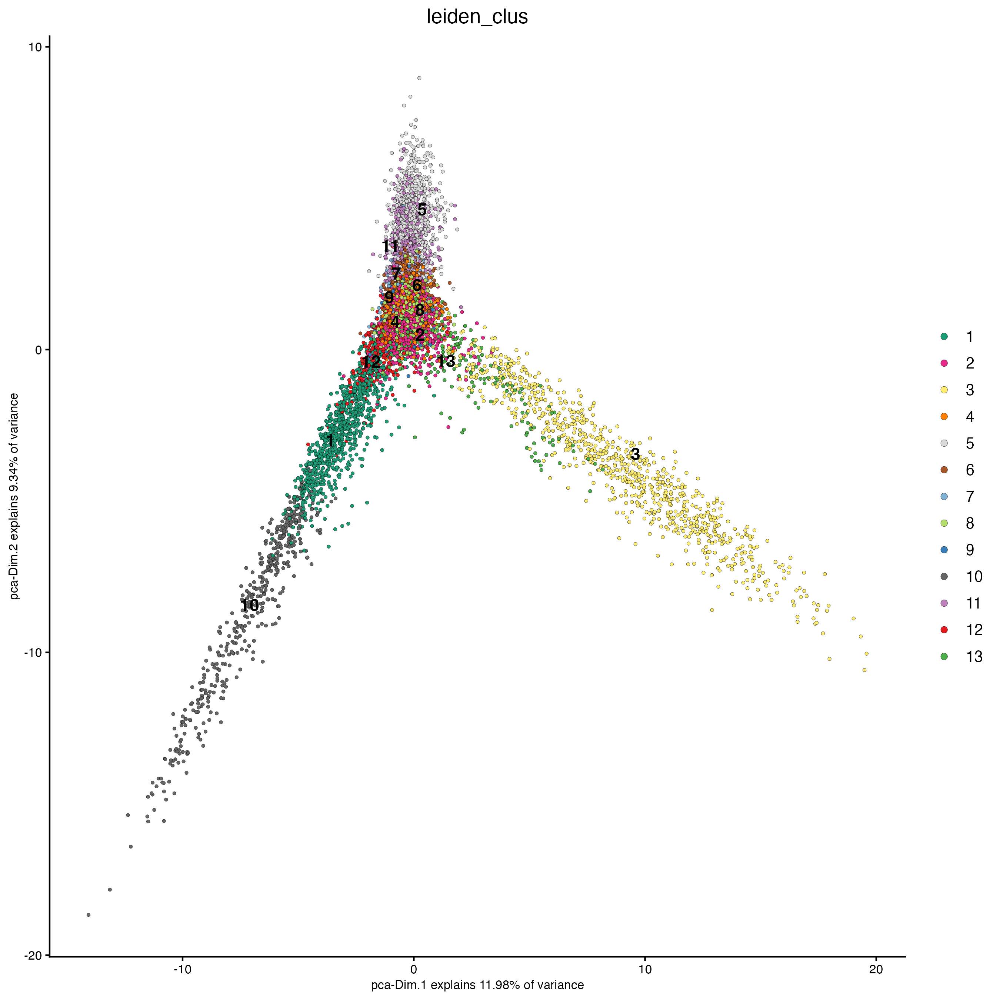
```

Set the argument "show_NN_network = TRUE" to visualize the connections between spots.

```{r, eval=FALSE}
plotUMAP(gobject = g,
         cell_color = "leiden_clus", 
         show_NN_network = TRUE, 
         point_size = 1.5)
```

```{r, echo=FALSE, out.width="60%", fig.align="center", fig.alt="UMAP plot, colors indicate the Leiden clusters."}
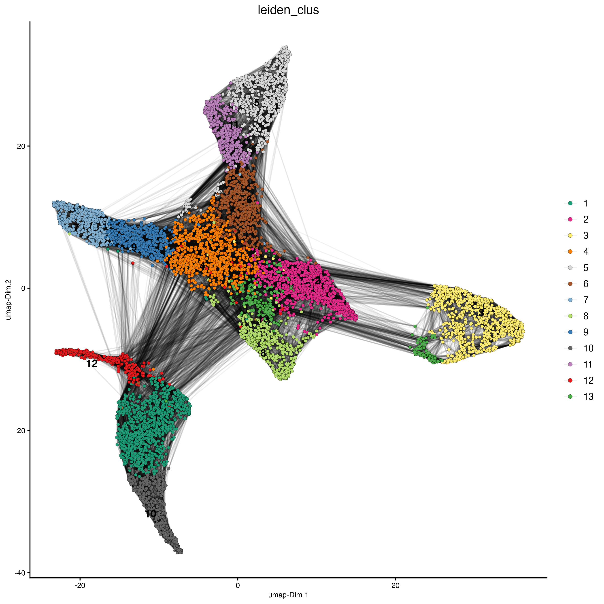
```

```{r, eval=FALSE}
plotTSNE(gobject = g,
         cell_color = "leiden_clus")
```

```{r, echo=FALSE, out.width="60%", fig.align="center", fig.alt="UMAP plot, colors indicate the Leiden clusters."}
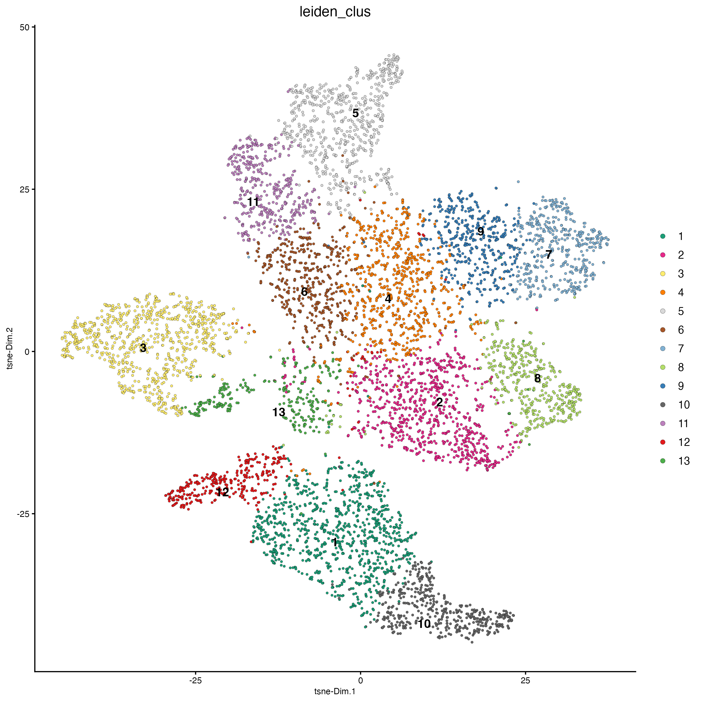
```

```{r, eval=FALSE}
spatPlot2D(gobject = g, 
           point_size = 2,
           show_image = FALSE, 
           point_alpha = 0.7,
           background_color = "black",
           cell_color = "leiden_clus")
```

```{r, echo=FALSE, out.width="60%", fig.align="center", fig.alt="Spatial plot, colors indicate the Leiden clusters."}
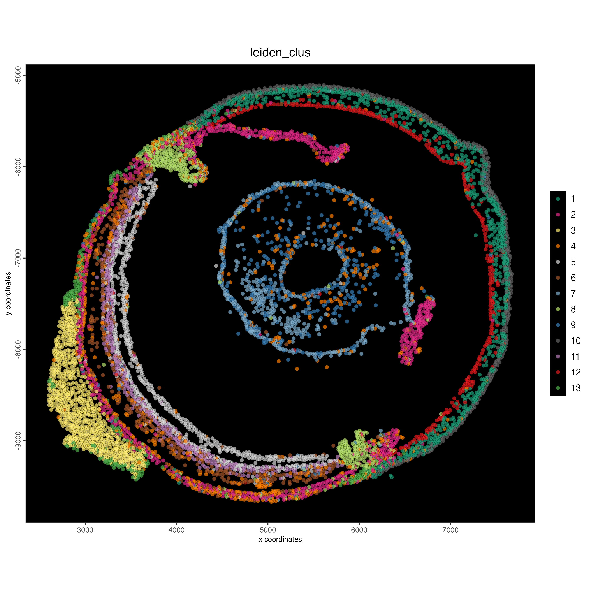
```

# Session info

```{r, eval=FALSE}
sessionInfo()
```

```{r, eval=FALSE}
R version 4.5.1 (2025-06-13)
Platform: x86_64-apple-darwin20
Running under: macOS Tahoe 26.0.1

Matrix products: default
BLAS:   /System/Library/Frameworks/Accelerate.framework/Versions/A/Frameworks/vecLib.framework/Versions/A/libBLAS.dylib 
LAPACK: /Library/Frameworks/R.framework/Versions/4.5-x86_64/Resources/lib/libRlapack.dylib;  LAPACK version 3.12.1

locale:
[1] en_US.UTF-8/en_US.UTF-8/en_US.UTF-8/C/en_US.UTF-8/en_US.UTF-8

time zone: America/New_York
tzcode source: internal

attached base packages:
[1] stats     graphics  grDevices utils     datasets  methods   base     

other attached packages:
[1] Giotto_4.2.3       GiottoClass_0.4.10

loaded via a namespace (and not attached):
  [1] colorRamp2_0.1.0            gridExtra_2.3              
  [3] rlang_1.1.6                 magrittr_2.0.4             
  [5] RcppAnnoy_0.0.22            GiottoUtils_0.2.5          
  [7] matrixStats_1.5.0           compiler_4.5.1             
  [9] systemfonts_1.3.1           png_0.1-8                  
 [11] vctrs_0.6.5                 pkgconfig_2.0.3            
 [13] SpatialExperiment_1.18.1    crayon_1.5.3               
 [15] fastmap_1.2.0               backports_1.5.0            
 [17] magick_2.9.0                XVector_0.48.0             
 [19] labeling_0.4.3              ggraph_2.2.2               
 [21] rmarkdown_2.30              UCSC.utils_1.4.0           
 [23] ragg_1.5.0                  purrr_1.1.0                
 [25] xfun_0.53                   bluster_1.18.0             
 [27] beachmat_2.24.0             cachem_1.1.0               
 [29] GenomeInfoDb_1.44.3         jsonlite_2.0.0             
 [31] rhdf5filters_1.20.0         DelayedArray_0.34.1        
 [33] Rhdf5lib_1.30.0             BiocParallel_1.42.2        
 [35] tweenr_2.0.3                terra_1.8-70               
 [37] irlba_2.3.5.1               parallel_4.5.1             
 [39] cluster_2.1.8.1             R6_2.6.1                   
 [41] RColorBrewer_1.1-3          reticulate_1.43.0          
 [43] parallelly_1.45.1           GenomicRanges_1.60.0       
 [45] scattermore_1.2             Rcpp_1.1.0                 
 [47] SummarizedExperiment_1.38.1 knitr_1.50                 
 [49] future.apply_1.20.0         R.utils_2.13.0             
 [51] FNN_1.1.4.1                 IRanges_2.42.0             
 [53] Matrix_1.7-4                igraph_2.1.4               
 [55] tidyselect_1.2.1            rstudioapi_0.17.1          
 [57] abind_1.4-8                 yaml_2.3.10                
 [59] viridis_0.6.5               codetools_0.2-20           
 [61] listenv_0.9.1               lattice_0.22-7             
 [63] tibble_3.3.0                Biobase_2.68.0             
 [65] withr_3.0.2                 S7_0.2.0                   
 [67] Rtsne_0.17                  evaluate_1.0.5             
 [69] future_1.67.0               polyclip_1.10-7            
 [71] pillar_1.11.1               MatrixGenerics_1.20.0      
 [73] checkmate_2.3.3             stats4_4.5.1               
 [75] dbscan_1.2.3                plotly_4.11.0              
 [77] generics_0.1.4              S4Vectors_0.46.0           
 [79] ggplot2_4.0.0               scales_1.4.0               
 [81] globals_0.18.0              gtools_3.9.5               
 [83] glue_1.8.0                  lazyeval_0.2.2             
 [85] tools_4.5.1                 GiottoVisuals_0.2.13       
 [87] BiocNeighbors_2.2.0         data.table_1.17.8          
 [89] ScaledMatrix_1.16.0         graphlayouts_1.2.2         
 [91] tidygraph_1.3.1             cowplot_1.2.0              
 [93] rhdf5_2.52.1                grid_4.5.1                 
 [95] tidyr_1.3.1                 colorspace_2.1-2           
 [97] SingleCellExperiment_1.30.1 GenomeInfoDbData_1.2.14    
 [99] BiocSingular_1.24.0         ggforce_0.5.0              
[101] rsvd_1.0.5                  cli_3.6.5                  
[103] textshaping_1.0.3           S4Arrays_1.8.1             
[105] viridisLite_0.4.2           dplyr_1.1.4                
[107] uwot_0.2.3                  gtable_0.3.6               
[109] R.methodsS3_1.8.2           digest_0.6.37              
[111] BiocGenerics_0.54.0         SparseArray_1.8.1          
[113] ggrepel_0.9.6               rjson_0.2.23               
[115] htmlwidgets_1.6.4           farver_2.1.2               
[117] R.oo_1.27.1                 memoise_2.0.1              
[119] htmltools_0.5.8.1           lifecycle_1.0.4            
[121] httr_1.4.7                  MASS_7.3-65 
```
