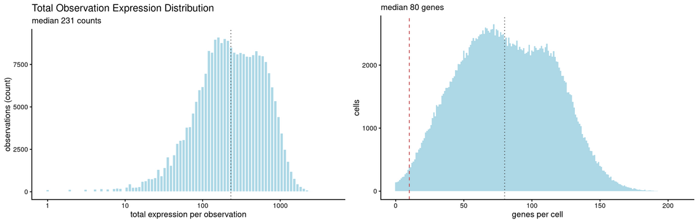
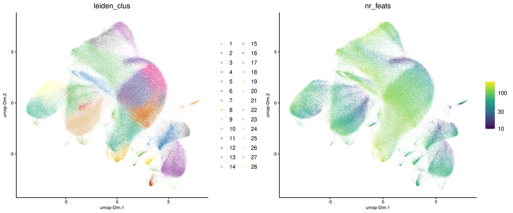
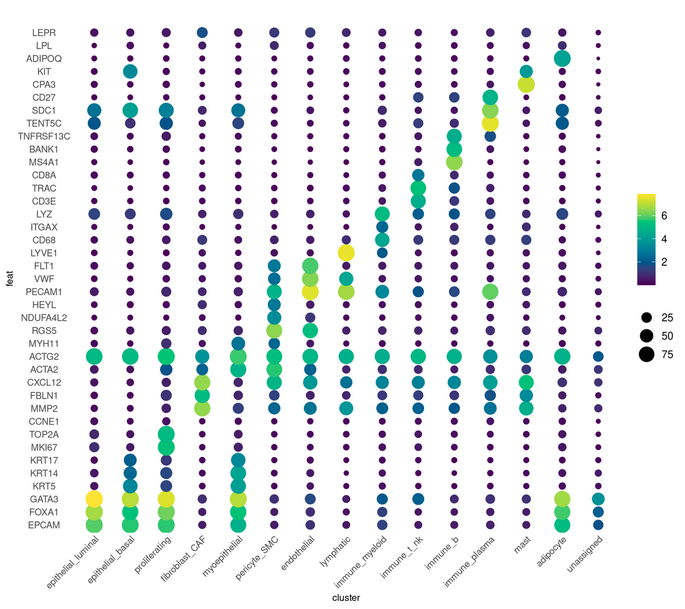
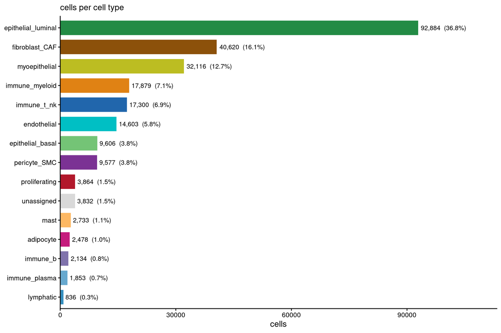
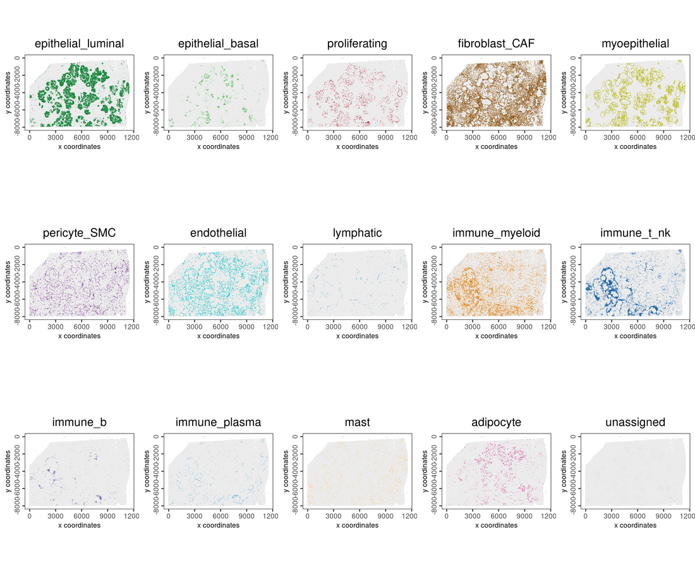
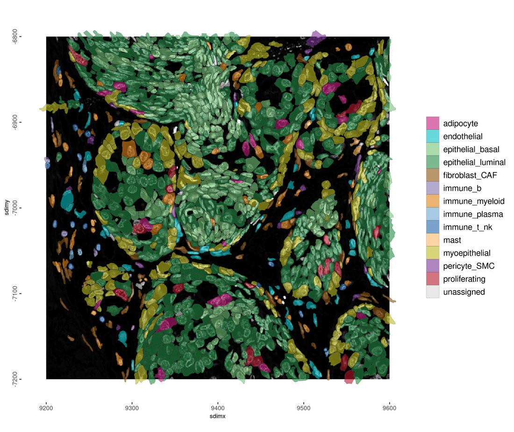
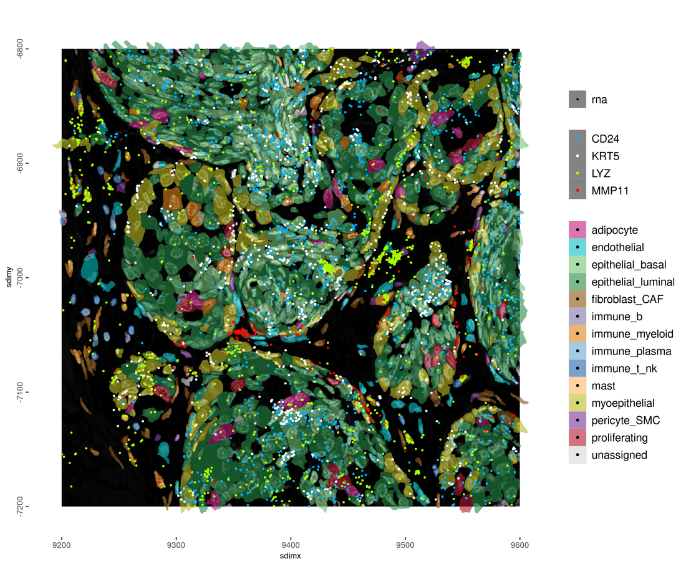
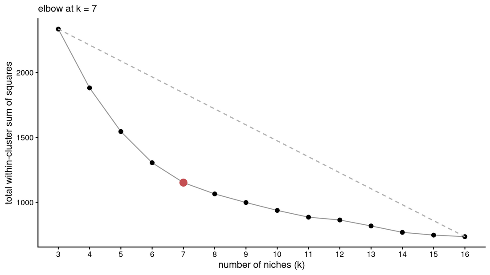
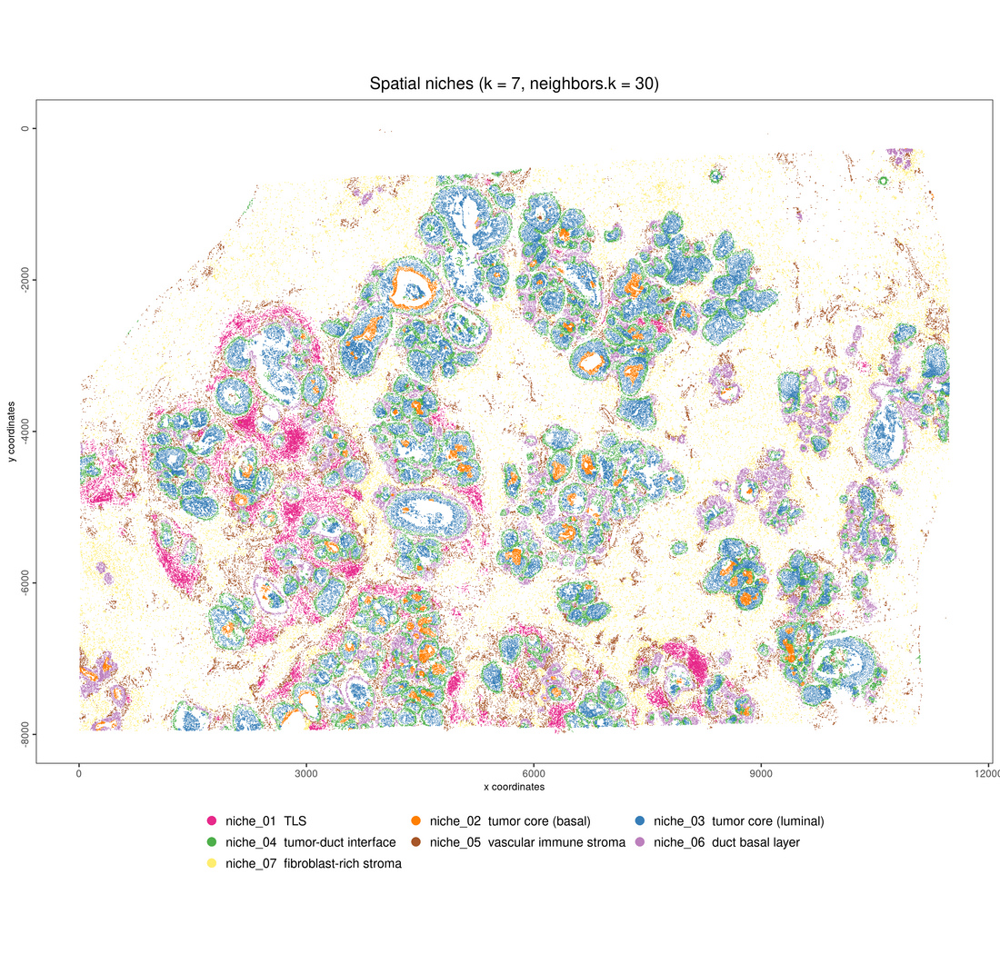
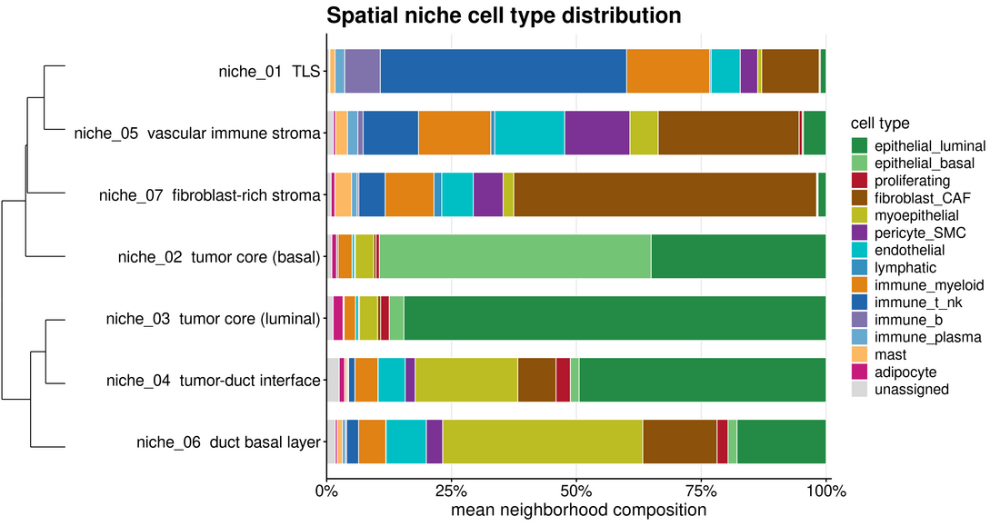

```{r setup, include=FALSE, eval = FALSE}
knitr::opts_chunk$set(echo = TRUE, warning = FALSE, message = TRUE,
                      fig.align = "center", dpi = 150, fig.path = "figures/")
set.seed(42)
```

# 1. Overview

This tutorial reads a 10x Xenium In Situ export as an on-disk GiottoDisk
project, builds the expression matrix by aggregating transcripts onto
segmentation polygons rather than reading the vendor matrix, and carries that
through filtering, clustering, cell typing and spatial niches. The export here
ships only zarr archives, and nothing is held in memory: the matrix and the
142.7 million transcripts stay on disk throughout.

# 2. Packages

## 2.1 arrow

GiottoDisk writes its parquet cache with zstd compression, so arrow has to be
built with zstd support. Install it before Giotto, or the Giotto install will
pull a binary that may not have it.

```r
has_arrow <- requireNamespace("arrow", quietly = TRUE)
zstd <- TRUE
if (has_arrow) {
    zstd <- arrow::arrow_info()$capabilities[["zstd"]]
}
if (!has_arrow || !zstd) {
    Sys.setenv(ARROW_WITH_ZSTD = "ON")
    install.packages("arrow", repos = c("https://apache.r-universe.dev"),
                     type = "source")
}
```

## 2.2 Giotto and the rest

```r
remotes::install_github("giotto-suite/GiottoUtils", ref = "dev")
GiottoUtils::suite_install("GiottoDisk")
BiocManager::install(c("scran", "Rarr"))
install.packages(c("duckdb", "DBI", "dbplyr", "wk", "ggdendro"))
```

```{r version-guard, include=FALSE, eval = FALSE}
if (packageVersion("Giotto") < "4.3.0")
  stop("Giotto ", packageVersion("Giotto"), " is too old; see section 2.",
       call. = FALSE)
if (!requireNamespace("Rarr", quietly = TRUE))
  stop("Rarr is required for the zarr reader; see section 2.", call. = FALSE)
if (!isTRUE(arrow::arrow_info()$capabilities[["zstd"]]))
  stop("arrow lacks zstd support; see section 2.", call. = FALSE)
```

# 3. The dataset

10x Genomics **Xenium In Situ** on FFPE human breast cancer. The published
dataset covers three sections of sample S1; **this tutorial uses S1_Bot only**,
and every figure and count below is that one section. S1_Bot is ductal
carcinoma in situ, T1c N0 M0, grade 3, HER2 1+: tumor fills the ducts but an
intact myoepithelial layer still bounds them, with stroma and immune
infiltrate around both.

|  |  |
|:--|:---------------------------------------------------------------|
| panel | Xenium Human Breast Cancer HK Gene Panel, 280 targets + 261 controls |
| cells | 254,480 |
| transcripts | 142,664,090 decoded, 117,682,273 above the Q20 cutoff |
| area | 89.0 mm^2 of section S1_Bot, 204 fields of view, 0.2125 um/px |

The release is
[Xenium v1 Human Breast FFPE with Biomarkers and Housekeeping Genes Custom Panel](https://www.10xgenomics.com/datasets/xenium-ffpe-human-breast-biomarkers).
That page opens on an overview; the files are under **Output and supplemental
files** > **Section 1, bottom** > **General output files** > **Xenium Output
Bundle (Xenium Explorer subset)**, or fetch it directly:

```sh
curl -O https://cf.10xgenomics.com/samples/xenium/4.0.0/Human_Breast_Biomarkers_S1_Bot/Human_Breast_Biomarkers_S1_Bot_xe_outs.zip
```

That is 5.9 GB zipped and holds `experiment.xenium`, `gene_panel.json`,
`morphology_focus/` and four `*.zarr.zip` archives. The per-file outputs
(`transcripts.parquet`, `cells.parquet`, `cell_feature_matrix.h5`) are in the
larger **Xenium Output Bundle** instead, and GiottoDisk reads the archives
without them.

**The expression matrix is built here.** Every transcript is assigned to a
segmentation polygon and aggregated into counts. The vendor's matrix is loaded
once to check that aggregation (section 6), then dropped.

| zarr product | what it holds | size |
|---|---|---:|
| `transcripts.zarr.zip` | 142.7 M decoded detections in a 7-level tile grid | 2.72 GB |
| `cells.zarr.zip` | centroids, areas, and cell + nucleus boundary vertices | 300 MB |
| `cell_feature_matrix.zarr.zip` | vendor cell x gene CSC matrix | 43 MB |
| `analysis.zarr.zip` | 10x's own clustering and UMAP | 2 MB |

`gene_panel.json` and `experiment.xenium` carry the panel and run metadata.
The DAPI channel of `morphology_focus/` is the backdrop for the zoom figures
later on.

# 4. Setup

```{r config, message=FALSE, eval = FALSE}
suppressMessages({
  library(Giotto); library(GiottoClass); library(GiottoVisuals)
  library(GiottoDisk)
  library(data.table); library(ggplot2); library(cowplot); library(future)
})

# hide progress bars, and run GiottoDisk's tiled operations on 4 parallel
# workers
options(progressr.enable = FALSE)
future::plan(future::multisession, workers = 4)

XENIUM_DIR  <- Sys.getenv("XENIUM_ZARR_DIR", "/path/to/xenium/outs")
PROJECT_DIR <- "vault"                  # the GiottoDisk project directory

plot_theme <- theme_classic(base_size = 9)

results_folder <- "results"             # where every Giotto figure is saved as a PNG
instructions   <- createGiottoInstructions(save_dir = results_folder,
                                           save_plot = TRUE, show_plot = TRUE,
                                           return_plot = FALSE)
```

```{r config-hidden, include=FALSE, eval = FALSE}
if (!dir.exists(XENIUM_DIR))
  stop("no staged xenium folder at ", XENIUM_DIR,
       " -- run prepare_xenium_dir.sh first", call. = FALSE)
options(giotto.no_python_warn = TRUE)
```

# 5. Ingest

## 5.1 Set up the disk backend

142.7 million transcripts and 254,480 cells are too large to hold in memory,
so this runs as a GiottoDisk disk-backed project.

```{r backend, eval = FALSE}
# a managed project directory to hold the object on disk
giotto_source <- sourceCreate(PROJECT_DIR, type = "gDirSource")
# send expression and spatial writes there instead of a temp folder
setArtifactDumpDir(giotto_source)
```

## 5.2 Reading a zarr export

All four archives are read in place without unpacking, and each product is
converted to parquet once and cached in the project directory.

## 5.3 Create the giotto object

```{r create, eval = FALSE}
g_xen <- createGiottoXeniumObject(
  xenium_dir       = XENIUM_DIR,
  backend          = giotto_source,
  bounds_path      = list(cell = "cell"),
  qv_threshold     = 20,     # 10x's recommended Phred cutoff, applied as the grid is read
  load_transcripts = TRUE,   # all 142.7 M detections, as a disk-backed points store
  load_expression  = TRUE,   # the vendor matrix -- QC cross-check only, see 6.1
  load_cellmeta    = TRUE,
  load_images      = "focus",
  instructions     = instructions)
g_xen
```

## 5.4 Save checkpoint

A backed project writes named snapshots into the project directory.

```{r save-ingest, eval = FALSE}
g_xen <- saveGiotto(g_xen, name = "ingest")
```

Reload it with `loadGiotto(PROJECT_DIR, name = "ingest")`.

```{r ingest-slots, eval = FALSE}
# both are disk stores, so neither the matrix nor the transcripts are in memory
class(g_xen@expression$cell$rna$raw[])
class(g_xen@feat_info$rna@spatVector)
list_spatial_info(g_xen)
```

Only `cell` boundaries are loaded; the archive also carries nucleus boundaries,
unused here.

## 5.5 Aggregating transcripts into expression

The transcripts carry no cell assignment, so it is computed here by overlapping
the detections with the segmentation polygons.

```{r rename-vendor, eval = FALSE}
# the vendor matrix currently sits under "raw", which is the name
# aggregateFeatures() will write to below, so move it aside first
vendor_expr <- GiottoClass::getExpression(g_xen, values = "raw", output = "exprObj")
g_xen <- GiottoClass::setExpression(g_xen, vendor_expr, name = "vendor_raw",
                       spat_unit = "cell", feat_type = "rna")
```

```{r overlap, eval = FALSE}
g_xen <- aggregateFeatures(g_xen, spat_info = "cell", feat_info = "rna",
                           name = "raw", verbose = TRUE)
```

```{r overlap-slots, eval = FALSE}
# "raw" is now the aggregated matrix and "vendor_raw" the vendor's
list_expression(g_xen)
```

# 6. Quality control and filtering

## 6.1 Checking the aggregation against the vendor matrix

<details>
<summary>Vendor counts against transcript-derived counts</summary>

The vendor's own cell-by-gene matrix was built by 10x's pipeline from the same
detections. It is an independent implementation of the same operation, so
comparing the two is a real check on the aggregation.

```{r vendor-check, eval = FALSE}
vendor_store  <- GiottoClass::getExpression(g_xen, values = "vendor_raw", output = "exprObj")
derived_store <- GiottoClass::getExpression(g_xen, values = "raw", output = "exprObj")

totals <- rbindlist(lapply(list(vendor_store, derived_store), function(x)
  dplyr::collect(dplyr::summarise(storeRead(x[], output = "query"),
                                  counts = sum(value, na.rm = TRUE),
                                  nonzeros = dplyr::n()))))
totals[, source := c("vendor cell_feature_matrix", "aggregated from transcripts")]
totals[, .(source, counts, nonzeros)]
```

The totals should not match exactly: 10x applies nucleus-expansion rules where
this aggregation is a plain point-in-polygon test at `qv > 20`. What matters is
agreement *per cell*, below.

```{r vendor-check-fig, fig.cap="Vendor counts against transcript-aggregated counts, one point per cell; the dashed line is equality.", fig.width=5.4, fig.height=4.8, eval = FALSE}
per_cell <- function(exprobj) {
  store <- exprobj[]
  dt <- as.data.table(dplyr::collect(dplyr::summarise(
    dplyr::group_by(storeRead(store, output = "query"), row_id),
    total = sum(value, na.rm = TRUE))))
  dt[, .(cell_ID = store@cell_ids[row_id], total)]
}
cmp <- merge(per_cell(vendor_store), per_cell(derived_store),
             by = "cell_ID", suffixes = c("", "_derived"))
setnames(cmp, c("total", "total_derived"), c("vendor", "derived"))
cat(sprintf("cells compared: %s\n", format(nrow(cmp), big.mark = ",")))

p_vendor <- ggplot(cmp[vendor > 0 & derived > 0], aes(vendor, derived)) +
  geom_point(size = 0.2, alpha = 0.12, stroke = 0) +
  geom_abline(slope = 1, intercept = 0, linetype = "dashed", color = "#C44E52") +
  scale_x_log10() + scale_y_log10() +
  labs(x = "vendor counts per cell", y = "transcript-aggregated counts per cell",
       subtitle = sprintf("Spearman rho = %.3f over %s cells",
                          cor(cmp$vendor, cmp$derived, method = "spearman"),
                          format(nrow(cmp), big.mark = ","))) +
  plot_theme
p_vendor
all_plots_save_function(g_xen, p_vendor, save_name = "vendor_vs_aggregated")
```

```{r vendor-check-fig-fig, echo = FALSE, out.width = "100%"}
knitr::include_graphics("images/xenium_human_breast_cancer_giottodisk/01_vendor-check-fig.png")
```

</details>

```{r drop-vendor, eval = FALSE}
# the check is done, so drop the vendor matrix: no step below uses it, and
# everything downstream runs on the aggregated "raw"
g_xen <- GiottoClass::setExpression(g_xen, NULL, name = "vendor_raw", spat_unit = "cell",
                       feat_type = "rna")
```

## 6.2 Filtering

```{r stats, eval = FALSE}
g_xen <- addStatistics(g_xen, stats = "cell", expression_values = "raw")

# the same statistics for the 20 negative-control probes, which target nothing
# and so measure this panel's noise floor
g_xen <- addStatistics(g_xen, feat_type = "NegControlProbe",
                       stats = "cell", expression_values = "raw")
```

```{r negprobe-stats, eval = FALSE}
neg <- pDataDT(g_xen, feat_type = "NegControlProbe")
rna <- pDataDT(g_xen)
# mean, not median: most cells detect no control probe at all, so the median
# is 0 and a ratio against it is undefined
rna_per_feat <- mean(rna$total_expr, na.rm = TRUE) / 280
neg_per_feat <- mean(neg$total_expr, na.rm = TRUE) / 20

data.table(
  metric = c("mean counts / cell, 280-gene panel",
             "mean counts / cell, negative-control probes",
             "cells with any control-probe count (%)",
             "signal-to-noise, per feature"),
  value  = c(round(mean(rna$total_expr, na.rm = TRUE), 1),
             round(mean(neg$total_expr, na.rm = TRUE), 3),
             round(100 * mean(neg$total_expr > 0, na.rm = TRUE), 1),
             if (neg_per_feat > 0) round(rna_per_feat / neg_per_feat, 1) else NA_real_))
```

Control probes target nothing, so any count on one is a decoding error and
their rate is the noise floor. Real genes are detected about a thousand times
more often, and most cells carry no control count at all, so no background
correction is needed.

```{r spatial-overview, fig.cap="Every cell in the section, colored by genes detected. Centroids come from the segmentation polygons.", fig.width=8, fig.height=7, dpi=150, eval = FALSE}
gene_limits <- quantile(pDataDT(g_xen)$nr_feats, c(0.01, 0.99), na.rm = TRUE)

p_section <- spatPlot2D(g_xen, cell_color = "nr_feats", color_as_factor = FALSE,
                        point_size = 0.25, point_shape = "border",
                        point_border_stroke = 0, coord_fix_ratio = 1,
                        background_color = "white",
                        show_plot = FALSE, return_plot = TRUE,
                        save_plot = FALSE) +
  scale_fill_viridis_c(transform = "sqrt", limits = gene_limits,
                       oob = scales::squish, name = "genes\nper cell")
p_section
all_plots_save_function(g_xen, p_section, save_name = "section_genes_per_cell")
```

```{r spatial-overview-fig, echo = FALSE, out.width = "100%"}
knitr::include_graphics("images/xenium_human_breast_cancer_giottodisk/02_spatial-overview.png")
```

```{r qc-figs, fig.cap="Counts and genes per cell before filtering, with the gene threshold drawn.", fig.width=10.6, fig.height=3.4, eval = FALSE}
qc_md <- pDataDT(g_xen)[, .(counts = median(total_expr, na.rm = TRUE),
                            genes  = median(nr_feats,   na.rm = TRUE))]

p_counts <- filterDistributions(g_xen, detection = "cells", method = "sum",
                                nr_bins = 90, show_plot = FALSE,
                                return_plot = TRUE, save_plot = FALSE) +
  scale_x_log10() +
  geom_vline(xintercept = qc_md$counts, color = "grey25", linetype = "dotted") +
  labs(subtitle = sprintf("median %s counts", format(qc_md$counts, big.mark = ","))) +
  plot_theme

p_genes <- ggplot(pDataDT(g_xen), aes(nr_feats)) +
  geom_histogram(binwidth = 1, fill = "lightblue") +
  geom_vline(xintercept = 10, color = "#C44E52", linetype = "dashed") +
  geom_vline(xintercept = qc_md$genes, color = "grey25", linetype = "dotted") +
  labs(x = "genes per cell", y = "cells",
       subtitle = sprintf("median %s genes", qc_md$genes)) + plot_theme

p_qc <- plot_grid(p_counts, p_genes, nrow = 1)
p_qc
all_plots_save_function(g_xen, p_qc, save_name = "qc_distributions")
```

```{r qc-figs-fig, echo = FALSE, out.width = "100%"}

```

`min_det_feats_per_cell = 10` drops cells, set low because a cell here detects
only a few tens of the 280 genes. `feat_det_in_min_cells = 100` drops genes,
keeping those seen in at least 100 cells.

```{r filter, eval = FALSE}
g_xen <- filterGiotto(g_xen,
                      expression_threshold   = 1,
                      feat_det_in_min_cells  = 100,
                      min_det_feats_per_cell = 10)
g_xen
```

# 7. Normalization and dimension reduction

```{r reduce, eval = FALSE}
g_xen <- normalizeGiotto(g_xen, scale_feats = FALSE, scale_cells = FALSE,
                         scalefactor = 6000)

g_xen <- addStatistics(g_xen, stats = c("cell", "feature"))

SEED <- 1234

g_xen <- runPCA(g_xen, feats_to_use = NULL, scale_unit = TRUE, center = TRUE,
                ncp = 50, method = "auto", set_seed = TRUE,
                seed_number = SEED, verbose = FALSE)
```

`feats_to_use = NULL` uses the whole panel, and there is no `calculateHVF()`
step. On a 280-gene targeted panel every gene was chosen to be informative, so
selecting highly variable features from it discards deliberate design rather
than noise.

```{r scree, fig.cap="Variance per principal component. Percentages are shares of the variance in the 50 components computed, not of the total variance in the data.", fig.width=8, fig.height=7, eval = FALSE}
screePlot(g_xen, ncp = 50, verbose = FALSE)
```

```{r scree-fig, echo = FALSE, out.width = "100%"}
knitr::include_graphics("images/xenium_human_breast_cancer_giottodisk/04_scree.png")
```

```{r pc-depth, fig.cap="Absolute correlation of each PC with log10 total counts. The dashed line is the 0.5 threshold used to decide whether PC1 is a depth axis.", fig.width=6.8, fig.height=3.6, eval = FALSE}
cell_metadata <- pDataDT(g_xen)
pc_matrix     <- getDimReduction(g_xen, reduction_method = "pca", output = "matrix")
shared_cells  <- intersect(rownames(pc_matrix), cell_metadata$cell_ID)
cell_depth    <- cell_metadata$total_expr[match(shared_cells, cell_metadata$cell_ID)]

pc_depth_cor <- data.table(
  pc      = seq_len(ncol(pc_matrix)),
  abs_cor = abs(as.numeric(cor(pc_matrix[shared_cells, , drop = FALSE],
                               log10(pmax(cell_depth, 1))))))

p_pc_depth <- ggplot(pc_depth_cor[pc <= 30], aes(pc, abs_cor, fill = abs_cor > 0.5)) +
  geom_col(width = 0.75) + geom_hline(yintercept = 0.5, linetype = "dashed") +
  scale_fill_manual(values = c(`FALSE` = "#BBBBBB", `TRUE` = "#C44E52"), guide = "none") +
  labs(x = "principal component",
       y = expression("|correlation| with log"[10] * " total counts"),
       subtitle = sprintf("PC1 |r| = %.3f", pc_depth_cor$abs_cor[1])) + plot_theme
p_pc_depth
all_plots_save_function(g_xen, p_pc_depth, save_name = "pc_depth_correlation")
```

```{r pc-depth-fig, echo = FALSE, out.width = "100%"}
knitr::include_graphics("images/xenium_human_breast_cancer_giottodisk/05_pc-depth.png")
```

```{r pcs-used, eval = FALSE}
# drop PC1 only if the figure above shows it is a depth axis
PCS_USE <- if (pc_depth_cor$abs_cor[1] > 0.5) 2:30 else 1:30
cat("dimensions_to_use =", deparse(PCS_USE), "\n")
```

# 8. Neighbors, UMAP, clustering

```{r cluster, eval = FALSE}
g_xen <- createNearestNetwork(g_xen, k = 30, dimensions_to_use = PCS_USE,
                              engine = "hnsw", ef = 400,
                              n_threads_build = 1, verbose = FALSE)

g_xen <- doLeidenCluster(g_xen, name = "leiden_clus", resolution = 1,
                         n_iterations = 20, set_seed = TRUE,
                         seed_number = SEED)

g_xen <- runUMAP(g_xen, dimensions_to_use = PCS_USE, n_neighbors = 30,
                 min_dist = 0.3, spread = 1, n_sgd_threads = 0,
                 nn_engine = "annoy", set_seed = TRUE, seed_number = SEED,
                 verbose = FALSE)

g_xen <- saveGiotto(g_xen, name = "clustered")
```

```{r cells-table, eval = FALSE}
cell_metadata <- pDataDT(g_xen)
cell_metadata[, clus := factor(leiden_clus,
                               levels = sort(unique(as.integer(leiden_clus))))]
CLUS_LEVELS <- levels(cell_metadata$clus)
LEIDEN_PAL  <- setNames(getDistinctColors(length(CLUS_LEVELS)), CLUS_LEVELS)
```

```{r cluster-figs, fig.cap="Every cell in UMAP space by Leiden cluster, and the same embedding colored by genes detected.", fig.width=13, fig.height=5.4, eval = FALSE}
p_umap_clusters <- plotUMAP(g_xen, cell_color = "leiden_clus",
                            cell_color_code = LEIDEN_PAL,
                            point_size = 0.25, point_alpha = 0.4,
                            point_shape = "border", point_border_stroke = 0,
                            show_center_label = FALSE,
                            show_plot = FALSE, return_plot = TRUE,
                            save_plot = FALSE)
p_umap_genes <- plotUMAP(g_xen, cell_color = "nr_feats", color_as_factor = FALSE,
                         cell_color_gradient = "viridis",
                         gradient_style = "sequential",
                         point_size = 0.25, point_alpha = 0.4,
                         point_shape = "border", point_border_stroke = 0,
                         show_plot = FALSE, return_plot = TRUE,
                         save_plot = FALSE)
p_umap_genes <- p_umap_genes +
  scale_fill_viridis_c(transform = "log10", name = "genes\nper cell")
p_clusters <- plot_grid(p_umap_clusters, p_umap_genes, nrow = 1,
                        rel_widths = c(1, 0.95))
p_clusters
all_plots_save_function(g_xen, p_clusters, save_name = "umap_clusters")
```

```{r cluster-figs-fig, echo = FALSE, out.width = "100%"}

```

# 9. Markers

```{r markers, eval = FALSE}
scran_markers <- findScranMarkers_one_vs_all(g_xen,
                                             cluster_column = "leiden_clus",
                                             expression_values = "normalized",
                                             verbose = FALSE)
```

```{r tidy-markers, eval = FALSE}
markers_de <- as.data.table(scran_markers)[
  , .(feats, cluster = as.character(cluster), logFC, p_value = p.value, FDR, ranking)]
markers_de <- markers_de[logFC >= 0.25 & FDR <= 0.05][order(cluster, ranking)]

head(markers_de, 5)
```

```{r top-markers, eval = FALSE}
top_markers <- markers_de[order(cluster, ranking)][, head(.SD, 10), by = cluster]
cluster_table <- merge(
  cell_metadata[, .(cells = .N), by = .(cluster = as.character(clus))],
  top_markers[, .(top_genes = paste(feats, collapse = ", ")), by = cluster],
  by = "cluster", all.x = TRUE)
cluster_table[is.na(top_genes), top_genes := "(no markers passed the filter)"]
cluster_table[, cluster := factor(cluster, levels = CLUS_LEVELS)]
setorder(cluster_table, cluster)
cluster_table[]
```

| cluster | cells | top markers |
|---:|---:|---|
| 1 | 26,082 | MYLK, KRT14, KRT5, TAGLN, ACTA2, COL17A1, KRT17, SEMA3C, DSP, SLC39A6 |
| 2 | 6,034 | S100A14, CD24, TAGLN, SEMA3C, ACTA2, KRT14, VTCN1, OXTR, COL17A1, SERPINA3 |
| 3 | 19,997 | GATA3, TYMS, SLC39A6, HMGB2, FOXA1, EPCAM, MLPH, FADS2, RRM2, DSP |
| 4 | 14,931 | GATA3, CD24, SLC39A6, FOXA1, MLPH, AGR3, ESR1, EPCAM, DSP, NAT1 |
| 5 | 32,289 | MLPH, SLC39A6, SCUBE2, FOXA1, AGR3, GATA3, TFF3, ESR1, TPD52, NPY1R |
| 6 | 14,646 | SLC39A6, GATA3, FOXA1, MLPH, AGR3, MDM2, SCUBE2, EPCAM, TPD52, DSP |
| 7 | 3,991 | S100A9, S100A8, LYZ, CD74, CD68, CD163, ARHGDIB, HLA-G, PECAM1, HSPA6 |
| 8 | 3,864 | MKI67, PRR11, TOP2A, CENPF, CCNB1, HMGB2, UBE2C, AURKA, ANLN, CDC20 |
| 9 | 2,478 | ADIPOQ, ESR1, MLPH, AGR3, SCUBE2, FOXA1, SLC39A6, GATA3, EPCAM, NPY1R |
| 10 | 2,719 | MLPH, CPA3, SLC39A6, GATA3, AGR3, ESR1, FOXA1, SCUBE2, EPCAM, TPD52 |
| 11 | 3,832 | CXCL14 |
| 12 | 1,766 | SFRP4, FBLN1, C1R, CCDC80, MMP2, LEPR, IGFBP3, IL1R1, IGFBP5, TAGLN |
| 13 | 9,943 | CD74, LYZ, CD68, ITGAX, HSPA6, ARHGDIB, CD163, CXCR4, PECAM1, CD83 |
| 14 | 11,378 | PDGFRB, LAMB1, CXCL14, LAMA2, TIMP1, MMP2, LOXL1, IGFBP5, CCDC80, MMP11 |
| 15 | 16,997 | TRAC, IL7R, ARHGDIB, CXCR4, CD3E, IL2RG, CD74, CYTIP, CCL5, HLA-G |
| 16 | 2,134 | MS4A1, CD74, BANK1, TNFRSF13C, CXCR4, ARHGDIB, IL2RG, CYTIP, BIRC3, HLA-G |
| 17 | 3,658 | LYVE1, CD163, CD74, CD68, HSPA6, COLEC12, SLC40A1, CXCL12, PECAM1, ARHGDIB |
| 18 | 14,603 | AQP1, PECAM1, VWF, PLVAP, FLT1, HSPG2, RGS5, CLEC14A, COL4A1, CD74 |
| 19 | 1,853 | TENT5C, CD27, IL2RG, PECAM1, SDC1, CD74, BIRC3, CYTIP, HLA-G, DNAJC3 |
| 20 | 27,476 | CXCL12, C1R, MMP2, LAMB1, FBLN1, LAMA2, CCDC80, PDGFRB, ADH1B, COLEC12 |
| 21 | 9,577 | RGS5, ACTA2, PDGFRB, TAGLN, COL4A1, PECAM1, NDUFA4L2, IGFBP5, AQP1, MYLK |
| 22 | 287 | MMP12, MMP9, CHIT1, APOC1, MUC6, TIGIT |
| 23 | 9,606 | PTN, CD24, KRT23, KIT, VTCN1, SFRP1, SERPINA3, KRT6B, KRT15, ANPEP |
| 24 | 2,733 | CPA3, KIT, CXCL12, MMP2, C1R, LAMB1, LAMA2, CCDC80, FBLN1, PDGFRB |
| 25 | 303 | MKI67, ARHGDIB, TRAC, CD8A, CD3E, CD74, HMGB2, IL2RG, TYMS, CCL5 |
| 26 | 836 | LYVE1, PECAM1, COLEC12, LAMA4, VWF, HSPG2, COL4A1, HLA-G, NDRG1, IL1R1 |
| 27 | 8,136 | S100A14, ANKRD30A, CD24, VTCN1, SERPINA3, KRT19, MLPH, LYPD3, PIP, MDM2 |
| 28 | 166 | PIP, ANKRD30A, TFPI2, FASN, LDHB, PGR, LTF, MLPH, SCUBE2, IL1R1 |

# 10. Naming the clusters

Two sources of evidence: the de novo markers above, and the dot plot of curated
panel genes below, which checks the labels against genes chosen independently
of this clustering.

## 10.1 Curated marker panels

One curated gene set per broad cell type, restricted to what this 280-gene
breast panel actually carries.

```{r panels-data, eval = FALSE}
breast_markers_l1 <- list(
  epithelial_luminal  = c("EPCAM", "FOXA1", "GATA3", "ESR1", "AR", "PGR",
                          "SLC39A6", "AGR3", "MLPH", "KRT19", "TFF3",
                          "SCGB2A1", "SCGB2A2", "ANKRD30A", "TACSTD2", "CD24"),
  epithelial_basal    = c("KRT5", "KRT14", "KRT17", "KRT6B", "TP63",
                          "SERPINB5", "CDH3", "LAMB3", "LAMC2", "LAMA3"),
  myoepithelial       = c("ACTA2", "ACTG2", "MYH11", "TAGLN", "CNN1", "MYLK",
                          "OXTR", "COL17A1", "DST"),
  proliferating       = c("MKI67", "TOP2A", "CCNE1", "AURKA", "BIRC5", "CENPF",
                          "MELK", "CEP55", "TYMS", "HMGB2", "UBE2C", "CCNB1",
                          "CDC20", "NDC80", "NUF2", "ANLN", "RRM2", "PTTG1",
                          "EXO1", "KIF2C", "MYBL2"),
  fibroblast_CAF      = c("MMP2", "FBLN1", "CXCL12", "SFRP4", "CCDC80", "C1R",
                          "PDGFRB", "MMP11", "MMP14", "TIMP1", "IGFBP5",
                          "CHI3L1", "COLEC12", "ADAMTS8", "LOXL1", "OLFML2A",
                          "PDGFD", "SFRP1", "CXCL14"),
  pericyte_SMC        = c("RGS5", "NDUFA4L2", "HEYL", "ANPEP"),
  endothelial         = c("PECAM1", "VWF", "FLT1", "AQP1", "CLEC14A", "PLVAP",
                          "COL4A1", "HSPG2", "LAMA4"),
  lymphatic           = c("LYVE1"),
  immune_myeloid      = c("CD68", "ITGAX", "LYZ", "CD163", "APOC1", "MMP9",
                          "MMP12", "S100A8", "S100A9", "CHIT1", "CD83"),
  immune_t_nk         = c("CD3E", "TRAC", "CD8A", "IL7R", "CCL5", "IL2RG",
                          "CTLA4", "TIGIT", "CCR7", "GPR183", "CYTIP"),
  immune_b            = c("MS4A1", "BANK1", "TNFRSF13C"),
  immune_plasma       = c("TENT5C", "SDC1", "CD27"),
  mast                = c("CPA3", "KIT"),
  adipocyte           = c("ADIPOQ", "LPL", "LEPR", "ADH1B")
)
```

## 10.2 Attaching labels

This section is DCIS, so malignant cells sit inside ducts that still carry a
myoepithelial layer, alongside normal luminal epithelium. Telling the two
luminal populations apart needs copy number or a matched normal, and a
280-gene panel gives neither. Clusters are therefore named by cell type, not
by malignancy, and `proliferating` marks a cycling signature that appears in
both.

```{r label-map, eval = FALSE}
broad_palette <- c(
  epithelial_luminal   = "#238B45",
  epithelial_basal     = "#74C476",
  proliferating        = "#B2182B",
  fibroblast_CAF       = "#8C510A",
  myoepithelial        = "#BCBD22",
  pericyte_SMC         = "#7B3294",
  endothelial          = "#00BFC4",
  lymphatic            = "#3690C0",
  immune_myeloid       = "#E08214",
  immune_t_nk          = "#2166AC",
  immune_b             = "#8073AC",
  immune_plasma        = "#67A9CF",
  mast                 = "#FDB863",
  adipocyte            = "#C51B7D",
  unassigned           = "gray85")

BROAD <- c(
  "1"    = "myoepithelial",
  "2"    = "myoepithelial",
  "3"    = "epithelial_luminal",
  "4"    = "epithelial_luminal",
  "5"    = "epithelial_luminal",
  "6"    = "epithelial_luminal",
  "7"    = "immune_myeloid",
  "8"    = "proliferating",
  "9"    = "adipocyte",
  "10"   = "epithelial_luminal",
  "11"   = "unassigned",
  "12"   = "fibroblast_CAF",
  "13"   = "immune_myeloid",
  "14"   = "fibroblast_CAF",
  "15"   = "immune_t_nk",
  "16"   = "immune_b",
  "17"   = "immune_myeloid",
  "18"   = "endothelial",
  "19"   = "immune_plasma",
  "20"   = "fibroblast_CAF",
  "21"   = "pericyte_SMC",
  "22"   = "immune_myeloid",
  "23"   = "epithelial_basal",
  "24"   = "mast",
  "25"   = "immune_t_nk",
  "26"   = "lymphatic",
  "27"   = "epithelial_luminal",
  "28"   = "epithelial_luminal"
)
```

```{r annotate, eval = FALSE}
g_xen <- annotateGiotto(g_xen, annotation_vector = BROAD,
                        cluster_column = "leiden_clus", name = "cell_type_broad")

cell_metadata <- merge(cell_metadata,
                       pDataDT(g_xen)[, .(cell_ID, cell_type_broad)], by = "cell_ID")
cell_metadata <- merge(cell_metadata,
                       getSpatialLocations(g_xen, output = "data.table"),
                       by = "cell_ID", all.x = TRUE)

CELLTYPES       <- intersect(names(broad_palette), unique(BROAD))
CELLTYPE_COLORS <- broad_palette[CELLTYPES]
cell_metadata[, celltype := factor(cell_type_broad, levels = CELLTYPES)]

STAMP <- sprintf("S1_Bot | %s cells | %d clusters | %d cell types",
                 format(nrow(cell_metadata), big.mark = ","),
                 length(CLUS_LEVELS), length(CELLTYPES))
STAMP
```

```{r dot-broad, fig.cap="Up to three curated panel genes per cell type: color is mean normalized expression, size is the percent of cells detecting the gene.", fig.width=9, fig.height=8, eval = FALSE}
panel_feats <- featIDs(g_xen)
dot_genes <- unique(unlist(lapply(
  breast_markers_l1[intersect(CELLTYPES, names(breast_markers_l1))],
  function(genes) head(genes[genes %in% panel_feats], 3)), use.names = FALSE))

dotPlot(g_xen, feats = dot_genes,
                 cluster_column       = "cell_type_broad",
                 cluster_custom_order  = CELLTYPES,
                 expression_values     = "normalized",
                 gradient_style        = "sequential",
                 dot_scale             = 7,
                 axis_text             = 6,
                 theme_param = list(axis.text.x = element_text(angle = 45, hjust = 1)))
```

```{r dot-broad-fig, echo = FALSE, out.width = "100%"}

```

```{r marker-heatmap, fig.cap="Top de novo markers per celltype, z-scored across cell types and rescaled.", fig.width=9, fig.height=9, eval = FALSE}
heat_genes <- unique(markers_de[order(cluster, ranking)][, head(.SD, 2), by = cluster]$feats)

plotMetaDataHeatmap(g_xen, metadata_cols = "cell_type_broad",
                              selected_feats = heat_genes,
                              expression_values = "normalized",
                              show_values = "zscores_rescaled",
                              custom_cluster_order = CELLTYPES,
                              x_text_angle = 45, x_text_size = 10, y_text_size = 8)
```

```{r marker-heatmap-fig, echo = FALSE, out.width = "100%"}
knitr::include_graphics("images/xenium_human_breast_cancer_giottodisk/08_marker-heatmap.png")
```

```{r celltype-counts, fig.cap="Cells per cell type.", fig.width=7.5, fig.height=5, eval = FALSE}
celltype_counts <- cell_metadata[, .(cells = .N), by = .(label = as.character(celltype))]
celltype_counts[, pct_of_cells := round(100 * cells / sum(cells), 2)]
setorder(celltype_counts, -cells)
celltype_counts[, label := factor(label, levels = rev(label))]

p_counts_bar <- ggplot(celltype_counts, aes(label, cells, fill = label)) +
  geom_col(width = 0.75) +
  scale_fill_manual(values = CELLTYPE_COLORS, drop = FALSE, na.value = "white",
                    guide = "none") + coord_flip() +
  geom_text(aes(label = sprintf("%s  (%.1f%%)",
                                formatC(cells, big.mark = ",", format = "d"),
                                pct_of_cells)), hjust = -0.06, size = 2.4) +
  scale_y_continuous(expand = expansion(mult = c(0, 0.22))) +
  labs(x = NULL, y = "cells", subtitle = "cells per cell type") + plot_theme
p_counts_bar
all_plots_save_function(g_xen, p_counts_bar, save_name = "celltype_counts")
```

```{r celltype-counts-fig, echo = FALSE, out.width = "100%"}

```

# 11. The annotated section

```{r umap-celltype, fig.cap="The same embedding as section 8, now in the curated cell type colors.", fig.width=8, fig.height=6.4, eval = FALSE}
plotUMAP(g_xen, cell_color = "cell_type_broad",
                           cell_color_code = CELLTYPE_COLORS,
                           point_size = 0.25, point_alpha = 0.4,
                           point_shape = "border", point_border_stroke = 0,
                           show_center_label = FALSE)
```

```{r umap-celltype-fig, echo = FALSE, out.width = "100%"}
knitr::include_graphics("images/xenium_human_breast_cancer_giottodisk/10_umap-celltype.png")
```

```{r spatial-celltype, fig.cap="The whole section by cell type.", fig.width=9, fig.height=7.6, dpi=150, eval = FALSE}
spatPlot2D(g_xen, cell_color = "cell_type_broad",
                                cell_color_code = CELLTYPE_COLORS,
                                point_size = 0.25, point_shape = "border",
                                point_border_stroke = 0, coord_fix_ratio = 1,
                                title = STAMP, background_color = "white")
```

```{r spatial-celltype-fig, echo = FALSE, out.width = "100%"}
knitr::include_graphics("images/xenium_human_breast_cancer_giottodisk/11_spatial-celltype.png")
```

```{r spatial-facets, fig.cap="One panel per celltype, every other cell in gray behind it.", fig.width=11, fig.height=9, eval = FALSE}
celltype_plots <- lapply(CELLTYPES, function(celltype)
  spatPlot2D(g_xen, cell_color = "cell_type_broad", cell_color_code = CELLTYPE_COLORS,
             select_cell_groups = celltype, show_other_cells = TRUE,
             other_cell_color = "#ECECEC", other_point_size = 0.06,
             point_size = 0.18, point_shape = "border", point_border_stroke = 0,
             coord_fix_ratio = 1, show_legend = FALSE, title = celltype,
             background_color = "white",
             show_plot = FALSE, return_plot = TRUE, save_plot = FALSE))
p_facets <- plot_grid(plotlist = celltype_plots, ncol = 5)
p_facets
all_plots_save_function(g_xen, p_facets, save_name = "celltype_facets")
```

```{r spatial-facets-fig, echo = FALSE, out.width = "100%"}

```

# 12. Segmentation boundaries and transcripts in place

```{r zoom-window, eval = FALSE}
ZOOM_UM <- 400

# center the window on the densest square of the section
densest <- cell_metadata[!is.na(sdimx), .N, by = .(bx = floor(sdimx / ZOOM_UM),
                                                   by_ = floor(sdimy / ZOOM_UM))][order(-N)]
cx <- (densest$bx[1]  + 0.5) * ZOOM_UM
cy <- (densest$by_[1] + 0.5) * ZOOM_UM
XL <- c(cx - ZOOM_UM / 2, cx + ZOOM_UM / 2)
YL <- c(cy - ZOOM_UM / 2, cy + ZOOM_UM / 2)

g_zoom <- crop(g_xen, c(XL[1], XL[2], YL[1], YL[2]), view = "roi")
zoom_n <- nrow(cell_metadata[sdimx %between% XL & sdimy %between% YL])
cat(sprintf("window %.0f-%.0f x %.0f-%.0f um holds %s cells\n",
            XL[1], XL[2], YL[1], YL[2], format(zoom_n, big.mark = ",")))

```

```{r polygons, fig.cap="A 400 x 400 um window of Xenium segmentation boundaries, filled by cell type.", fig.width=9.5, fig.height=8, eval = FALSE}
spatInSituPlotPoints(g_zoom,
                     show_image = TRUE, image_name = "dapi",
                     polygon_feat_type = "cell", show_polygon = TRUE,
                     polygon_fill = "cell_type_broad",
                     polygon_fill_as_factor = TRUE,
                     polygon_fill_code = CELLTYPE_COLORS,
                     polygon_alpha = 0.6,
                     polygon_color = "gray30", polygon_line_size = 0.06,
                     legend_text = 11, background_color = "white",
                     view = "roi")
```

```{r polygons-fig, echo = FALSE, out.width = "100%"}

```

```{r transcripts-in-place, fig.cap="Epithelial, stromal and immune transcripts over the segmentation they were assigned to.", fig.width=9.5, fig.height=8, eval = FALSE}
tx_genes  <- intersect(c("KRT5", "CD24", "MMP11", "LYZ"), featIDs(g_xen))
TX_COLORS <- c(KRT5 = "#FFFFFF", CD24 = "#00B0FF",
               MMP11 = "#FF0000", LYZ = "#A6FF00")

spatInSituPlotPoints(g_zoom,
                     show_image = TRUE, image_name = "dapi",
                     feats = list(rna = tx_genes), feat_type = "rna",
                     feats_color_code = TX_COLORS, use_overlap = FALSE,
                     plot_last = "points",
                     polygon_feat_type = "cell", show_polygon = TRUE,
                     polygon_fill = "cell_type_broad",
                     polygon_fill_as_factor = TRUE,
                     polygon_fill_code = CELLTYPE_COLORS, polygon_alpha = 0.6,
                     polygon_color = "gray40", polygon_line_size = 0.04,
                     point_size = 0.75, legend_text = 11,
                     background_color = "white", view = "roi")
```

```{r transcripts-in-place-fig, echo = FALSE, out.width = "100%"}

```

# 13. Spatial niches

Two cells share a niche when the mix of cell types *around* them looks the
same, however different the two cells are themselves. Building one takes three
steps: a spatial graph, the composition of labels over that graph, and a
clustering of those composition vectors.

```{r niche-network, eval = FALSE}
g_xen <- createSpatialNetwork(g_xen, method = "kNN", k = 30,
                              name = "niche_knn_30", verbose = FALSE)
```

```{r niche-composition, eval = FALSE}
g_xen <- calculateLabelProportions(
  g_xen, labels = "cell_type_broad", group_method = "spatialnetwork",
  spatial_network_name = "niche_knn_30", weights = FALSE,
  spat_unit = "cell", feat_type = "rna",
  name = "niche_props", output = "gobject", verbose = FALSE)

list_spatial_enrichments(g_xen)
```

```{r niche-matrix, eval = FALSE}
niche_dt <- getSpatialEnrichment(g_xen, name = "niche_props",
                                 output = "data.table")
setDT(niche_dt)
comp_mat <- as.matrix(niche_dt[, ..CELLTYPES])
rownames(comp_mat) <- niche_dt$cell_ID
dim(comp_mat)
```

## 13.1 Choosing the number of niches

Pick `k` from the data. The sweep runs k-means over a range of `k` and records
the total within-cluster sum of squares, which always falls as `k` grows; the
elbow is the `k` furthest from the line joining the two ends of that curve.

```{r niche-k, fig.cap="Total within-cluster sum of squares against the number of niches. The chosen k is the point furthest from the line joining the ends of the curve.", fig.width=6.4, fig.height=3.6, eval = FALSE}
K_RANGE <- 3:16
set.seed(SEED)
# a 25,000-cell subsample resolves the curve's shape and keeps the sweep short
sweep_rows <- sample.int(nrow(comp_mat), min(25000L, nrow(comp_mat)))
wss <- vapply(K_RANGE, function(k)
  kmeans(comp_mat[sweep_rows, ], centers = k, nstart = 5, iter.max = 50)$tot.withinss,
  numeric(1))

k_n   <- (K_RANGE - min(K_RANGE)) / diff(range(K_RANGE))
wss_n <- (wss - min(wss)) / diff(range(wss))
n <- length(k_n)
elbow_d <- abs((wss_n[n] - wss_n[1]) * k_n - (k_n[n] - k_n[1]) * wss_n +
                 k_n[n] * wss_n[1] - wss_n[n] * k_n[1]) /
  sqrt((wss_n[n] - wss_n[1])^2 + (k_n[n] - k_n[1])^2)
NICHE_K <- K_RANGE[which.max(elbow_d)]
cat("chosen NICHE_K =", NICHE_K, "\n")

p_elbow <- ggplot(data.table(k = K_RANGE, wss = wss), aes(k, wss)) +
  geom_line(color = "grey60") + geom_point(size = 1.6) +
  geom_point(data = data.table(k = NICHE_K, wss = wss[which.max(elbow_d)]),
             color = "#C44E52", size = 3) +
  geom_segment(x = min(K_RANGE), y = wss[1],
               xend = max(K_RANGE), yend = wss[length(wss)],
               linetype = "dashed", color = "grey70") +
  scale_x_continuous(breaks = K_RANGE) +
  labs(x = "number of niches (k)", y = "total within-cluster sum of squares",
       subtitle = sprintf("elbow at k = %d", NICHE_K)) + plot_theme
p_elbow
all_plots_save_function(g_xen, p_elbow, save_name = "niche_elbow")
```

```{r niche-k-fig, echo = FALSE, out.width = "100%"}

```

```{r niche-kmeans, eval = FALSE}
set.seed(SEED)
g_xen <- clusterData(g_xen,
                     clusterParam("kmeans", centers = NICHE_K,
                                  nstart = 25, iter.max = 100),
                     what = "spatial_enrichment", spat_enr_name = "niche_props",
                     name = "niche_k", output = "gobject")

NICHE_NAMES <- c(
  niche_01 = "TLS",
  niche_02 = "tumor core (basal)",
  niche_03 = "tumor core (luminal)",
  niche_04 = "tumor-duct interface",
  niche_05 = "vascular immune stroma",
  niche_06 = "duct basal layer",
  niche_07 = "fibroblast-rich stroma")
ANNOT_LEVELS <- sprintf("%s  %s", names(NICHE_NAMES), NICHE_NAMES)
ANNOT_PAL    <- setNames(getDistinctColors(length(NICHE_NAMES)), ANNOT_LEVELS)

niche_labels <- pDataDT(g_xen)[, .(cell_ID,
                                   niche = sprintf("niche_%02d", as.integer(niche_k)))]
niche_vec <- niche_labels$niche[match(rownames(comp_mat), niche_labels$cell_ID)]
stopifnot("niche labels do not cover comp_mat" = !anyNA(niche_vec))
niche_labels[, niche_annot := ANNOT_LEVELS[match(niche, names(NICHE_NAMES))]]

niche_mean <- melt(
  as.data.table(rowsum(comp_mat, niche_vec) / as.vector(table(niche_vec)),
                keep.rownames = "niche"),
  id.vars = "niche", variable.name = "celltype", value.name = "mean_prop")
niche_mean[, `:=`(mean_prop = mean_prop / sum(mean_prop),
                  annot = ANNOT_LEVELS[match(niche, names(NICHE_NAMES))]), by = niche]

g_xen <- addCellMetadata(g_xen, new_metadata = niche_labels,
                         by_column = TRUE, column_cell_ID = "cell_ID")
```

```{r niche-spatial, fig.cap="Spatial niches across the section: each cell colored by the composition cluster of its 30-nearest-neighbor neighborhood.", fig.width=11, fig.height=10.5, dpi=150, eval = FALSE}
p_niche_spat <- spatPlot2D(g_xen, cell_color = "niche_annot",
                      cell_color_code = ANNOT_PAL,
                      point_size = 0.3, point_shape = "border",
                      point_border_stroke = 0, coord_fix_ratio = 1,
                      background_color = "white", return_plot = TRUE,
                      show_plot = FALSE, save_plot = FALSE,
                      title = sprintf("Spatial niches (k = %d, neighbors.k = 30)", NICHE_K)) +
  guides(fill = guide_legend(nrow = 3, byrow = TRUE,
                             override.aes = list(size = 3.5)),
         color = guide_legend(nrow = 3, byrow = TRUE,
                              override.aes = list(size = 3.5))) +
  theme(legend.position = "bottom", legend.direction = "horizontal",
        legend.box = "horizontal", legend.title = element_blank(),
        legend.text = element_text(size = 10),
        legend.key.size = unit(0.4, "cm"))
p_niche_spat
all_plots_save_function(g_xen, p_niche_spat, save_name = "niche_spatial")
```

```{r niche-spatial-fig, echo = FALSE, out.width = "100%"}

```

```{r niche-by-celltype, eval = FALSE}
niche_by_celltype <- table(factor(pDataDT(g_xen)$cell_type_broad, levels = CELLTYPES),
                           pDataDT(g_xen)$niche_annot)
as.data.frame.matrix(niche_by_celltype)
```

| cell type | niche_01<br>TLS | niche_02<br>tumor core (basal) | niche_03<br>tumor core (luminal) | niche_04<br>tumor-duct interface | niche_05<br>vascular immune stroma | niche_06<br>duct basal layer | niche_07<br>fibroblast-rich stroma |
|---|---:|---:|---:|---:|---:|---:|---:|
| epithelial_luminal | 163 | 3,372 | 55,595 | 28,368 | 524 | 4,603 | 259 |
| epithelial_basal | 6 | 6,805 | 1,564 | 680 | 52 | 462 | 37 |
| proliferating | 30 | 55 | 976 | 1,955 | 74 | 755 | 19 |
| fibroblast_CAF | 2,258 | 14 | 51 | 2,807 | 11,324 | 6,195 | 17,971 |
| myoepithelial | 27 | 183 | 734 | 13,465 | 501 | 17,093 | 113 |
| pericyte_SMC | 677 | 6 | 20 | 812 | 5,159 | 1,436 | 1,467 |
| endothelial | 1,145 | 11 | 71 | 2,526 | 5,416 | 3,875 | 1,559 |
| lymphatic | 53 | 0 | 1 | 9 | 280 | 14 | 479 |
| immune_myeloid | 3,513 | 302 | 1,326 | 1,982 | 5,691 | 2,138 | 2,927 |
| immune_t_nk | 10,270 | 28 | 56 | 277 | 4,398 | 746 | 1,525 |
| immune_b | 1,487 | 0 | 26 | 47 | 401 | 81 | 92 |
| immune_plasma | 417 | 0 | 0 | 44 | 901 | 183 | 308 |
| mast | 206 | 2 | 10 | 111 | 990 | 392 | 1,022 |
| adipocyte | 23 | 87 | 1,352 | 547 | 158 | 91 | 220 |
| unassigned | 100 | 107 | 720 | 1,443 | 421 | 814 | 227 |


```{r niche-composition-bar, fig.cap="What each niche is made of: one stacked bar per niche, split by the mean neighborhood proportion of each cell type.", fig.width=9.5, fig.height=5, eval = FALSE}
niche_profile <- niche_mean
prof_wide  <- dcast(niche_profile, niche ~ celltype, value.var = "mean_prop")
prof_mat   <- as.matrix(prof_wide[, -1]); rownames(prof_mat) <- prof_wide$niche
niche_hc   <- hclust(dist(prof_mat), method = "ward.D2")
ORD_LEVELS <- ANNOT_LEVELS[match(rownames(prof_mat)[niche_hc$order],
                                 names(NICHE_NAMES))]

niche_profile[, `:=`(celltype = factor(as.character(celltype), levels = CELLTYPES),
                     annot    = factor(annot, levels = rev(ORD_LEVELS)))]

p_niche_bar <- ggplot(niche_profile, aes(x = mean_prop, y = annot, fill = celltype)) +
  geom_col(width = 0.72, color = "white", linewidth = 0.25) +
  scale_fill_manual(values = CELLTYPE_COLORS, drop = FALSE, name = "cell type") +
  scale_x_continuous(labels = scales::percent,
                     expand = expansion(mult = c(0, 0.01))) +
  labs(title = "Spatial niche cell type distribution",
       x = "mean neighborhood composition", y = NULL) +
  plot_theme +
  theme(plot.title = element_text(size = 15, face = "bold"),
        axis.text = element_text(size = 11),
        axis.title = element_text(size = 12),
        legend.key.size = unit(0.42, "cm"),
        legend.text = element_text(size = 10),
        legend.title = element_text(size = 11),
        panel.grid.major.x = element_line(color = "grey92"))
dd <- ggdendro::dendro_data(as.dendrogram(niche_hc), type = "rectangle")
p_dendro <- ggplot(ggdendro::segment(dd)) +
  geom_segment(aes(x = y, y = x, xend = yend, yend = xend), linewidth = 0.3) +
  scale_x_reverse(expand = expansion(mult = c(0.03, 0))) +
  scale_y_continuous(limits = c(0.5, nrow(prof_mat) + 0.5), expand = c(0, 0)) +
  theme_void()

p_niche_bar <- cowplot::plot_grid(p_dendro, p_niche_bar, nrow = 1,
                                  rel_widths = c(0.07, 1), align = "h", axis = "tb")
p_niche_bar
all_plots_save_function(g_xen, p_niche_bar, save_name = "niche_composition_bar")
```

```{r niche-composition-bar-fig, echo = FALSE, out.width = "100%"}

```

# 14. Session information

```{r shutdown-workers, eval = FALSE}
# release the worker processes before the document ends
future::plan(future::sequential)
```

```{r session, eval = FALSE}
sessionInfo()
```
NA
```
